# CDW Workshops - vHoL  

Analyze Stored Data

## Introduction
This workshop gives you an overview of how to use the Cloudera Data Warehouse service to quickly explore raw data, create curated versions of the data for reporting and dashboarding, and then scale up usage of the curated data by exposing it to more users. It highlights the performance and automation capabilities that help ensure performance is maintained while controlling cost.  

Enitiy-Relation Diagram of tables we use in todays workshop:
- fact table: flights (86mio rows)
- dimension tables: airlines (1.5k rows), airports (3.3k rows) and planes (5k rows)

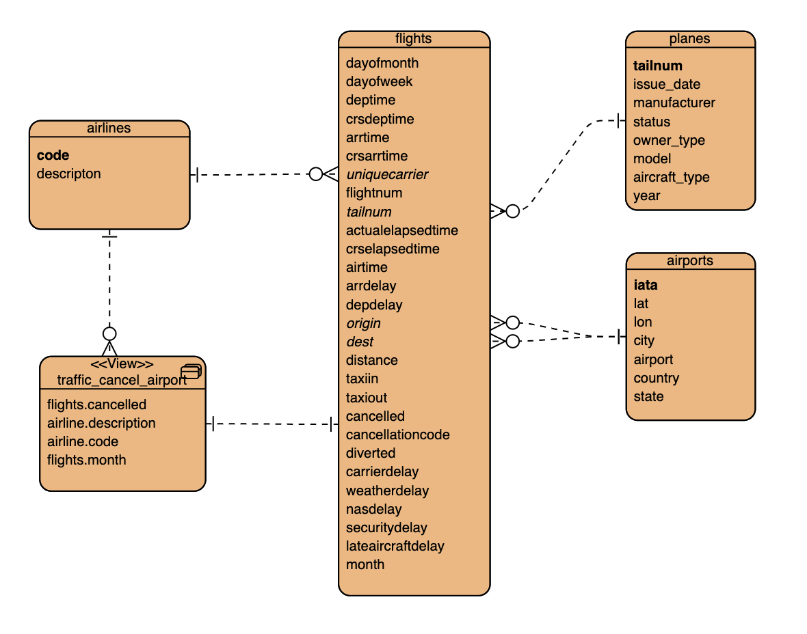

-----
## Lab 1 - Create Database

Navigate to Data Warehouse, then Virtual Warehouse and open the HUE SQL Authoring tool.

Create new database for your user to be used, or use one that is already created for you.

```sql
-- Change *** of database name
CREATE DATABASE DB_USER0**;

USE DB_USER0**;
```
Your can check your current database
```sql
select current_database();
```
-----
## Lab 2 - External Tables

Run DDL to create four external tables on the CSV data files, which are already in cloud object storage.

```sql
drop table if exists flights_csv;
CREATE EXTERNAL TABLE flights_csv(month int, dayofmonth int,
 dayofweek int, deptime int, crsdeptime int, arrtime int,
 crsarrtime int, uniquecarrier string, flightnum int, tailnum string,
 actualelapsedtime int, crselapsedtime int, airtime int, arrdelay int,
 depdelay int, origin string, dest string, distance int, taxiin int,
 taxiout int, cancelled int, cancellationcode string, diverted string,
 carrierdelay int, weatherdelay int, nasdelay int, securitydelay int,
lateaircraftdelay int, year int)
ROW FORMAT DELIMITED FIELDS TERMINATED BY ',' LINES TERMINATED BY '\n'
STORED AS TEXTFILE LOCATION '/airlinedata-csv/flights' tblproperties("skip.header.line.count"="1");

drop table if exists planes_csv;
CREATE EXTERNAL TABLE planes_csv(tailnum string, owner_type string, manufacturer string, issue_date string, model string, status string, aircraft_type string, engine_type string, year int)
ROW FORMAT DELIMITED FIELDS TERMINATED BY ',' LINES TERMINATED BY '\n'
STORED AS TEXTFILE LOCATION '/airlinedata-csv/planes' tblproperties("skip.header.line.count"="1");

drop table if exists airlines_csv;
CREATE EXTERNAL TABLE airlines_csv(code string, description string) ROW FORMAT DELIMITED FIELDS TERMINATED BY ',' LINES TERMINATED BY '\n'
STORED AS TEXTFILE LOCATION '/airlinedata-csv/airlines' tblproperties("skip.header.line.count"="1");

drop table if exists airports_csv;
CREATE EXTERNAL TABLE airports_csv(iata string, airport string, city string, state string, country string, lat DOUBLE, lon DOUBLE)
ROW FORMAT DELIMITED FIELDS TERMINATED BY ',' LINES TERMINATED BY '\n'
STORED AS TEXTFILE LOCATION '/airlinedata-csv/airports' tblproperties("skip.header.line.count"="1");

drop table if exists unique_tickets_csv;
CREATE external TABLE unique_tickets_csv (ticketnumber BIGINT, leg1flightnum BIGINT, leg1uniquecarrier STRING, leg1origin STRING,   leg1dest STRING, leg1month BIGINT, leg1dayofmonth BIGINT,   
 leg1dayofweek BIGINT, leg1deptime BIGINT, leg1arrtime BIGINT,   
 leg2flightnum BIGINT, leg2uniquecarrier STRING, leg2origin STRING,   
 leg2dest STRING, leg2month BIGINT, leg2dayofmonth BIGINT,   leg2dayofweek BIGINT, leg2deptime BIGINT, leg2arrtime BIGINT )
ROW FORMAT DELIMITED FIELDS TERMINATED BY ',' LINES TERMINATED BY '\n'
STORED AS TEXTFILE LOCATION '/airlinedata-csv/unique_tickets'
tblproperties("skip.header.line.count"="1");

```


Check that you created tables

```sql
SHOW TABLES;
```


Results


|TAB_NAME|
| :- |
|airlines_csv|
|airports_csv|
|flights_csv|
|planes_csv|

Query external tables to see few samples pointing to the right files

```sql
SELECT
  *
FROM  
  airports_csv
LIMIT 3;
```

Results


|airports_csv.iata | airports_csv.airport |airports_csv.city |airports_csv.country |airports_csv.lat| airports_csv.lon|
| :- | :- | :- | :- | :- | :- |
|00M	|"Thigpen "	|Bay Springs |USA	|31.95376472	|-89.23450472 |
|00R	|Livingston Municipal	|Livingston |USA	|30.68586111	|-95.0179277 |
|00V	|Meadow Lake |Colorado Springs |USA	|38.94574889	|-104.5698933 |


Run exploratory queries to understand the data. This reads the CSV data, converts it into a columnar in-memory format, and executes the query.

QUERY: Airline Delay Aggregate Metrics by Airplane.

DESCRIPTION: Customer Experience Reporting showing airplanes that have the highest average delays, causing the worst customer experience.

*Do all these steps in the* **“db\_user001”..”db\_user020”** *unless otherwise noted.*

```sql
SELECT
  tailnum,
  count(*) as flights_count,
  sum( nvl(depdelay,0) ) AS departure_delay_minutes,
  sum( case when nvl(depdelay,0) > 0 then 1 end) as departure_delay_count
FROM
  flights_csv
GROUP BY
  tailnum
ORDER BY
 departure_delay_minutes DESC
LIMIT 5;
```
Note: Running the first time may take some time.

Results

|tailnum	| flights_count | departure_delay_minutes |	 departure_delay_count|
| :- | :- | :- | :- |
|N381UA	| 25287 |341368 | 12280	|
|N375UA	| 25147 |341103	| 12162 |
|N673	| 30616 |333744	| 12835	|
|N366UA	| 24808 |331318	| 12113	|
|N377UA	| 25105 |328546	| 12163	|

### SQL AI Assistant  

A SQL AI Assistant has been integrated into Hue with the capability to leverage the power of Large Language Models (LLMs) for various SQL tasks. It helps you to create, edit, optimize, fix, and succinctly summarize queries using natural language and makes SQL development faster, easier, and less error-prone.

Click on the blue dot to launch the SQL AI Assistant

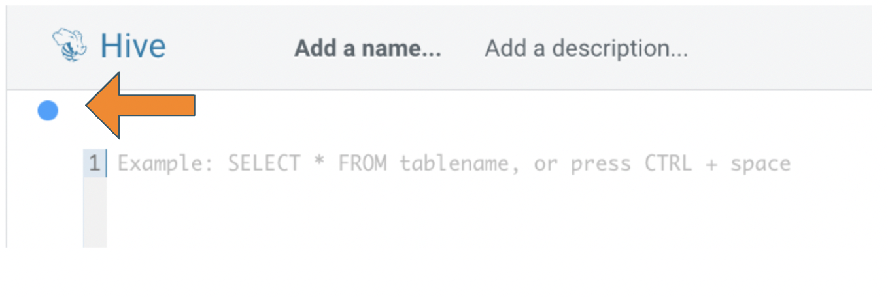

this unfolds this bar

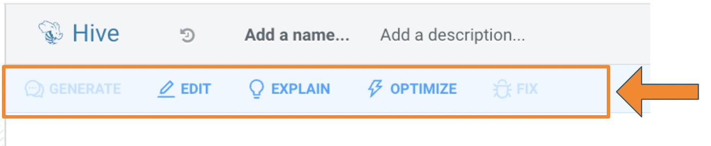

Click on EXPLAIN to understand SQL query command


it will take a few secondes to generate this outcome.

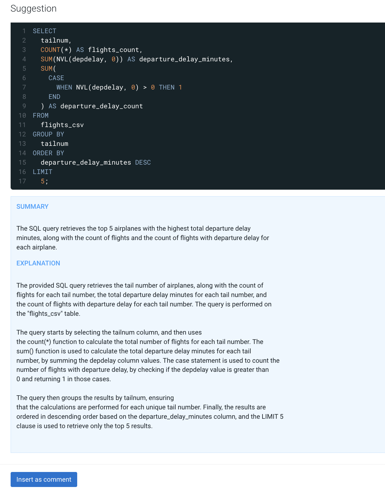

This can be inserted for documentation purposes.

-----
## Lab 3 - Managed Tables

Run “CREATE TABLE AS SELECT” queries to create full ACID ORC type of the tables. This creates curated versions of the data which are optimal for BI usage.

*Do all these steps in the* **“db\_user001”..”db\_user020”** *unless otherwise noted.*

```sql
drop table if exists airlines_orc;
create table airlines_orc as select * from airlines_csv;

drop table if exists airports_orc;
create table airports_orc as select * from airports_csv;

drop table if exists planes_orc;
create table planes_orc as select * from planes_csv;

drop table if exists unique_tickets_orc;
create table unique_tickets_orc as select * from unique_tickets_csv;

drop table if exists flights_orc;
create table flights_orc partitioned by (year) as
select year, month, dayofmonth, dayofweek, deptime, crsdeptime, arrtime, crsarrtime, uniquecarrier, flightnum, tailnum, actualelapsedtime, crselapsedtime, airtime, arrdelay, depdelay, origin, dest, distance, taxiin, taxiout, cancelled, cancellationcode, diverted, carrierdelay, weatherdelay, nasdelay, securitydelay, lateaircraftdelay
from flights_csv;

```

This takes a few minutes to read and write the data back.

Check that you created managed & external tables

```sql
USE DB_USER0**;
SHOW TABLES;
```

Results

|TAB_NAME|
| :- |
|airlines_csv|
|airlines_orc|
|airports_csv|
|airports_orc|
|flights_csv|
|flights_orc|
|planes_csv|
|planes_orc|
|unique_tickets_csv|
|unique_tickets_orc|

The DESCRIBE cmd shows detailed information about the table.

 ```sql
 DESCRIBE formatted flights_orc ;
 ```

Result: column names with types, parameters and storage

|col_name| data_type| comment|
| :- | :- |:- |
|month| int| |
|dayofmonth| int| |
|dayofweek| int| |
...

Scrol down to row 46

| | numFiles| 14 |
| :- | :- |:- |
| | numPartitions| 14 |
| | numRows| 86399321  |

 ```sql
show partitions flights_orc;
 ```
Result: showing all 14 partitions with keys

| partition |
| :- |
|year=1995|
|year=1996|
|year=1997|
|...|
|year=2008|

Experiment with different queries to see effects of the columnar storage format and cache.

QUERY: Airline Delay Aggregate Metrics by Airplane on managed table

```sql
SELECT
  tailnum,
  count(*) as flights_count,
  sum( nvl(depdelay,0) ) AS departure_delay_minutes,
  sum( case when nvl(depdelay,0) > 0 then 1 end) as departure_delay_count
FROM
  flights_orc
GROUP BY
  tailnum
ORDER BY
 departure_delay_minutes DESC
LIMIT 5;
```

Results (same as previous query)
|tailnum	| flights_count | departure_delay_minutes |	 departure_delay_count|
| :- | :- | :- | :- |
|N381UA	| 25287 |341368 | 12280	|
|N375UA	| 25147 |341103	| 12162 |
|N673	| 30616 |333744	| 12835	|
|N366UA	| 24808 |331318	| 12113	|
|N377UA	| 25105 |328546	| 12163	|

Now let's compare this query select flights_orc managed table with the previous query for the flights_csv external table.

The Hive Query Processors can compare the queries. You navigate to the Query Processor via on the left side you click on Jobs, next is to click on Queries.

Next is to select the two queries, hoover over the SQL command and search the FROM clause with flights_csv and flights_orc.

When you found the SQL queries next is to check the box to click compare.

Here you see the two queries side-by-side with all details.
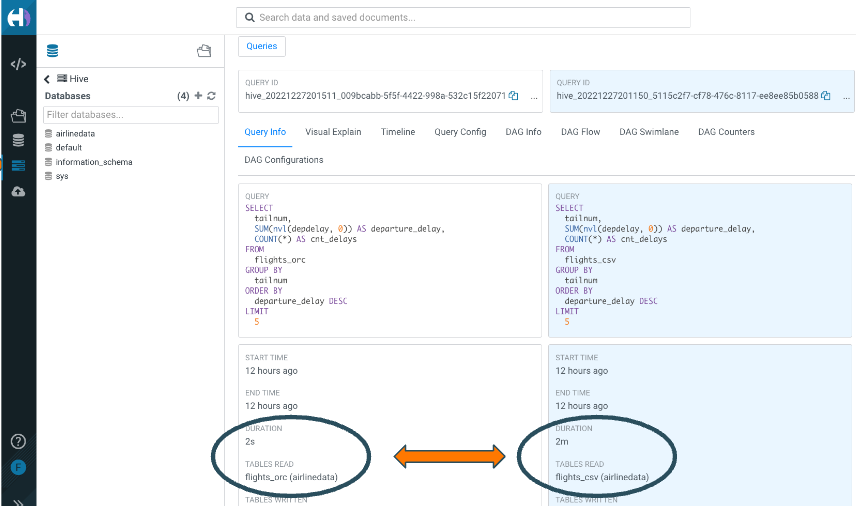

Query: Find all international flights: flights where destination airport country is not the same as origin airport country

```sql
SELECT DISTINCT
   flightnum,
   uniquecarrier,
   origin,
   dest,
   month,
   dayofmonth,
   `dayofweek`
FROM
  flights_orc f,
   airports_orc oa,
   airports_orc da  
WHERE
   f.origin = oa.iata
   and f.dest = da.iata
   And oa.country <> da.country
ORDER BY
   month ASC,
   dayofmonth ASC;
```


### Defaults - Surrogate_key & Sequence

Surrogate keys are easy & distributable & fast, but not in sequence, has gaps.

```sql
DROP TABLE IF EXISTS airlines_with_surrogate_key;

CREATE TABLE
  airlines_with_surrogate_key (
    ID BIGINT DEFAULT SURROGATE_KEY(),
    CODE STRING,
    DESCRIPTION STRING);

INSERT INTO airlines_with_surrogate_key (CODE, DESCRIPTION)
SELECT
  code,
  description
FROM
  airlines_csv;

SELECT
 *
FROM  
 airlines_with_surrogate_key
ORDER BY
 id
LIMIT 3;
```

Result:

|id	| code |	 description|
| :- | :- | :- |
|1099511627776 |02Q |Titan Airways |
|1099511627777 |04Q |Tradewind Aviation |
|1099511627778 |05Q |"Comlux Aviation |

Note: the first column is the new unique SURROGATE_KEY

### Optional Step - Create a SEQUENCE

```sql
CREATE TABLE AIRLINES_with_SEQ (
 ID BIGINT,
 CODE STRING,
 DESCRIPTION STRING);

INSERT INTO AIRLINES_with_SEQ (
  ID, CODE, DESCRIPTION)
 SELECT
  row_number() over(),
  CODE,
  DESCRIPTION
 from
  AIRLINES_CSV;

select
 *
from
 AIRLINES_with_SEQ
limit 3;
```

Result:

|id	| code |	 description|
| :- | :- | :- |
|1 |02Q |Titan Airways |
|2 |04Q |Tradewind Aviation |
|3 |05Q |"Comlux Aviation |

-----
## Lab 4 - Materialized View
Reminder: use your own “db\_user001”..”db\_user020” database.

Materialized views (MV) cause Hive to transparently rewrite queries, when possible, to use the MV instead of the base tables.

Create Materialized View of a join of two tables with aggregation.

```sql
DROP MATERIALIZED VIEW IF EXISTS traffic_cancel_airlines;

CREATE MATERIALIZED VIEW
 traffic_cancel_airlines
AS SELECT
 airlines.code AS code,  
 airlines.description AS airline_name,
 flights.month AS month,
 COUNT(*) as flights_count,
 SUM(flights.cancelled) AS cancelled,
 SUM( nvl(depdelay,0) ) AS departure_delay_minutes,
 SUM( case when nvl(depdelay,0) > 0 then 1 end) as departure_delay_count
FROM
 flights_orc flights
 JOIN
  airlines_orc airlines ON (flights.uniquecarrier = airlines.code)
group by
 airlines.code,
 airlines.description,
 flights.month;
```
Note: The time to create the MV takes apporox. 3-5 minutes.

Checking that the materialized view is created.

```sql
SHOW MATERIALIZED VIEWS;
```

Results

|MV_NAME | REWRITE_ENABLED |  MODE  | incremental_rebuild |
| :- | :- | :- | :- |
|traffic_cancel_airlines|Yes	| Manual refresh | Available |

Running a query for part of the materialized view.

```sql
SELECT
 airlines.description AS description,
 SUM(flights.cancelled) AS flights_cancelled
FROM
 flights_orc flights ,
 airlines_orc airlines
WHERE
 flights.uniquecarrier = airlines.code
group by
 airlines.description;
```

Navigate to the query processor, select the above query and the visual explain you see query rewrite:

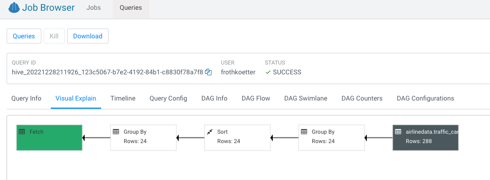


------
## Lab 5 - Time Travel and Partition Evolution

Cloudera Iceberg is a high-performance format for huge analytic tables for engines like Spark, Impala Flink and Hive to safely work with the same tables, at the same time.

Creating a partitioned table with CREATE TABLE ... PARTITIONED BY & STORED BY ICEBERG syntax enables you to create identity-partitioned Iceberg tables. Identity-partitioned Iceberg tables are similar to the regular partitioned tables and are stored in the same directory structure as the regular partitioned tables.

Lets create a new table with Iceberg format and insert rows in batches:

```sql
drop table if exists flights_ice;
create table flights_ice(
 year int, month int, dayofmonth int,  
 dayofweek int, deptime int, crsdeptime int, arrtime int,  
 crsarrtime int, uniquecarrier string, flightnum int, tailnum string,  
 actualelapsedtime int, crselapsedtime int, airtime int, arrdelay int,  
 depdelay int, origin string, dest string, distance int, taxiin int,  
 taxiout int, cancelled int, cancellationcode string, diverted string,  
 carrierdelay int, weatherdelay int, nasdelay int, securitydelay int,  
 lateaircraftdelay int )
 stored by ICEBERG;

insert into flights_ice (year, month, dayofmonth, dayofweek, deptime, crsdeptime, arrtime, crsarrtime,uniquecarrier, flightnum, tailnum, actualelapsedtime, crselapsedtime, airtime, arrdelay, depdelay,origin, dest, distance, taxiin, taxiout, cancelled, cancellationcode, diverted, carrierdelay, weatherdelay,nasdelay, securitydelay, lateaircraftdelay )
select year, month, dayofmonth, dayofweek, deptime, crsdeptime, arrtime, crsarrtime, uniquecarrier, flightnum, tailnum, actualelapsedtime, crselapsedtime, airtime, arrdelay, depdelay, origin, dest, distance, taxiin, taxiout, cancelled, cancellationcode, diverted, carrierdelay, weatherdelay, nasdelay, securitydelay, lateaircraftdelay
from flights_orc where year = 1995 and month <= 6;

insert into flights_ice (year, month, dayofmonth, dayofweek, deptime, crsdeptime, arrtime, crsarrtime,uniquecarrier, flightnum, tailnum, actualelapsedtime, crselapsedtime, airtime, arrdelay, depdelay,origin, dest, distance, taxiin, taxiout, cancelled, cancellationcode, diverted, carrierdelay, weatherdelay,nasdelay, securitydelay, lateaircraftdelay )
select year,month, dayofmonth, dayofweek, deptime, crsdeptime, arrtime, crsarrtime, uniquecarrier, flightnum, tailnum, actualelapsedtime, crselapsedtime, airtime, arrdelay, depdelay, origin, dest, distance, taxiin, taxiout, cancelled, cancellationcode, diverted, carrierdelay, weatherdelay, nasdelay, securitydelay, lateaircraftdelay
from flights_orc where year = 1995 and month > 6;
```

Now all rows for one year inserted into the table flights_ice.

Check the count of all rows inserted previouly:

```sql
select
 count(*) row_count
from
 flights_ice;
```

Result:

| row_count |
| :- |
| 5454913 |

Now select the snapshot history of the table.

*** Change the database name “db\_user001”
```sql
select * from DB_userXXX.flights_ice.history;
```

Result: two snapshots of the table in the output, one for each insert command.

|FLIGHTS.MADE_CURRENT_AT |	FLIGHTS_ICE.SNAPSHOT_ID	|FLIGHTS.PARENT_ID	|FLIGHTS.IS_CURRENT_ANCESTOR|
| :- | :- | :- | :- |
2022-05-01 09:29:12.509 Z|	7097750832501567062 | null | true |
2022-05-01 09:56:21.464 Z|	5696129515471947086 | 7097750832501567062 | true |


Let's make a quick time travel to one of the versions using SYSTEM_VERSION or SYSTEM_TIME.

Pick the number of FLIGHTS_ICE.SNAPSHOT_ID from the first row and replace ***SNAPSHOT_ID***

```sql
select
 count(*) as row_count
from
 flights_ice
FOR
 SYSTEM_VERSION AS OF ***SNAPSHOT_ID***
group by
 year
order by
 year;
```

Result: Only data from the first insert.

|  row_count |
| :- |
| 2783584 |


Partition Evolution is a feature when table layout can be updated as data or queries change and  users are not required to maintain partition columns.


With Iceberg’s hidden partitions the tables separation between physical and logical users avoid reading unnecessary partitions and don’t need to know how the table is partitioned and add extra filters to their queries.

Lets change the partition schema to YEAR & MONTH & DAYOFMONTH

```sql
alter table flights_ice SET PARTITION SPEC (year ,month, dayofmonth);
```

Now let's insert one day of data into the partitioned table:
```sql
insert into flights_ice (year, month, dayofmonth, dayofweek, deptime, crsdeptime, arrtime, crsarrtime,uniquecarrier, flightnum, tailnum, actualelapsedtime, crselapsedtime, airtime, arrdelay, depdelay,origin, dest, distance, taxiin, taxiout, cancelled, cancellationcode, diverted, carrierdelay, weatherdelay,nasdelay, securitydelay, lateaircraftdelay )
select 2023, 1, 1 , dayofweek, deptime, crsdeptime, arrtime, crsarrtime, uniquecarrier, flightnum, tailnum, actualelapsedtime, crselapsedtime, airtime, arrdelay, depdelay, origin, dest, distance, taxiin, taxiout, cancelled, cancellationcode, diverted, carrierdelay, weatherdelay, nasdelay, securitydelay, lateaircraftdelay
from flights_orc where year = 1995 and month = 1 and dayofmonth = 1;
```
Now lets see the impact what the difference is, lets run two queries and note the complete time:

Count the records for one year and month that is inserted before the partition:
```sql
select
  count(1) as row_count,
  sum(depdelay)
from
  flights_ice
where  
  year = 1995 and month = 1 and dayofmonth = 1;
```

Run the second query for the data last inserted into the partition:
```sql
select
count(1) as row_count,
sum(depdelay)
from
  flights_ice
where  
  year = 2023 and month = 1 and dayofmonth = 1;
 ```

You can compare the two queries in the HUE Query Processor tool. The second query has reads only the small partitioned file and you notice the difference in the DAG Swimlane tab:

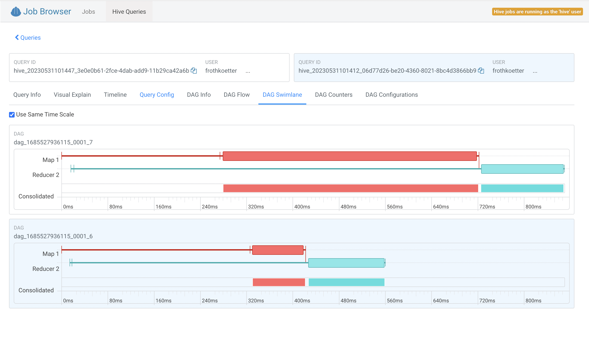

More details on the DAG Counter tab:

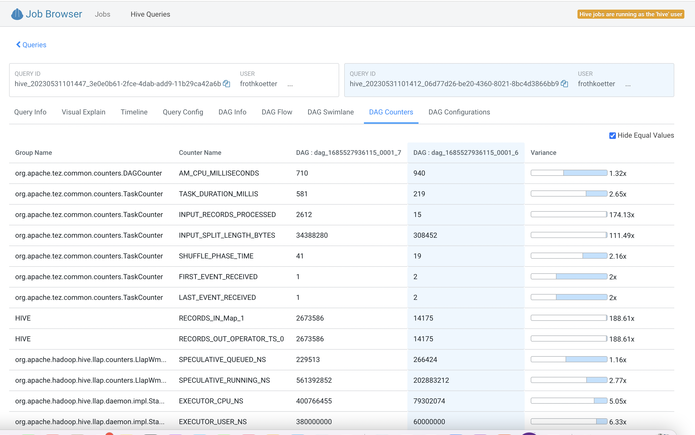
Note: check on Hide Equal Values to see only changed values

This example shows that the execution time is greatly decreased because less data was read.

## Lab 6 - Data Quality with Branching
*Do all these steps in the* **“db\_user001”..”db\_user020”** *unless otherwise noted.*

*Enter the your_dbname as **“db\_user001”..”db\_user020”**

The quality of data holds immense importance within any data engineering process, directly influencing subsequent analytical tasks like business intelligence and machine learning. It is imperative to conduct thorough testing, cleansing and validation of data at every stage of the data pipeline before deployment into the production.

The QA pipeline looks like the following:
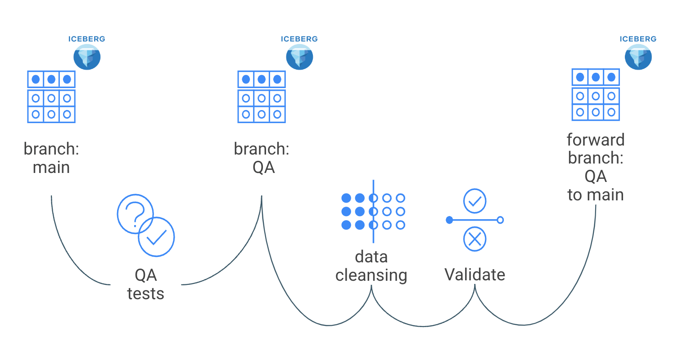

The QA steps are test, cleanse, validate and propergate to production.

In this lab we go through these steps for the AIRPORTS table.


1) uniqueness of the IATA codes

2) length of field IATA should be always 3

3) no quotation marks in the field AIRPORT


Begin with the creation of ICEBERG V2 table with the raw data and run the first test

```sql
drop table if exists airports_ice;
create table airports_ice stored by iceberg TBLPROPERTIES('format-version'='2')
as select * from airports_csv;

/*
** QA test:  iata unique values   
*/
select
      count(*) as failures,
      count(*) != 0 as should_warn,
      count(*) != 0 as should_error
    from (
select
    iata as unique_field,
    count(*) as n_records
from airports_ice
where iata is not null
group by iata
having count(*) > 1
) iata_unique_test;
```

The output should like this not reporting any duplicate IATA codes.

| failures | should_warn | should_error |
| :- | :- |  :- |
|0 | false |	false |

Now running the 2nd test of the field length for the IATA code.
```sql
/*
** test iata len = 3
*/
select
      count(*) as failures,
      count(*) != 0 as should_warn,
      count(*) > 100 as should_error
from (
      with validation as (
	                         select iata as field
	                          from airports_ice
                         ),
                         validation_errors as (
	   select field from validation
	    where LENGTH(field) != 3
                        )
select *
from validation_errors
) iata_length_test;
```

The test shows that 42 rows are not having the correct lenght.

|failures |	should_warn	| should_error |
| :- | :- |  :- |
| 42 |	true |	false |


Running the 3rd test and find quotation marks

```sql
/*
**  QA test: quotation marks in fields
*/
select
      count(*) as failures,
      count(*) >10 as should_warn,
      count(*) >1000 as should_error
    from (
with validation as (
	select airport as field
	from airports_ice
),
validation_errors as (
	select field from validation
	where field rlike('"')
)
select *
from validation_errors
) quotation_marks_test;
```

The Output is 373 rows with quotation marks and there is a warning and error level.

|failures |	should_warn	| should_error |
| :- | :- |  :- |
| 373 |	true |	false |

Out test showing that we data must be cleaned and create a branch with the name QA.
```SQL
/*
** create branch  
*/
ALTER TABLE airports_ice CREATE BRANCH test;

select * from ${your_dbname}.airports_ice.refs;
```

The list of branches are as follows:


|name	|type	|snapshot_id |	max_reference_age_in_ms |	min_snapshots_to_keep	| max_snapshot_age_in_ms |
| :- | :- |  :- | :- | :- |  :- |
|qa	|BRANCH	|4861947596552380217	|NULL	|NULL	|NULL|
|main	|BRANCH	|4861947596552380217	|NULL	|NULL	|NULL

The main branch always exists a base when creating the Iceberg table.

Now do the cleaning job and delete rows where the IATA code is != 3 and remove the quotation marks

```SQL
/*
** Data Cleansing: data transformations
*/
delete from ${your_dbname}.airports_ice.branch_qa
where LENGTH(iata) != 3;

update ${your_dbname}.airports_ice.branch_qa
set airport = regexp_replace( airport ,'"','')
where airport rlike('"');
```


Output should like this:

 Success.

Next is to validate the data we have cleansed to be on the save side.

```SQL
 /*
 ** Validate: not iata len <> 3
 */
 select
       count(*) as failures,
       count(*) != 0 as should_warn,
       count(*) > 100 as should_error
 from (
       with validation as (
 	                         select iata as field
 	                          from ${your_dbname}.airports_ice.branch_qa
                          ),
 validation_errors as (
 	select field from validation
 	where LENGTH(field) != 3
 )
 select *
 from validation_errors
 ) iata_length_test;
```

Output looks good:

 |failures |	should_warn	| should_error |
 | :- | :- |  :- |
 | 0 |	false |	false |

Run the 2nd validation

 ```SQL
 /*
 **  validation: no quotation marks in Field
 */
 select
       count(*) as failures,
       count(*) >10 as should_warn,
       count(*) >1000 as should_error
     from (
 with validation as (
 	select airport as field
 	from ${your_dbname}.airports_ice.branch_qa
 ),
 validation_errors as (
 	select field from validation
 	where field rlike('"')
 )
 select *
 from validation_errors
 ) quotation_marks_validation;
```
Output looks good:

|failures |	should_warn	| should_error |
| :- | :- |  :- |
| 0 |	false |	false |

Move the data from the QA branch into the main branch and drop the QA branch for housekeeping.

 ```SQL
ALTER table airports_ice EXECUTE FAST-FORWARD 'qa';

ALTER TABLE airports_ice DROP BRANCH if exists qa;

select * from ${your_dbname}.airports_ice.refs;
```

Output:

|name	|type	|snapshot_id |	max_reference_age_in_ms |	min_snapshots_to_keep	| max_snapshot_age_in_ms |
| :- | :- |  :- | :- | :- |  :- |
|main	|BRANCH	|4861947596552380217	|NULL	|NULL	|NULL


This lab you saw how Iceberg branching feature helping data quality pipelines in a data engineering workflow.

-----
## Lab 7 - Slowly Changing Dimensions (SCD) - TYPE 2

*Do all these steps in the* **“db\_user001”..”db\_user020”** *unless otherwise noted.*


We create a new SDC table ***airline\_scd*** and add columns ***valid\_from*** and ***valid\_to***. Then loading the initial 1000 rows into this SDC table, then mock up new data and change data in the table ***airlines\_stage***.

Finally merging these two tables with a single MERGE command to maintain the historical data and check the results.

Create the Hive managed table for airlines. Load initial by copy 1000 rows of current airlines with hard code the valid_from date

```sql
drop table if exists airlines_scd;

create table airlines_scd(code string, description string, updated_at date, valid_from date, valid_to date);

insert into airlines_scd
  select *, current_date(), cast('2021-01-01' as date), cast(null as date)
  from airlines_csv;
```

Create an external staging table pointing to our complete airlines dataset (1491 records) and update a description to mockup a change in the dimension

```sql
drop table if exists airlines_stage;

create table airlines_stage as select * from airlines_csv;

update airlines_stage
set
 description = concat('Update - ',upper(description))
where
 code in ('02Q','04Q');
```

Perform the SCD type 2 Merge Command

```sql
merge into airlines_scd
using (
 -- The base staging data.
 select
   airlines_stage.code as join_key,
   airlines_stage.* from airlines_stage
 union all
 -- Generate an extra row for changed records.
 -- The null join_key means it will be inserted.
 select
   null, airlines_stage.*
 from
   airlines_stage join airlines_scd on airlines_stage.code = airlines_scd.code
 where
   ( airlines_stage.description <> airlines_scd.description )
   and airlines_scd.valid_to is null
) sub
on sub.join_key = airlines_scd.code
when matched
 and sub.description <> airlines_scd.description
 then update set valid_to = current_date(), updated_at = current_date()
when not matched
 then insert values (sub.code, sub.description, current_date(), current_date(), null);
```

View the changed records and see that the VALID_FROM and VALID_TO dates are set

```sql
select
 *
from
 airlines_scd
where
 code in ('02Q','04Q')
order by
 code,
 valid_from;
```

Results

|CODE|DESCRIPTION|UPDATAED\_AT|VALID\_FROM|VALID\_TO|
| :- | :- | :- | :- | :- |
|02Q|Titan Airways|2022-12-26|2021-01-01|2022-12-26|
|02Q|Update - TITAN AIRWAYS|2022-12-26|2021-05-26|null|
|04Q|Tradewind Aviation|2022-12-26|2021-01-01|2022-12-26|
|04Q|Update - TRADEWIND AVIATION|2022-12-26|2021-12-26|null|


-----
## Lab 7 - Data Security & Governance

The combination of the Data Warehouse with SDX offers a list of powerful features like rule-based masking columns based on a user’s role and/or group association or rule-based row filters.

For this workshop we are going to explore Attribute-Based Access Control a.k.a. Tage-based security policies.

First we are going to create a series of tables in your work database.

In the SQL editor, select your database and run this script:

```sql
CREATE TABLE emp_fname (id int, fname string);
insert into emp_fname(id, fname) values (1, 'Carl'),(2, 'Clarence');

CREATE TABLE emp_lname (id int, lname string);
insert into emp_lname(id, lname) values (1, 'Rickenbacker'), (2, 'Fender');

CREATE TABLE emp_age (id int, age smallint);
insert into emp_age(id, age) values (1, 35),(2, 55);

CREATE TABLE emp_denom (id int, denom char(2), email string);
insert into emp_denom(id, denom, email) values (1, 'rk','cr@yahoo.com'),(2, 'na','cfender@gmail.com');

CREATE TABLE emp_id (id int, empid integer);
insert into emp_id(id, empid) values (1, 1146651),(2, 239125);

CREATE TABLE emp_all as
  (select a.id, a.fname, b.lname, c.age, d.denom,d.email,e.empid from emp_fname a
	inner join emp_lname b on b.id = a.id
	inner join emp_age c on c.id = b.id
	inner join emp_denom d on d.id = c.id
	inner join emp_id e on e.id = d.id);

create table emp_younger as (select * from emp_all where emp_all.age <= 45);

create table emp_older as (select * from emp_all where emp_all.age > 45);
```

After this script executes, a simple

```sql
select * from emp_all;
```

… should give the contents of the emp\_all table, which only has a couple of lines of data.

For the next step we will switch to the UI of Atlas, the CDP component responsible for metadata management and governance: in the Cloudera Data Warehouse *Overview* UI, select Database Catalog. Click on the three-dot menu of this DB catalog and select “Open Atlas” in the associated pop-up menu:

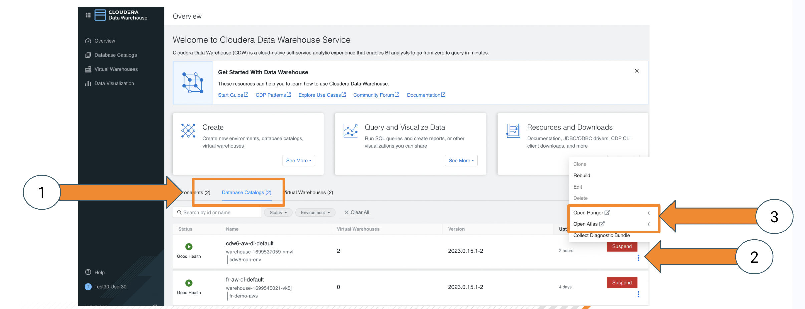

This should open the Atlas UI. CDP comes with a newer, improved user interface which can be enabled through the __“Switch to Beta”__ item in the user menu on the upper right corner of the screen. Do this now.

The Atlas UI has a left column which lists the Entities, Classifications, Business Metadata and Glossaries that belong to your CDP Environment.


We just created a couple of tables in the Data Warehouse, let’s look at the associated metadata. Under “Entities”, click on “hive\_db”. This should produce a list of databases.
Select you workshop database, this will result in the database’s metadata being displayed.

Select the “Tables” tab (the rightmost)


Select the “emp\_all” table from the list, this will result in Atlas displaying the metadata for this table; select the “lineage” tab:
   
This lineage graph shows the inputs, outputs as well as the processing steps resulting from the execution of our SQL code in the Data Warehouse.

The red circle marks the currently selected entity. Atlas will always display the current entity's type in braces next to the entity name (middle, top of the page, e.g. "hive_table"). Clicking on one of the nodes will display a popup menu, which allows us to navigate through the lineage graph.

   Click on the “emp\_age” input table and select the link (the “guid” attribute) in the resulting popup menu:
   

In the screen that follows, select the “Schema” tab and in that table, click on the link for the “age” field:
   

[Explanation: we are now looking at the metadata page for the “age” column of the “emp\_age” table. There’s also a lineage tab here, because CDP tracks table- as well as column-based lineage for the Data Warehouse. What we want to do here: age is certainly a piece of sensitive personal information. We want to classify (‘tag’) it appropriately and then let SDX take care of treating this field as classified information that’s not visible to everyone.]

   Still in the screen for the “age” column, click on the plus sign next to “Classifications”; this will bring up a dialog:


   

   In the drop-down menu, select “PII” and make sure the “Propagate” checkbox is enabled.
   Click the “Add” button.
[This effectively means we apply the classification “PII” to the selected column and Atlas also will apply that classification to all columns that have been or will be derived from it.]

We can actually check this easily by using the lineage graph to navigate to a downstream table’s column: select one of the nodes that *don’t* have gear wheels (those are process information) and select the guid link.

This will give us the metadata for the “age” column in a derived table. Note the information on “Propagated Classifications”:
   

Try to query all columns from the “emp\_all” table again in HUE – by simply executing the last query again.
Why did we get an error now? There exists a policy in Ranger that denies all members of the hands-on lab group access to Hive data that is classified as “PII”. Let’s check that out.

Like before for Atlas, open the Ranger UI via the triple-dot menu in you warehouse’s Database Catalog: 

In the Ranger UI, select the “Audit” menu and limit the amount of data displayed by specifying the filter expressions:
   Result: Denied
   Service Type: HADOOP SQL


-----
## Lab 8 - Data Visualization


1. Use Data Visualization to further explore the data set.

`	`Open DataViz


|**Step**|**Description**|
| :-: | :- |
|1|<p>Open Data Visualization </p><p></p><p></p><p>SSO login as user with password (not prompted) </p><p></p>|
|2|<p>Overview</p><p></p>|
|3|<p>Switch to Data Tab</p><p></p><p>Initially will have no Data Models</p>|
|4|<p>Build Data Model</p><p></p><p></p><p>Create the Semantic Layer - data is not copied</p>|
|5|<p>Select Table or use SQL</p><p></p><p></p><p></p><p></p><p></p><p></p><p>     </p><p>Ability to add as a table or enter your own pre-defined SQL</p>|
|6|<p>Edit Data Model</p><p></p><p></p><p></p><p></p><p></p>|
|7|<p>Show Fields quickly</p><p>     </p><p></p><p>Can see that it created fields for each column in the table that was selected.</p><p></p>|
|8|<p>Join Planes table with Flights table</p><p></p><p></p><p></p><p></p><p>  </p><p></p><p></p><p>` `</p>|
|9|<p>Join Airlines table with Flights table</p><p>  </p><p></p>|
|10|<p>Preview Data</p><p></p><p></p><p></p><p></p><p>Scroll right</p><p></p>|
|11|<p>Edit Fields</p><p></p><p></p><p>Before</p><p></p><p></p><p>You’ll use the following:</p><p>    </p><p></p><p>Edit Field properties</p><p></p><p></p><p>     </p><p></p><p></p><p></p><p></p><p>Create New Field</p><p> 1st clone</p><p></p><p>     </p><p></p><p></p><p></p><p>Change Display Name to “Route”</p><p></p><p></p><p>Edit Expression</p><p></p><p></p><p>Expression: </p><p>**concat( [origin],'-', [dest])**</p><p></p><p>Can Validate (to check for any errors) or Click Apply (to accept changes)</p><p> or </p>|
|12|<p>Finished Data Model</p><p></p><p></p><p></p><p>Click Save</p>|
|13|<p>Create Dashboard</p><p></p><p>` `</p>|
|14|<p>First Visual</p><p></p><p></p><p></p><p>Change Dep Delay Aggregate to Average</p><p></p><p></p><p></p><p></p><p></p><p></p><p></p><p>Change to only show Top 25 Avgs</p><p></p><p></p><p>Change Alias</p><p></p><p></p><p>Finished</p><p></p><p></p><p>Refresh Visual</p><p></p><p></p><p></p><p></p><p>Add Title & Subtitle for Dashboard</p><p></p><p></p><p>Add Title & Subtitle for this chart</p><p></p><p></p>|
|15|<p>Second Visual</p><p></p><p></p><p></p><p></p><p>Use Visual Styles to suggest charts</p><p>     </p><p></p><p>Select UniqueCarrier, Cancellationcode, Cancelled</p><p></p><p></p><p></p><p></p><p>Filter for only cancelled flights</p><p></p><p></p><p></p><p></p><p></p><p></p><p>Resize (make larger)</p><p></p><p></p><p></p><p></p><p>Add Chart Title - “Cancellation Correlation”</p>|
|16|<p>Add Prompts</p><p></p><p></p><p></p><p></p><p></p><p></p><p>Select values from prompt</p><p></p><p></p><p></p><p></p>|
|17|<p>Save Dashboard</p><p></p><p></p><p></p>|
|18|<p>View Dashboard</p><p> click on visuals tab </p><p></p><p></p><p></p><p>Click on Dashboard</p><p></p><p></p><p></p>|


||
| :- |
# Bonus Material (optional)

## 9 - Continues Data Pipeline

During the workshop every minute new streaming flight events are
 - created
 - enriched with realtime weather information and with the prediction of the delay
 - stored in Iceberg table

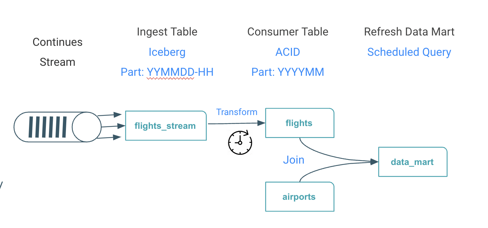

The steps in this optional lab are as follows:
 - Create flights_final table, a offset table and a temporary table
 - Populate and transform the data from the raw streaming table into the temporary table
 - Sweep transformed data and save meta data of the micro batch in the offset table


Create the table of the final streaming events with additional columns for weather information and delay prediction:

```sql
drop table if exists flights_final;
create table flights_final
(
 year int, month int, dayofmonth int,
 dayofweek int, deptime int, crsdeptime int, arrtime int,
 crsarrtime int, uniquecarrier string, flightnum int, tailnum string,
 actualelapsedtime int, crselapsedtime int, airtime int, arrdelay int,
 depdelay int, origin string, dest string, distance int, taxiin int,
 taxiout int, cancelled int, cancellationcode string, diverted string,
 carrierdelay int, weatherdelay int, nasdelay int, securitydelay int, lateaircraftdelay int,
 origin_lon string,origin_lat string, dest_lon string,dest_lat string,
 prediction decimal,proba  decimal,prediction_delay  decimal,
 temp decimal, pressure decimal,humidity decimal,wind_speed decimal, clouds string,
 batch_id BIGINT )
stored by ICEBERG;
```

Create a table for the meta data of the micro batch, as batch_id, offset pointer and row count of the events processed:

```sql
drop table if exists flights_batch_offset;
create table flights_batch_offset(
 batch_id bigint DEFAULT SURROGATE_KEY(), run_ts timestamp,
 from_ts bigint,
 to_ts bigint,
 row_count bigint);
```
Note: the Default surrogate_key() creates new unique number when new rows inserted

Next is to create a temporary table of the new format (including prediction and weather)
```sql
drop table if exists flights_streaming__tmp;
create temporary table flights_streaming__tmp
(
 year int, month int, dayofmonth int,
 dayofweek int, deptime int, crsdeptime int, arrtime int,
 crsarrtime int, uniquecarrier string, flightnum int, tailnum string,
 actualelapsedtime int, crselapsedtime int, airtime int, arrdelay int,
 depdelay int, origin string, dest string, distance int, taxiin int,
 taxiout int, cancelled int, cancellationcode string, diverted string,
 carrierdelay int, weatherdelay int, nasdelay int, securitydelay int, lateaircraftdelay int,
 origin_lon string,origin_lat string, dest_lon string,dest_lat string,
 prediction decimal,proba  decimal,prediction_delay  decimal,
 temp decimal, pressure decimal,humidity decimal,wind_speed decimal, clouds string);
```

Now we populate the temporary table with new events from the raw streaming:
```sql
with flights as ( select
  year, month, dayofmonth, dayofweek, deptime, crsdeptime, arrtime, crsarrtime, uniquecarrier, flightnum, tailnum,
  actualelapsedtime, crselapsedtime, airtime, arrdelay, depdelay, origin, dest, cast( distance as integer ) as distance, taxiin, taxiout,
  cancelled, cancellationcode, diverted, carrierdelay, weatherdelay, nasdelay, securitydelay, lateaircraftdelay,
  origin_lon, origin_lat, cast( dest_lon as float) as dest_lon, cast(dest_lat as float) as dest_lat,
  cast( translate( substr(prediction, instr(prediction,'prediction=')+11,1 ),'}','') as integer),
  cast( translate( substr(prediction, instr(prediction,'proba=')+6,4 ),'}','') as float),
  cast( translate( substr(prediction, instr(prediction,'prediction_delay=')+17,2 ),',','') as integer) ,
  cast( translate( substr( weather_json, instr(weather_json,'temp=')+5,5 ),',','') as float) ,
  cast( translate( substr( weather_json, instr(weather_json,'pressure=')+9,6 ),',','') as float) ,
  cast( translate( substr( weather_json, instr(weather_json,'humidity=')+9,2 ),',','') as float) ,
  cast( translate( substr( weather_json, instr(weather_json,'speed=')+6,5 ),',','') as float) ,
  cast( translate( substr( weather_json, instr(weather_json,'all=')+4,3 ),'}','') as string)
 from
  airlinedata.flights_streaming_ice
  ),
offset as ( select max(to_ts) as max_ts from flights_batch_offset)
insert into flights_streaming__tmp
  select
    flights.*
  from
   flights, offset
   where  
     unix_timestamp(concat( year,'-', month, '-', dayofmonth, ' ' ,
       substring(lpad(deptime,4,'0'),1,2),':', substring(lpad(deptime,4,'0'),3,2) ,':00' )) > nvl(max_ts,0);
```

Maintain the offset and create a new batch_id and meta data about the batch content into the offset table:

```SQL
insert into flights_batch_offset(run_ts,from_ts,to_ts,row_count)
select
 current_timestamp(),
 min( unix_timestamp(concat( year,'-', month, '-', dayofmonth, ' ' ,
   substring(lpad(deptime,4,'0'),1,2),':', substring(lpad(deptime,4,'0'),3,2) ,':00' ))),
 max( unix_timestamp(concat( year,'-', month, '-', dayofmonth, ' ' ,
   substring(lpad(deptime,4,'0'),1,2),':', substring(lpad(deptime,4,'0'),3,2) ,':00' ))),
 count(1)
from
flights_streaming__tmp;
```

Finally swept events into the flights_final table:

```SQL
with ingest as ( select * from flights_streaming__tmp),
     offset as ( select max(batch_id) from flights_batch_offset)
insert into flights_final
select
 ingest.*,
 offset.*
from
 ingest,
 offset;
```
Clean up as good housekeeping is;
```SQL
drop table if exists flights_streaming__tmp;
```

Lets run two checks, checking the offset table
```sql
select
 run_ts,
 from_unixtime(from_ts) as ingest_from,
 from_unixtime(to_ts) as ingest_to,  
 row_count as total_process
from
 flights_batch_offset;
```
There should be one row of the previous ingest
| run_ts | ingest_from | ingest_to     | total_process |
| :------------- | :------------- |:------------- |:------------- |
| 2023-05-22 12:45:50.832883 | 2023-05-22 10:14:00   | 	2023-05-22 12:38:00 | 	4020 |

Let's run a SQL query of a 15 minutes tumbling window:
```sql
with tumbling_window as (
 SELECT
  from_unixtime(
   floor(
    unix_timestamp(concat( year,'-', month, '-', dayofmonth, ' ' ,substring(lpad(deptime,4,'0'),1,2),':', substring(lpad(deptime,4,'0'),3,2) ,':00' ))
     / (15 * 60)) * (15 * 60)) AS window_start,
  from_unixtime(floor(unix_timestamp(concat( year,'-', month, '-', dayofmonth, ' ' ,substring(lpad(deptime,4,'0'),1,2),':', substring(lpad(deptime,4,'0'),3,2) ,':00' )) / (15 * 60)) * (15 * 60) + (15 * 60)) AS window_end,
  COUNT(*) AS count
 FROM
  flights_final
 GROUP BY
  floor(unix_timestamp(concat( year,'-', month, '-', dayofmonth, ' ' ,substring(lpad(deptime,4,'0'),1,2),':', substring(lpad(deptime,4,'0'),3,2) ,':00' )) / (15 * 60))
)
select * from tumbling_window
order by 1 desc;
```

The output should like this for every 15 minutes window

| window_start    | window_end    | count |
| :------------- | :------------- |:-------------
| 2023-05-22 10:30:00	| 2023-05-22 10:45:00	| 423 |
| 2023-05-22 10:15:00 |	2023-05-22 10:30:00	| 405 |
(more rows ... )

## 10 Data Mart / Cubes

In earlier Above examples you had two dimensions with origin and dest, now you add a third dimension with the time i.e. year. The data set you start to analyze has become a real cube with three dimensions as here airlinedata as multi dimension cube.


Lets define the table for the cube:

```sql
drop table if exists airport_delayed_flights;
create table airport_delayed_flights (
 daytime string,
 dest_airport_iata string,
 dest_city  string,
 dest_temp  decimal,
 dest_wind_speed decimal,
 dest_pressure  decimal,
 predicted_delayed int,
 predicted_delay_min int);
 ```

Create a job with the query scheduler to run the query every 15 minute:

```sql
-- drop scheduled query airport_delayed_flights;
create scheduled query airport_delayed_flights cron '0 */15 * * * ? *' defined as
insert overwrite airlinedata.airport_delayed_flights
SELECT
  date_format( from_unixtime( ( unix_timestamp(concat( year,'-', month, '-', dayofmonth, ' ' ,
        substring(lpad(deptime,4,'0'),1,2),':', substring(lpad(deptime,4,'0'),3,2) ,':00' )))) , 'yyyy/MM/dd HH:00:00'),
   flights.dest as destination_airport,
   airports.city as destination_city,
    max(flights.temp) as dest_temp,
    max(flights.wind_speed) as dest_wind_speed,
    max(flights.pressure) as dest_pressure,
    sum(flights.prediction) AS predicted_delayed,
    sum(flights.prediction_delay) AS predicted_delay_min
FROM
   airlinedata.flights_final flights,
   airlinedata.airports_orc airports
WHERE
    flights.dest = airports.iata
GROUP BY
   date_format( from_unixtime( ( unix_timestamp(concat( year,'-', month, '-', dayofmonth, ' ' ,
        substring(lpad(deptime,4,'0'),1,2),':', substring(lpad(deptime,4,'0'),3,2) ,':00' )))) , 'yyyy/MM/dd HH:00:00'),
   flights.dest ,
   airports.city ;
```

Lets enable and check that the job is created:
```sql
alter scheduled query airport_delayed_flights enable;
select
  schedule_name,
  enabled,
  next_execution,
  query  
from
  information_schema.scheduled_queries
where
  `user` = current_user();
```
The query output should be like this:

|schedule_name	|enabled	|next_execution	|query |
| :- | :- | :- | :- |
|airport_delayed_flights | true | 2023-05-15 17:55:00 | insert overwrite airlinedata.airport_delayed_flights SELECT  .... |

Next step is activated job to kick off executions, check the status:
```sql
alter scheduled query airport_delayed_flights execute;
with job_runs as (select
 schedule_name,
 state,
 start_time,
 elapsed
from
  information_schema.scheduled_executions )
select
 job_runs.*
from
  information_schema.scheduled_queries jobs
join job_runs
  on
   `user` = current_user()
  and
   jobs.schedule_name = job_runs.schedule_name;
  ```
You see the job finished status:

|job_runs.schedule_name	|job_runs.state	|job_runs.start_time	|job_runs.elapsed|
| :- | :- | :- | :- |
|airport_delayed_flights | FINISHED | 2023-05-15 17:48:06 | 3 |


Check that rows for Boston airport in the data mart:
```sql
select  
 *
from
 airport_delayed_flights
where
 dest_airport_iata = 'BOS'
order by 1 desc;
```

-----
### Loadtest

Run load test to simulate adding many more end users. Then view results of autoscaling. Discuss how autoscaling works, and how it allows for easy, cost-effective scaling.

|-- Optional step. Can be just a discussion if no load test is actually done.|
| :- |

Discuss how workload aware autoscaling runs ETL style queries on dedicated executor group to not interfere with shorter queries.

|<p>-- Start the creation process for a Hive VW and see the **“Query Isolation” option.**</p><p>-- No need to continue to create the VW.</p>|
| :- |

Clean Up
```sql
DROP DATABASE DBB_USER0** CASCADE;
```

### Hive Compaction

Hive compaction is a ‘subsystem’ within Hive to implement the most critical type of ACID housekeeping task: merging the delta changes together to reduce the read-path overhead of reading current state from across multiple deltas.

Compaction workflow is fully asynchronous:


There are two types of compaction.

Minor compaction merges deltas but does not merge original base.

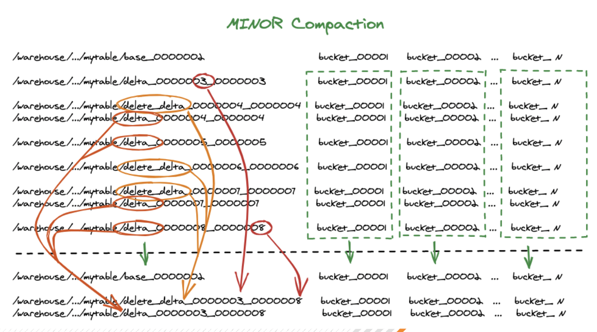

Major compaction merges old base (if exists) with deltas - creates new base .
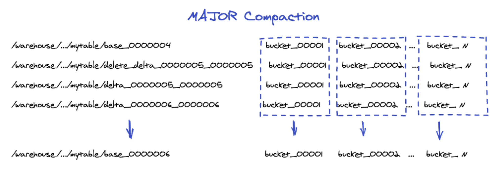

Let's see how Hive compaction works in practice.

```sql
describe formatted flights;
```
Search in the result the numFiles and numPartitions


|numFiles  |          	12  |                
|numPartitions  |     	12  |  

Now lets update the table and see the impact

```sql
update flights set taxiin = 1
where
 month = 1;

update flights set taxiin = 2
where
 month = 2;

describe formatted flights;
```

Search agin the numFiles and notice the numFiles is increased


|numFiles  |          	16  |                
|numPartitions  |     	12  |  

Now we start a manual compaction for the table partitions

```sql
alter table flights partition (month='1') compact 'major';
alter table flights partition (month='2') compact 'major';
```

This works asyncronus in the background can you can observe the status with

```sql
show compactions;
```

Results

| compactionid	| dbname | tabname | partname | type | state | workerhost | workerid | enqueuetime | starttime | duration | hadoopjobid | errormessage |
| :- | :- | :- | :- | :- | :- | :- | :-| :- | :- | :- | :- | :- |
| 1 |	airlinedata_ws	| flights	| month=2 | MAJOR | succeeded | yjnam-yakurut-oozie-master0.se-sandb.a465-9q4k.cloudera.site | 66 | 1666787018950 | 1666787023591 | 62 | None | jk.svc.cluster.local |


When the compaction is completed you can lookup the numFiles and find the reduced number.

Compaction does helps with the small file problem as it eliminates the deltas and their buckets.

Compaction does NOT reduce the number of base buckets for the table/partition and the rows don’t move between buckets (which can lead to unbalanced data skew in the bucket files). A full table rewrites would solve this issue.


### HPLSQL - Database Applications


This HPLSQL Package run a analyse by airport and list the top delayed flights in one single field (denormalized).

SQL Procedures Script - copy and paste to Hue

```sql

use airlinedata;

create or replace package airport_experience AS
 MAX_FLIGHTS int := 3;
 procedure describe();
 procedure dbg (debug_level integer, msg string);
 procedure total_arrival_delay ( IN v_iata string, OUT v_top_flights string, OUT v_totaldelay double);
 procedure generate( v_airports varchar default 'JFK');
END;

create or replace package body airport_experience AS

procedure describe () is
begin
 dbms_output.put_line('Package airport_experiences');
 dbms_output.put_line('Version: 0.0.1');
 dbms_output.put_line('Collection of prodecures to calcluate airpoort experience')
 dbms_output.put_line('prodecures : generate () no parameter')
 dbms_output.put_line('result set : table : airport_experiences')
end;

procedure dbg (debug_level integer, msg string)
is
BEGIN
declare ts string default SYSDATE;
declare lvl string default 'INFO';
if debug_level > 0
 Begin

 if debug_level > 10 SET lvl := 'ERROR';

  DBMS_OUTPUT.PUT_LINE( ts || ':' ||lvl|| ': ' || msg);
 end;
EXCEPTION WHEN OTHERS THEN
  dbg(99,'Error: procedure dbg');
end;

procedure total_arrival_delay ( IN v_iata string, OUT v_top_flights string, OUT v_totaldelay double)
is
BEGIN
  declare debug_level integer default 1;
  declare v_flight string default  '';
  declare v_sum_delay double;
  declare i int default  0;
  declare v_d double;

  DECLARE cur CURSOR FOR SELECT concat(uniquecarrier, flightnum) as flight_num, sum(arrdelay) as sum_delay
        from flights_orc
        where origin = v_iata
        group by concat(uniquecarrier,flightnum)
	having sum(arrdelay) is not null
        order by sum_delay DESC;

  dbg(debug_level, 'pro: total_arriaval_delay v_iata value: ' || v_iata || ' v_arrdelay: '||v_arr_delay );
  v_top_flights = '';

  select nvl(sum(arrdelay),0) into v_totaldelay
    from flights_orc
    where origin = v_iata;

  dbg(debug_level, 'pro: fetch total delay value: ' || v_totaldelay );


  if v_totaldelay <> 0  then
    begin
    dbg(debug_level, 'pro: delays found');

    OPEN cur;

    dbg(debug_level,'pro: cursor open');

    FETCH cur INTO  v_flight, v_sum_delay;
     WHILE SQLCODE=0 and i < MAX_FLIGHTS THEN
      set i := i + 1;

      dbg(debug_level,'pro: fetched to ' || i || ' flight : ' || v_flight );

      SET v_top_flights = v_top_flights || v_flight ||':'||v_sum_delay||';'
    FETCH cur INTO  v_flight, v_sum_delay;
   END WHILE;
   CLOSE cur;

   end;
   else
    begin
    dbg(debug_level,'pro: no delays found ');
     v_totaldelay = 0;
    end;
 end if;

dbg( debug_level,'end: top_flights: '||v_top_flights);

EXCEPTION WHEN OTHERS THEN
  dbg(99,'OTHERS: total_arrival_delay()');
END;

procedure generate( v_airports varchar default 'JFK')
IS
BEGIN
DECLARE debug_level integer default 1;
DECLARE v_iata string default 'JFK';
DECLARE v_top string default '#';
DECLARE v_total double default 0;
DECLARE v_c char;
DECLARE ts timestamp;
DECLARE v_msg string default '';

dbg(debug_level, 'main: 1 airports ' || v_airports);
select "'" into v_c;

DECLARE cur CURSOR FOR 'SELECT iata from airports_orc where iata in ( ' || v_c || v_airports || v_c || ')';

dbg(debug_level, 'main: 1');

OPEN cur;

  dbg(debug_level,'main: 2 - cursor open');

FETCH cur INTO v_iata;
WHILE SQLCODE=0 THEN
  v_top = '#';
  v_total = 0;

  dbg(debug_level,'main: 3 fetch - iata: ' || v_iata) ;
  call total_arrival_delay(v_iata,v_top,v_total );
  dbg(debug_level,  'main: 4 called proc total_arrival_delay ');

  v_msg = 'airport:'||v_iata|| ' top flights: '|| v_top ||' total delay:'||v_total;
  dbg(debug_level,  'main: 4 IN_OUT '||v_msg);
  if v_total > 0.0
    BEGIN
     insert into  airports_experiences values( v_iata, v_top, v_total);
     dbg(debug_level,  'main: 5 row inserted with SQLCODE '|| SQLCODE );
    END;

  FETCH cur INTO v_iata;
END WHILE;
CLOSE cur;

  dbg(debug_level ,'main: 5 - finished');

EXCEPTION WHEN OTHERS THEN
  dbg(99,'Error: main');
END;

end;

```

Open Hue HPL/SQL Editor and create the above package.


Now run the Analytics for a individual airport

```sql
drop table if exists airports_experiences;
create table airports_experiences(iata string, delay_top_flights string, delay_total double  ) ;
begin
 CALL airport_experience.describe();
 CALL airport_experience.generate( 'SFO');
 CALL airport_experience.generate( 'JFK');
 CALL airport_experience.generate( 'BOS');
end;
select * from airports_experiences;

```


Results

| airports_stats.iata  |        airports_stats.delay_top_flights        | airports_stats.delay_total  |
| :- | :- | :- |
| JFK                  | AA647:91067.0;AA177:87305.0;AA1639:82770.0;    | 1.0155716E7                 |
| LAX                  | DL1579:68519.0;DL1565:49367.0;WN1517:48037.0;  | 1.795024E7                  |

Create dataset for top 100 airports


```sql
drop table if exists airports_experiences;
create table airports_experiences(iata string, delay_top_flights string, delay_total double  ) ;
begin
declare c_iata string;
declare c_anz int;
declare cur cursor as select origin, count(*) anz
       from flights_orc
       group by origin
       order by anz desc
       limit 100;
open cur;
FETCH cur INTO  c_iata, c_anz;
     WHILE SQLCODE=0 THEN
     DBMS_OUTPUT.PUT_LINE( 'airport:' || c_iata || ' Anzahl Flüge:' || c_anz );
     CALL airport_experience.generate( c_iata);
    FETCH cur INTO c_iata, c_anz;
   END WHILE;
CLOSE cur;
END;
/
```


### HPLSQL - Oracle Migration


Login into a K8s pod with hiveserver2 CDW and create emp & dept tables (DDL with Oracle data type and constraints) and insert data.


SQL Procedures Script - copy and save in a file: emp.ddl

```sql

create database if not exists hplsql;
use hplsql;

drop table dept;
create table  dept(
  deptno number(2,0),
  dname  varchar2(14),
  loc    varchar2(13),
  constraint pk_dept primary key (deptno)
);

drop table emp;
create table emp(
  empno    number(4,0),
  ename    varchar2(10),
  job      varchar2(9),
  mgr      number(4,0),
  hiredate date,
  sal      number(7,2),
  comm     number(7,2),
  deptno   number(2,0),
  constraint pk_emp primary key (empno),
  constraint fk_deptno foreign key (deptno) references dept (deptno)
);
insert into dept values(10, 'ACCOUNTING', 'NEW YORK');
insert into dept values(20, 'RESEARCH', 'DALLAS');
insert into dept values(30, 'SALES', 'CHICAGO');
insert into dept values(40, 'OPERATIONS', 'BOSTON');

insert into emp values (7369,'SMITH','CLERK',7902,'1993-6-13',800,0.00,20);
insert into emp values (7499,'ALLEN','SALESMAN',7698,'1998-8-15',1600,300,30);
insert into emp values (7521,'WARD','SALESMAN',7698,'1996-3-26',1250,500,30);
insert into emp values (7566,'JONES','MANAGER',7839,'1995-10-31',2975,null,20);
insert into emp values (7698,'BLAKE','MANAGER',7839,'1992-6-11',2850,null,30);
insert into emp values (7782,'CLARK','MANAGER',7839,'1993-5-14',2450,null,10);
insert into emp values (7788,'SCOTT','ANALYST',7566,'1996-3-5',3000,null,20);
insert into emp values (7839,'KING','PRESIDENT',null,'1990-6-9',5000,0,10);
insert into emp values (7844,'TURNER','SALESMAN',7698,'1995-6-4',1500,0,30);
insert into emp values (7876,'ADAMS','CLERK',7788,'1999-6-4',1100,null,20);
insert into emp values (7900,'JAMES','CLERK',7698,'2000-6-23',950,null,30);
insert into emp values (7934,'MILLER','CLERK',7782,'2000-1-21',1300,null,10);
insert into emp values (7902,'FORD','ANALYST',7566,'1997-12-5',3000,null,20);
insert into emp values (7654,'MARTIN','SALESMAN',7698,'1998-12-5',1250,1400,30);
```
Switch to HUE and query the data.
```sql
use hplsql;
select ename, dname, job, empno, hiredate, loc  
from emp, dept  
where emp.deptno = dept.deptno  
order by ename;
```
Result

|  ename  |    dname    |    job     | empno  | hiredate    |    loc    |
|:--------|:------------|:-----------|:-------|:------------|:----------|
| ADAMS   | RESEARCH    | CLERK      | 7876   | 1999-06-04  | DALLAS    |
| ALLEN   | SALES       | SALESMAN   | 7499   | 1998-08-15  | CHICAGO   |
| BLAKE   | SALES       | MANAGER    | 7698   | 1992-06-11  | CHICAGO   |
| CLARK   | ACCOUNTING  | MANAGER    | 7782   | 1993-05-14  | NEW YORK  |
| FORD    | RESEARCH    | ANALYST    | 7902   | 1997-12-05  | DALLAS    |
| JAMES   | SALES       | CLERK      | 7900   | 2000-06-23  | CHICAGO   |
| JONES   | RESEARCH    | MANAGER    | 7566   | 1995-10-31  | DALLAS    |
| KING    | ACCOUNTING  | PRESIDENT  | 7839   | 1990-06-09  | NEW YORK  |
| MARTIN  | SALES       | SALESMAN   | 7654   | 1998-12-05  | CHICAGO   |
| MILLER  | ACCOUNTING  | CLERK      | 7934   | 2000-01-21  | NEW YORK  |
| SCOTT   | RESEARCH    | ANALYST    | 7788   | 1996-03-05  | DALLAS    |
| SMITH   | RESEARCH    | CLERK      | 7369   | 1993-06-13  | DALLAS    |
| TURNER  | SALES       | SALESMAN   | 7844   | 1995-06-04  | CHICAGO   |
| WARD    | SALES       | SALESMAN   | 7521   | 1996-03-26  | CHICAGO   |


### Data Sketches

You can use Datasketch algorithms for queries that take too long to calculate exact results due to very large data sets (e.g. number of distinct values).

You may use data sketches (i.e. HLL algorithms) to generate approximate results that are much faster to retrieve. HLL is an algorithm that gives approximate answers for computing the number of distinct values in a column. The value returned by this algorithm is similar to the result of COUNT(DISTINCT col) and the NDV function integrated with Impala.

However, HLL algorithm is much faster than COUNT(DISTINCT col) and the NDV function and is less memory-intensive for columns with high cardinality.

Create a table for data sketch columns
```sql
drop table if exists airlinedata.flights_qt_sketch;

create table airlinedata.flights_qt_sketch as
select flights_orc.uniquecarrier AS airline_code,
 count(1) as sum_flights,
 ds_quantile_doubles_sketch(cast(arrdelay+1 as double)) as sk_arrdelay
FROM airlinedata.flights_orc
where arrdelay > 0
GROUP BY uniquecarrier;

```
Fast retrieval a few rows
```sql							 
select airline_code, ds_quantile_doubles_pmf(sk_arrdelay,10,20,30,40,50,60,70,80,90,100)
from airlinedata.flights_qt_sketch;

```

|AIRLINE_CODE |	_C1 |
| :- | :- |
|AS	|[0.3603343697705233,0.26553116086244244,0.13278361 more... |
|B6	|[0.30352223997076566,0.22151105008319052,0.1250266 more...|
| ... |


Count distinct with HLL algorithm  

How many unique flights

```sql

drop table if exists airlinedata.flights_hll_sketch;							
create table airlinedata.flights_hll_sketch as
select ds_hll_sketch( cast(concat(flights_orc.uniquecarrier,flights_orc.flightnum) as string) ) AS flightnum_sk
FROM airlinedata.flights_orc;

select ds_hll_estimate(flightnum_sk)
from airlinedata.flights_hll_sketch;
```

|Results|
| :- |
|44834.13712876354|


Explain - extreme fast query a table


alternative classic query would be

```sql
select count(distinct(cast(concat(flights_orc.uniquecarrier,flights_orc.flightnum) as string)))
from airlinedata.flights_orc;
```
|Results|
| :- |
|44684|


Explain - query full fact table with going over 86mio of the fact table


#### Needle in Haystack - most frequency items - or better not on Alaska Airline Flight - AS65

Optional step. Can be just a discussion

What flights are most frequently cancelled

```sql
drop table if exists airlinedata.flights_frq_sketch; 					  
create table airlinedata.flights_frq_sketch (cancelled int, sk_flightnum binary);
insert into airlinedata.flights_frq_sketch
select flights_orc.cancelled, ds_freq_sketch( cast(concat(flights_orc.uniquecarrier,flights_orc.flightnum) as string), 8192 )
FROM airlinedata.flights_orc
GROUP BY flights_orc.cancelled;

select ds_freq_frequent_items(sk_flightnum, 'NO_FALSE_POSITIVES')
from airlinedata.flights_frq_sketch;
```

<p>Results</p><p>     </p>|


|ITEM|ESTIMATE|LOWER\_BOUND|UPPER\_BOUND|
| :- | :- | :- | :- |
|AS65|960|591|960|
|WN25|913|544|913|
|AS64|889|520|889|


validate the results

```sql
select concat(flights_orc.uniquecarrier,flights_orc.flightnum) as flight, count(1) as num_cancelled
from airlinedata.flights_orc
where uniquecarrier = 'AS' and flightnum = 65 and cancelled = 1
group by concat(flights_orc.uniquecarrier,flights_orc.flightnum)
order by num_cancelled desc;
```

Results

|FLIGHT|NUM\_CANCELLED|
| :- | :- |
|AS65|940|


### Cryptographic Functions

Hive has support for AES functions to encrypt or decrypt individual columns.

In this example we create a new table: manufactors_crypt and store the field
manufactor from the plances_orc table in a encrypted AES format. The 2nd parameter
of the aes_encrypt or aes_decrypt functions are the secret key. The sixteen
character are good for a 128bit encryption, for 256bit use 32 characters.  

```sql
drop table if exists manufactors_crypt;

create table manufactors_crypt
(id BIGINT DEFAULT SURROGATE_KEY() , description_crypt string);

INSERT into manufactors_crypt( description_crypt )
select base64( aes_encrypt(manufacturer,'1234567890123456'))
from planes_orc
where planes_orc.manufacturer
is not NULL
group by manufacturer;

SELECT description_crypt, aes_decrypt(unbase64(description_crypt),
'1234567890123456') description
from manufactors_crypt
where description_crypt is not NULL;
```

Results

|DESCRIPTION\_CRYPT|DESCRIPTIION|
| :- | :- |
|RhTzKHhSBr7RD3pGudQG3g==|	AEROSPATIALE|
|S0w4E8xFm3q1FaeKG99NAaNG7uqU2XAsD2A94p79NYk=|	AEROSPATIALE/ALENIA|
|HIL21crGdEnSYvLIqiKzNQ==|	AIRBUS|
