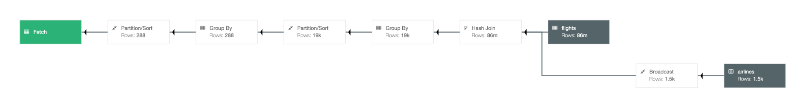
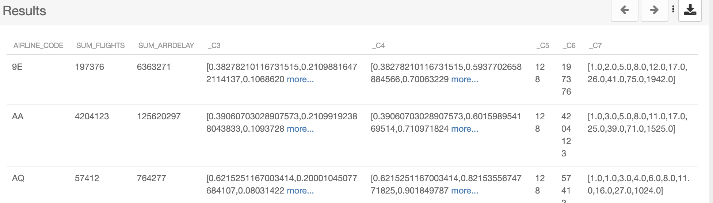
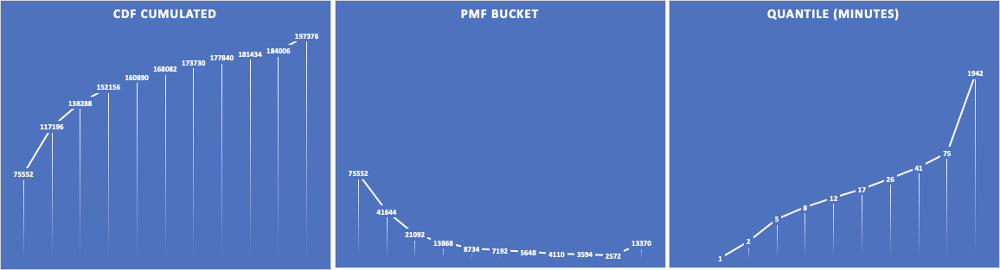

# CDW Workshops - vHoL  

Analyze Stored Data

## Introduction
This workshop gives you an overview of how to use the Cloudera Data Warehouse service to quickly explore raw data, create curated versions of the data for reporting and dashboarding, and then scale up usage of the curated data by exposing it to more users. It highlights the performance and automation capabilities that help ensure performance is maintained while controlling cost.  

Enitiy-Relation Diagram of tables we use in todays workshop: 
- fact table: flights (86mio rows) 
- dimension tables: airlines (1.5k rows), airports (3.3k rows) and planes (5k rows)


## Lab Setup


You have to set your **workload password**.

- [x] Click on username in the bottom left
- [x] Click Profile
- [x] Click “Set Workload Password” link
- [x] Then enter and confirm the password
- [x] Click “**Set Workload Password”**


-----
## Lab 1 - Create Database
*Do all these steps as the* **“db\_user001”..”db\_user020”** *unless otherwise noted.*

Navigate to Data Warehouse, then Virtual Warehouse and open the SQL Authoring tool DAS or HUE.
 
Create new database for your user to be used, or use one that is already created for you.

```sql
-- Change *** of database name
CREATE DATABASE DB_USER0**;
USE DB_USER0**;

```
Your can check your current database 
```sql
select current_database();
```
-----
## Lab 2 - External Tables

Run DDL to create four external tables on the CSV data files, which are already in cloud object storage.

```sql
drop table if exists flights_csv;
CREATE EXTERNAL TABLE flights_csv(month int, dayofmonth int, 
 dayofweek int, deptime int, crsdeptime int, arrtime int, 
 crsarrtime int, uniquecarrier string, flightnum int, tailnum string, 
 actualelapsedtime int, crselapsedtime int, airtime int, arrdelay int, 
 depdelay int, origin string, dest string, distance int, taxiin int, 
 taxiout int, cancelled int, cancellationcode string, diverted string, 
 carrierdelay int, weatherdelay int, nasdelay int, securitydelay int, 
lateaircraftdelay int) 
ROW FORMAT DELIMITED FIELDS TERMINATED BY ',' LINES TERMINATED BY '\n' 
STORED AS TEXTFILE LOCATION '/airlinedata-csv/flights' tblproperties("skip.header.line.count"="1");

drop table if exists planes_csv;
CREATE EXTERNAL TABLE planes_csv(tailnum string, owner_type string, manufacturer string, issue_date string, model string, status string, aircraft_type string, engine_type string, year int) 
ROW FORMAT DELIMITED FIELDS TERMINATED BY ',' LINES TERMINATED BY '\n' 
STORED AS TEXTFILE LOCATION '/airlinedata-csv/planes' tblproperties("skip.header.line.count"="1");

drop table if exists airlines_csv;
CREATE EXTERNAL TABLE airlines_csv(code string, description string) ROW FORMAT DELIMITED FIELDS TERMINATED BY ',' LINES TERMINATED BY '\n' 
STORED AS TEXTFILE LOCATION '/airlinedata-csv/airlines' tblproperties("skip.header.line.count"="1");

drop table if exists airports_csv;
CREATE EXTERNAL TABLE airports_csv(iata string, airport string, city string, state DOUBLE, country string, lat DOUBLE, lon DOUBLE) 
ROW FORMAT DELIMITED FIELDS TERMINATED BY ',' LINES TERMINATED BY '\n' 
STORED AS TEXTFILE LOCATION '/airlinedata-csv/airports' tblproperties("skip.header.line.count"="1");
```


Check that you created tables

```sql
SHOW TABLES;
```


Results


|TAB_NAME|
| :- |
|airlines_csv|
|airports_csv|
|flights_csv|
|planes_csv|


Run exploratory queries to understand the data. This reads the CSV data, converts it into a columnar in-memory format, and executes the query.

QUERY: Airline Delay Aggregate Metrics by Airplane

DESCRIPTION: Customer Experience Reporting showing airplanes that have the highest average delays, causing the worst customer experience.

*Do all these steps in the* **“db\_user001”..”db\_user020”** *unless otherwise noted.*

```sql
SELECT tailnum,
       count(*),
       avg(depdelay) AS avg_delay,
       max(depdelay),
       avg(taxiout),
       avg(cancelled),
       avg(weatherdelay),
       max(weatherdelay),
       avg(nasdelay),
       max(nasdelay),
       avg(securitydelay),
       max(securitydelay),
       avg(lateaircraftdelay),
       max(lateaircraftdelay),
       avg(airtime),
       avg(actualelapsedtime),
       avg(distance)
FROM flights_csv
GROUP BY tailnum
ORDER BY avg_delay DESC;
```

QUERY: Engine Types Causing Most Delays
DESCRIPTION: Ad Hoc Exploration to Investigate - Exploratory query to determine which engine type contributes to the most delayed flights.


```sql
SELECT model,
       engine_type
FROM planes_csv
WHERE planes_csv.tailnum IN
    (SELECT tailnum
     FROM
       (SELECT tailnum,
               count(*),
               avg(depdelay) AS avg_delay,
               max(depdelay),
               avg(taxiout),
               avg(cancelled),
               avg(weatherdelay),
               max(weatherdelay),
               avg(nasdelay),
               max(nasdelay),
               avg(securitydelay),
               max(securitydelay),
               avg(lateaircraftdelay),
               max(lateaircraftdelay),
               avg(airtime),
               avg(actualelapsedtime),
               avg(distance)
        FROM flights_csv
        WHERE tailnum IN ('N194JB',
                          'N906S',
                          'N575ML',
                          'N852NW',
                          'N000AA')
        GROUP BY tailnum) AS delays);

```
NOTE: If this returns no results, then remove the 'WHERE tailnum in …' clause


-----
## Lab 3 - Managed Tables

Run “CREATE TABLE AS SELECT” queries to create full ACID ORC type of the tables. This creates curated versions of the data which are optimal for BI usage.

*Do all these steps in the* **“db\_user001”..”db\_user020”** *unless otherwise noted.*

```sql
drop table if exists airlines_orc;
create table airlines_orc as select * from airlines_csv;

drop table if exists airports_orc;
create table airports_orc as select * from airports_csv;

drop table if exists planes_orc;
create table planes_orc as select * from planes_csv;

drop table if exists flights_orc;
create table flights_orc partitioned by (month) as 
select month, dayofmonth, dayofweek, deptime, crsdeptime, arrtime, crsarrtime, uniquecarrier, flightnum, tailnum, actualelapsedtime, crselapsedtime, airtime, arrdelay, depdelay, origin, dest, distance, taxiin, taxiout, cancelled, cancellationcode, diverted, carrierdelay, weatherdelay, nasdelay, securitydelay, lateaircraftdelay 
from flights_csv;

```

This takes a few minutes!

Check that you created managed & external tables

```sql
USE DB_USER0**;
SHOW TABLES;
```

Results


|TAB_NAME|
| :- |
|airlines_csv|
|airlines_orc|
|airports_csv|
|airports_orc|
|flights_csv|
|flights_orc|
|planes_csv|
|planes_orc|


Experiment with different queries to see effects of the data cache on each executor.

Run query. Highlight both “SET …” and “SELECT …” when you execute.

```sql
SET hive.query.results.cache.enabled=false;

SELECT
  SUM(flights.cancelled) AS num_flights_cancelled,
  SUM(1) AS total_num_flights,
  MIN(airlines.description) AS airline_name,
  airlines.code AS airline_code
FROM
  flights_orc flights
  JOIN airlines_orc airlines ON (flights.uniquecarrier = airlines.code)
GROUP BY
  airlines.code
ORDER BY
  num_flights_cancelled DESC;
```

Go to Queries page, then click on the query that just ran, then scroll down to DAG INFO,
choose DAG COUNTERS, then filter for 'cache', then show CACHE_MISS_BYTES and/or CACHE_HIT_BYTES. 
Take note of the query run time too.

Note:  sometimes it takes up to a few minutes for DAS to parse the query metrics and expose them in the UI.

Run query again.
Check the cache metrics again to see the improved hit rate.


-----
## Lab 4 - Materialized View

*Do all these steps in the* **“db\_user001”..”db\_user020”** *unless otherwise noted.*

Create materialized view (MV). This will cause Hive to transparently rewrite queries, when possible, to use the MV instead of the base tables.

Add constraints for better query and refresh 
```sql
ALTER TABLE airlines_orc ADD CONSTRAINT airlines_pk PRIMARY KEY (code) DISABLE NOVALIDATE;
ALTER TABLE flights_orc ADD CONSTRAINT airlines_fk FOREIGN KEY (uniquecarrier) REFERENCES airlines_orc(code) DISABLE NOVALIDATE RELY;
```
Create Materialized View
```sql
DROP MATERIALIZED VIEW IF EXISTS traffic_cancel_airlines
CREATE MATERIALIZED VIEW traffic_cancel_airlines
as SELECT airlines.code AS code,  MIN(airlines.description) AS description,
          flights.month AS month,
          sum(flights.cancelled) AS cancelled,
          count(flights.diverted) AS diverted
FROM flights_orc flights JOIN airlines_orc airlines ON (flights.uniquecarrier = airlines.code)
group by airlines.code, flights.month;
```

Check that the Materialized view is created.
Replace ** in DB_USER0**
```sql
SHOW MATERIALIZED VIEWS in DB_USER0**;
```


Incremental refresh the materialized View

*Do all these steps in the* **“db\_user001”..”db\_user020”** *unless otherwise noted.*

First create a table for incremental data 

```sql

drop table if exists flights_orc_incr;

create table flights_orc_incr
(dayofmonth int, dayofweek int, deptime int, crsdeptime int, arrtime int, 
 crsarrtime int, uniquecarrier string, flightnum int, tailnum string, 
 actualelapsedtime int, crselapsedtime int, airtime int, arrdelay int, 
 depdelay int, origin string, dest string, distance int, taxiin int, 
 taxiout int, cancelled int, cancellationcode string, diverted string, 
 carrierdelay int, weatherdelay int, nasdelay int, securitydelay int, 
 lateaircraftdelay int)
PARTITIONED BY (month int);
```
Now insert 1000 records  

```sql

insert into flights_orc_incr select 15 as month, dayofmonth, dayofweek, deptime, crsdeptime, arrtime, crsarrtime, uniquecarrier, flightnum, tailnum, actualelapsedtime, crselapsedtime, airtime, arrdelay, depdelay, origin, dest, distance, taxiin, taxiout, cancelled, cancellationcode, diverted, carrierdelay, weatherdelay, nasdelay, securitydelay, lateaircraftdelay 
from flights_orc limit 1000;
```

Insert the new data into fact table

```sql
INSERT into flights_orc select * from flights_orc_incr;
```

Update materialized view

```sql
ALTER MATERIALIZED VIEW traffic_cancel_airlines REBUILD;
```


Run dashboard query again to explore the usage of the MV. 

```sql
SET hive.query.results.cache.enabled=false;

SELECT airlines.code AS code,  MIN(airlines.description) AS description,
          flights.month AS month,
          sum(flights.cancelled) AS cancelled
FROM flights_orc flights , airlines_orc airlines 
WHERE flights.uniquecarrier = airlines.code
group by airlines.code, flights.month;
```

Disable materialized view rewrites
```sql
ALTER MATERIALIZED VIEW traffic_cancel_airlines DISABLE REWRITE;
```
Now repeat the first part of this step to see the different query plan, which no longer uses the MV.

Notice the difference in the explain 

With query rewrite read the **materialized view** : 


No query rewrite: Read flights (86mio rows) and airlines (1.5k rows) with merge join, group and sort



------
## Lab 5 - Slowly Changing Dimensions (SCD) - TYPE 2


We create a new SDC table ***airline\_scd*** table and add columns valid\_from and valid\_to. Then loading the initial 1000 rows into this SDC table. 


Next step is to mock up new data and change data in the table ***airlines\_stage***. 

Finally merging these two tables with a single MERGE command to maintain the historical data and check the results.

Create the Hive managed table for our contacts. We track a start and end date.

*Do all these steps in the* **“db\_user001”..”db\_user020”** *unless otherwise noted.*

```sql
drop table if exists airlines_scd;
create table airlines_scd(code string, description string, valid_from date, valid_to date);
```

Load initial by copy 1000 rows of current airlines table into the airlimanaged table, We hard code the valid_from dates to the beginning of 2021
```sql
insert into airlines_scd select *, cast('2021-01-01' as date), cast(null as date) from airlines_csv limit 1000;
```
Create an external table pointing to our complete airlines dataset (1491 records)

```sql
drop table if exists airlines_stage;

create table airlines_stage as select * from airlines_csv;
```

Update a description to mockup a change in the dimension
```sql
update airlines_stage set description ='SDC Demo Update' where code in ('02Q','04Q')
```

Perform the SCD type 2 Merge Command

```sql
merge into airlines_scd 
using (
 -- The base staging data.
 select
   airlines_stage.code as join_key,
   airlines_stage.* from airlines_stage
 union all
 -- Generate an extra row for changed records.
 -- The null join_key means it will be inserted.
 select
   null, airlines_stage.*
 from
   airlines_stage join airlines_scd on airlines_stage.code = airlines_scd.code
 where
   ( airlines_stage.description <> airlines_scd.description )
   and airlines_scd.valid_to is null
) sub
on sub.join_key = airlines_scd.code
when matched
 and sub.description <> airlines_scd.description 
 then update set valid_to = current_date()
when not matched
 then insert values (sub.code, sub.description, current_date(), null);
```

Confirm that te new data is updated, table should have 1493 records.

```sql
select count(*) from airlines_scd;
```

View the changed records 
```sql
select * from airlines_scd where code in ('02Q','04Q')
```


Results


|AIRLINES\_SCD.CODE|AIRLINES\_SCD.DESCRIPTION|AIRLINES\_SCD.VALID\_FROM|AIRLINES\_SCD.VALID\_TO|
| :- | :- | :- | :- |
|02Q|Titan Airways|2021-01-01|2021-05-26|
|04Q|Tradewind Aviation|2021-01-01|2021-05-26|
|02Q|SDC Demo Update|2021-05-26|null|
|04Q|SDC Demo Update|2021-05-26|null|


-----
## Lab 6 - Data Security & Governance 

The combination of the Data Warehouse with SDX offers a list of powerful features like rule-based masking columns based on a user’s role and/or group association or rule-based row filters. 

For this workshop we are going to explore Attribute-Based Access Control a.k.a. Tage-based security policies.

First we are going to create a series of tables in your work database. 

In the SQL editor, select your database and run this script:

```sql
CREATE TABLE emp_fname (id int, fname string);
insert into emp_fname(id, fname) values (1, 'Carl');
insert into emp_fname(id, fname) values (2, 'Clarence');

CREATE TABLE emp_lname (id int, lname string);
insert into emp_lname(id, lname) values (1, 'Rickenbacker');
insert into emp_lname(id, lname) values (2, 'Fender');

CREATE TABLE emp_age (id int, age smallint);
insert into emp_age(id, age) values (1, 35);
insert into emp_age(id, age) values (2, 55);

CREATE TABLE emp_denom (id int, denom char(2));
insert into emp_denom(id, denom) values (1, 'rk');
insert into emp_denom(id, denom) values (2, 'na');

CREATE TABLE emp_id (id int, empid integer);
insert into emp_id(id, empid) values (1, 1146651);
insert into emp_id(id, empid) values (2, 239125);

CREATE TABLE emp_all as
(select a.id, a.fname, b.lname, c.age, d.denom, e.empid from emp_fname a
	inner join emp_lname b on b.id = a.id
	inner join emp_age c on c.id = b.id
	inner join emp_denom d on d.id = c.id
	inner join emp_id e on e.id = d.id);

create table emp_younger as (select * from emp_all where emp_all.age <= 45);

create table emp_older as (select * from emp_all where emp_all.age > 45);
```

After this script executes, a simple

```sql
select * from emp_all;
```

… should give the contents of the emp\_all table, which only has a couple of lines of data.

For the next step we will switch to the UI of Atlas, the CDP component responsible for metadata management and governance: in the Cloudera Data Warehouse *Overview* UI, select your Virtual Warehouse to highlight the associated Database Catalog. Click on the three-dot menu of this DB catalog and select “Open Atlas” in the associated pop-up menu:


This should open the Atlas UI. CDP comes with a newer, improved user interface which can be enabled through the “Switch to Beta UI” link on the bottom right side of the screen. Do this now.

The Atlas UI has a left column which lists the Entities, Classifications, Business Metadata and Glossaries that belong to your CDP Environment.


We just created a couple of tables in the Data Warehouse, let’s look at the associated metadata. Under “Entities”, click on “hive\_db”. This should produce a list of databases.
Select you workshop database, this will result in the database’s metadata being displayed.

Select the “Tables” tab (the rightmost)


Select the “emp\_all” table from the list, this will result in Atlas displaying the metadata for this table; select the “lineage” tab:
   
This lineage graph shows the inputs, outputs as well as the processing steps resulting from the execution of our SQL code in the Data Warehouse. Clicking on one of the nodes will display a popup menu, which allows us to navigate through the lineage graph.
   Click on the “emp\_age” input table and select the link (the “guid” attribute) in the resulting popup menu:
   

In the screen that follows, select the “Schema” tab and in that table, click on the link for the “age” field:
   

[Explanation: we are now looking at the metadata page for the “age” column of the “emp\_age” table. There’s also a lineage tab here, because CDP tracks table- as well as column-based lineage for the Data Warehouse. What we want to do here: age is certainly a piece of sensitive personal information. We want to classify (‘tag’) it appropriately and then let SDX take care of treating this field as classified information that’s not visible to everyone.]

   Still in the screen for the “age” column, click on the plus sign next to “Classifications”; this will bring up a dialog:


   

   In the drop-down menu, select “PII” and make sure the “Propagate” checkbox is enabled.
   Click the “Add” button.
[This effectively means we apply the classification “PII” to the selected column and Atlas also will apply that classification to all columns that have been or will be derived from it.]

We can actually check this easily by using the lineage graph to navigate to a downstream table’s column: select one of the nodes that *don’t* have gear wheels (those are process information) and select the guid link.

This will give us the metadata for the “age” column in a derived table. Note the information on “Propagated Classifications”:
   
Try to query all columns from the “emp\_all” table again in DAS – by simply executing the last query again.
Why did we get an error now? There exists a policy in Ranger that denies all members of the hands-on lab group access to Hive data that is classified as “PII”. Let’s check that out. Like before for Atlas, open the Ranger UI via the triple-dot menu in you warehouse’s Database Catalog: 

In the Ranger UI, select the “Audit” menu and limit the amount of data displayed by specifying the filter expressions:
   Result: Denied
   Service Type: HADOOP SQL


-----
## Lab 7 - Data Visualization


1. Use Data Visualization to further explore the data set.

`	`Open DataViz 


|**Step**|**Description**|
| :-: | :- |
|1|<p>Open Data Visualization </p><p></p><p></p><p>SSO login as user with password (not prompted) </p><p></p>|
|2|<p>Overview</p><p></p>|
|3|<p>Switch to Data Tab</p><p></p><p>Initially will have no Data Models</p>|
|4|<p>Upload Data - will create new table within the Database that you are connected to</p><p></p><p></p><p></p><p>Don’t need to execute this steps, but is great to show for Self Service analytics (Data Scientists & Data Analy</p><p>sts</p>|
|5|<p>Build Data Model</p><p></p><p></p><p>Create the Semantic Layer - data is not copied</p>|
|6|<p>Select Table or use SQL</p><p></p><p></p><p></p><p></p><p></p><p></p><p>     </p><p>Ability to add as a table or enter your own pre-defined SQL</p>|
|7|<p>Edit Data Model</p><p></p><p></p><p></p><p></p><p></p>|
|8|<p>Show Fields quickly</p><p>     </p><p></p><p>Can see that it created fields for each column in the table that was selected.</p><p></p>|
|9|<p>Join Planes table with Flights table</p><p></p><p></p><p></p><p></p><p>  </p><p></p><p></p><p>` `</p>|
|10|<p>Join Airlines table with Flights table</p><p>  </p><p></p>|
|11|<p>Preview Data</p><p></p><p></p><p></p><p></p><p>Scroll right</p><p></p>|
|12|<p>Edit Fields</p><p></p><p></p><p>Before</p><p></p><p></p><p>You’ll use the following:</p><p>    </p><p></p><p>Edit Field properties</p><p></p><p></p><p>     </p><p></p><p></p><p></p><p></p><p>Create New Field</p><p> 1st clone</p><p></p><p>     </p><p></p><p></p><p></p><p>Change Display Name to “Route”</p><p></p><p></p><p>Edit Expression</p><p></p><p></p><p>Expression: </p><p>**concat( [origin],'-', [dest])**</p><p></p><p>Can Validate (to check for any errors) or Click Apply (to accept changes)</p><p> or </p>|
|13|<p>Finished Data Model</p><p></p><p></p><p></p><p>Click Save</p>|
|14|<p>Create Dashboard</p><p></p><p>` `</p>|
|15|<p>First Visual</p><p></p><p></p><p></p><p>Change Dep Delay Aggregate to Average</p><p></p><p></p><p></p><p></p><p></p><p></p><p></p><p>Change to only show Top 25 Avgs</p><p></p><p></p><p>Change Alias</p><p></p><p></p><p>Finished</p><p></p><p></p><p>Refresh Visual</p><p></p><p></p><p></p><p></p><p>Add Title & Subtitle for Dashboard</p><p></p><p></p><p>Add Title & Subtitle for this chart</p><p></p><p></p>|
|16|<p>Second Visual</p><p></p><p></p><p></p><p></p><p>Use Visual Styles to suggest charts</p><p>     </p><p></p><p>Select UniqueCarrier, Cancellationcode, Cancelled</p><p></p><p></p><p></p><p></p><p>Filter for only cancelled flights</p><p></p><p></p><p></p><p></p><p></p><p></p><p>Resize (make larger)</p><p></p><p></p><p></p><p></p><p>Add Chart Title - “Cancellation Correlation”</p>|
|17|<p>Add Prompts</p><p></p><p></p><p></p><p></p><p></p><p></p><p>Select values from prompt</p><p></p><p></p><p></p><p></p>|
|18|<p>Third Visual (optional)</p><p></p><p></p><p></p><p></p><p>Depending on user being used you may see the actual data not hashed (would need to login as Analyst user, and view this dashboard)</p><p></p><p> </p><p></p><p>or </p><p></p><p></p><p></p><p>View Tooltips (click Dep Delay value)</p><p></p><p>Use to show the Ranger security policy taking effect</p><p></p><p></p>|
|19|<p>Save Dashboard</p><p></p><p></p><p></p>|
|20|<p>View Dashboard</p><p> click on visuals tab </p><p></p><p></p><p></p><p>Click on Dashboard</p><p></p><p></p><p></p>|

||
| :- |


-----
## (Optional Bonus Material)
Run load test to simulate adding many more end users. Then view results of autoscaling. Discuss how autoscaling works, and how it allows for easy, cost-effective scaling. 

|-- Optional step. Can be just a discussion if no load test is actually done.|
| :- |

Discuss how workload aware autoscaling runs ETL style queries on dedicated executor group to not interfere with shorter queries. 

|<p>-- Start the creation process for a Hive VW and see the **“Query Isolation” option.**</p><p>-- No need to continue to create the VW.</p>|
| :- |

Clean Up 
```sql
DROP DATABASE DBB_USER0** CASCADE;
```

### Data Sketches

Create a table for data sketch columns
```sql
drop table if exists airlinedata.flights_airlines_sk;

create table airlinedata.flights_airlines_sk as
select flights_orc_partitioned.uniquecarrier AS airline_code,
 count(1) as sum_flights,
 sketch.qt_data2sketch(cast(arrdelay as double)) as sk_arrdelay
FROM airlinedata.flights_orc
where arrdelay > 0
GROUP BY uniquecarrier;
							
```
Fast retrieval a few rows 
```sql
select airline_code,sum_flights,sum_arrdelay,
	  sketch.qt_getPmf(sk_arrdelay,10,20,30,40,50,60,70,80,90,100),			
	  sketch.qt_getCdf(sk_arrdelay,10,20,30,40,50,60,70,80,90,100),
	  sketch.qt_getK(sk_arrdelay),						
	  sketch.qt_getN(sk_arrdelay)	
from airlinedata.flights_airlines_sk
group by airline_code
```



```sql
drop view if exists airlinedata.vw_flights_sk_airlines;
create view airlinedata.vw_flights_sk_airlines as					
select airline_code, 
   sum_flights, sum_arrdelay, min_arrdelay, max_arrdelay, avg_arrdelay,
   sketch.qt_getQuantile(sk_arrdelay,0.1) as arrival_delay_10,
   sketch.qt_getQuantile(sk_arrdelay,0.2) as arrival_delay_20,
   sketch.qt_getQuantile(sk_arrdelay,0.3) as arrival_delay_30,
   sketch.qt_getQuantile(sk_arrdelay,0.4) as arrival_delay_40,
   sketch.qt_getQuantile(sk_arrdelay,0.5) as arrival_delay_50,
   sketch.qt_getQuantile(sk_arrdelay,0.6) as arrival_delay_60,
   sketch.qt_getQuantile(sk_arrdelay,0.7) as arrival_delay_70,
   sketch.qt_getQuantile(sk_arrdelay,0.8) as arrival_delay_80,
   sketch.qt_getQuantile(sk_arrdelay,0.9) as arrival_delay_90,
   sketch.qt_getQuantile(sk_arrdelay,1.0) as arrival_delay_100
from airlinedata.flights_airlines_sk;

select * from airlinedata.vw_flights_sk_airlines;
```

PDF / CDF - Airline Histogram -  create Distribution Histograms (here as Excel) 




Count distinct with HLL algorithm  


Optional step how many unique flights 

```sql
create table airlinedata.flights_sketch as
select sketch.hll_data2sketch( cast(concat(flights_orc.uniquecarrier,flights_orc.flightnum) as string) ) AS flightnum_sk
FROM airlinedata.flights_orc;

select sketch.hll_estimate(flightnum_sk)
from airlinedata.flights_sketch;
```

<p>Results</p><p>     </p>|
| :- |

|44834.13712876354|
| :- |

||
| :- |

Explain - extreme fast query a table 


alternative classic query would be

```sql
select count(distinct(cast(concat(flights\_orc.uniquecarrier,flights\_orc.flightnum) as string))) from airlinedata.flights_orc;
```
</p><p>Results</p><p>     </p>|
| :- |

|44684|
| :- |

||
| :- |

Explain - query full fact table with going over 86mio of the fact table


#### Needle in Haystack - most frequency items - or better not on Alaska Airline Flight - AS65

Optional step. Can be just a discussion

What flights are most frequently cancelled

```sql
drop table if exists airlinedata.flights_frq_sketch; 					  
create table airlinedata.flights_frq_sketch (cancelled int, sk_flightnum binary);
insert into airlinedata.flights_frq_sketch 
select flights_orc.cancelled, sketch.frq_data2sketch( cast(concat(flights_orc.uniquecarrier,flights_orc.flightnum) as string), 8192 )
FROM airlinedata.flights_orc
GROUP BY flights_orc.cancelled;
							
select sketch.frq_get_items(sk_flightnum, 'NO_FALSE_POSITIVES')
from airlinedata.flights_frq_sketch;
```

<p>Results</p><p>     </p>|
| :- |

|ITEM|ESTIMATE|LOWER\_BOUND|UPPER\_BOUND|
| :- | :- | :- | :- |
|AS65|957|586|957|
|WN25|929|558|929|
|AS64|884|513|884|

||
| :- |


validate the results

```sql
select concat(flights_orc.uniquecarrier,flights_orc.flightnum) as flight, 
       count(1) as num_cancelled
from airlinedata.flights_orc 
where flightnum = 65 and cancelled = 1
group by concat(flights_orc.uniquecarrier,flights_orc.flightnum)
order by num_cancelled desc;
```

|FLIGHT|NUM\_CANCELLED|
| :- | :- |
|AS65|940|
|TW65|111|
|US65|74|

||
| :- |


