# CDW Workshops - Hands on Workshop

Analyze Stored Data with Trino and Iceberg

## Introduction
This workshop gives you an overview of how to use the Cloudera Data Warehouse service to quickly explore raw data, create curated versions of the data for reporting and dashboarding, and then scale up usage of the curated data by exposing it to more users. It highlights the performance and automation capabilities that help ensure performance is maintained while controlling cost.  

Star Schema Diagram of tables we use in todays workshop:
- fact table: flights (86mio rows)
- dimension tables: airlines (1.5k rows), airports (3.3k rows) and planes (5k rows)
- federation table: customer_complains (50k rows)


-----
## Lab 1 - Create Schema

Navigate to Data Warehouse, then Trino Virtual Warehouse and open the HUE SQL Authoring tool.

Create new schema for your user to be used, or use one that is already created for you.

```sql
-- 1. Create the schema in the catalogs for Hive and Iceberg
CREATE SCHEMA db_user001;

-- 2. Switch your session context to the Iceberg catalog and your new schema
USE iceberg.db_user001;

-- 3. Verify your context (should show 'iceberg' and 'db_user0')
SELECT current_catalog, current_schema;

```
-----
## Lab 2 - External Tables

Run DDL to create four external tables on the CSV data files, which are already in cloud object storage.

```sql
-- 1. Planes Table
DROP TABLE IF EXISTS hive.${your_dbname}.flights_csv;
CREATE TABLE hive.${your_dbname}.flights_csv (
    month VARCHAR,
    dayofmonth VARCHAR,
    dayofweek VARCHAR,
    deptime VARCHAR,
    crsdeptime VARCHAR,
    arrtime VARCHAR,
    crsarrtime VARCHAR,
    uniquecarrier VARCHAR,
    flightnum VARCHAR,
    tailnum VARCHAR,
    actualelapsedtime VARCHAR,
    crselapsedtime VARCHAR,
    airtime VARCHAR,
    arrdelay VARCHAR,
    depdelay VARCHAR,
    origin VARCHAR,
    dest VARCHAR,
    distance VARCHAR,
    taxiin VARCHAR,
    taxiout VARCHAR,
    cancelled VARCHAR,
    cancellationcode VARCHAR,
    diverted VARCHAR,
    carrierdelay VARCHAR,
    weatherdelay VARCHAR,
    nasdelay VARCHAR,
    securitydelay VARCHAR,
    lateaircraftdelay VARCHAR,
    year VARCHAR
)
WITH (
    format = 'CSV',
    csv_separator = ',',
    external_location = 's3a://goes-se-sandbox/data/airlinedata-csv/flights',
    skip_header_line_count = 1
);

-- 2. Planes Table
DROP TABLE IF EXISTS hive.${your_dbname}.planes_csv;
CREATE TABLE hive.${your_dbname}.planes_csv (
    tailnum VARCHAR,
    owner_type VARCHAR,
    manufacturer VARCHAR,
    issue_date VARCHAR,
    model VARCHAR,
    status VARCHAR,
    aircraft_type VARCHAR,
    engine_type VARCHAR,
    year VARCHAR -- Changed from INTEGER to VARCHAR
)
WITH (
    format = 'CSV',
    csv_separator = ',',
    external_location = 's3a://goes-se-sandbox/data/airlinedata-csv/planes',
    skip_header_line_count = 1
);

-- 3. Airlines Table
DROP TABLE IF EXISTS hive.${your_dbname}.airlines_csv;
CREATE TABLE hive.${your_dbname}.airlines_csv (
    code VARCHAR,
    description VARCHAR
)
WITH (
    format = 'CSV',
    csv_separator = ',',
    external_location = 's3a://goes-se-sandbox/data/airlinedata-csv/airlines',
    skip_header_line_count = 1
);

-- 4. Airports Table
DROP TABLE IF EXISTS hive.${your_dbname}.airports_csv;
CREATE TABLE hive.${your_dbname}.airports_csv (
    iata VARCHAR,
    airport VARCHAR,
    city VARCHAR,
    state VARCHAR,
    country VARCHAR,
    lat VARCHAR,
    lon VARCHAR
)
WITH (
    format = 'CSV',
    csv_separator = ',',
    external_location = 's3a://goes-se-sandbox/data/airlinedata-csv/airports',
    skip_header_line_count = 1
);

```


Check that you created tables

```sql
SHOW TABLES;
```


Results


|TAB_NAME|
| :- |
|airlines_csv|
|airports_csv|
|flights_csv|
|planes_csv|

Query external tables to see few samples pointing to the right files

```sql
SELECT
  *
FROM  
  hive.${your_dbname}.airports_csv
LIMIT 3;
```

Results


|airports_csv.iata | airports_csv.airport |airports_csv.city |airports_csv.country |airports_csv.lat| airports_csv.lon|
| :- | :- | :- | :- | :- | :- |
|00M	|Thigpen	|Bay Springs |USA	|31.95376472	|-89.23450472 |
|00R	|Livingston Municipal	|Livingston |USA	|30.68586111	|-95.0179277 |
|00V	|Meadow Lake |Colorado Springs |USA	|38.94574889	|-104.5698933 |


Run exploratory queries to understand the data. This reads the CSV data, converts it into a columnar in-memory format, and executes the query.

QUERY: Airline Delay Aggregate Metrics by Airplane.

DESCRIPTION: Customer Experience Reporting showing airplanes that have the highest average delays, causing the worst customer experience.

*Do all these steps in the* **“db\_user001”..”db\_user020”** *unless otherwise noted.*

```sql
SELECT
  tailnum,
  count(*) as flights_count,
  -- 1. NULLIF turns '' into NULL
  -- 2. CAST turns NULL (or the string) into an INTEGER
  -- 3. COALESCE turns that resulting NULL into 0
  sum(coalesce(cast(nullif(depdelay, '') as integer), 0)) AS departure_delay_minutes,

  sum(case when coalesce(cast(nullif(depdelay, '') as integer), 0) > 0 then 1 else 0 end) as departure_delay_count
FROM
  hive.${your_dbname}.flights_csv
GROUP BY
  tailnum
ORDER BY
  departure_delay_minutes DESC
LIMIT 5;
```
Note: Running the first time may take some time.

Results

|tailnum	| flights_count | departure_delay_minutes |	 departure_delay_count|
| :- | :- | :- | :- |
|N381UA	| 25287 |341368 | 12280	|
|N375UA	| 25147 |341103	| 12162 |
|N673	| 30616 |333744	| 12835	|
|N366UA	| 24808 |331318	| 12113	|
|N377UA	| 25105 |328546	| 12163	|


-----
## Lab 3 - Iceberg Tables

Run “CREATE TABLE AS SELECT” queries to create full features ICEBERG v2 type of the tables. This creates curated versions of the data which are optimal for BI usage.

*Do all these steps in * **“iceberg.db\_user001”..”db\_user020”**

```sql
-- 1. Airlines Table
DROP TABLE IF EXISTS iceberg.${your_dbname}.dim_airlines;
CREATE TABLE iceberg.${your_dbname}.dim_airlines
WITH (format = 'PARQUET')
AS
SELECT
    code,
    description
FROM hive.${your_dbname}.airlines_csv;

-- 2. Airports Table
DROP TABLE IF EXISTS iceberg.${your_dbname}.dim_airports;
CREATE TABLE iceberg.${your_dbname}.dim_airports
WITH (format = 'PARQUET')
AS
SELECT
    iata,
    airport,
    city,
    state,
    country,
    CAST(lat AS DOUBLE) as lat,
    CAST(lon AS DOUBLE) as lon
FROM hive.${your_dbname}.airports_csv;

-- 3. Planes Table
DROP TABLE IF EXISTS iceberg.${your_dbname}.dim_planes;
CREATE TABLE iceberg.${your_dbname}.dim_planes
WITH (format = 'PARQUET')
AS
SELECT
    tailnum, owner_type, manufacturer, issue_date, model,
    status, aircraft_type, engine_type,
    CAST(NULLIF(year, '') AS INTEGER) as year
FROM hive.${your_dbname}.planes_csv;

-- 4. Flights Table (Partitioned by Year)
DROP TABLE IF EXISTS iceberg.${your_dbname}.fct_flights;
CREATE TABLE iceberg.${your_dbname}.fct_flights
WITH (
    format = 'PARQUET',
    partitioning = ARRAY['year']
)
AS
SELECT
    CAST(NULLIF(year, '') AS INTEGER) as year,
    CAST(NULLIF(month, '') AS INTEGER) as month,
    CAST(NULLIF(dayofmonth, '') AS INTEGER) as dayofmonth,
    CAST(NULLIF(dayofweek, '') AS INTEGER) as dayofweek,
    CAST(NULLIF(deptime, '') AS INTEGER) as deptime,
    CAST(NULLIF(crsdeptime, '') AS INTEGER) as crsdeptime,
    CAST(NULLIF(arrtime, '') AS INTEGER) as arrtime,
    CAST(NULLIF(crsarrtime, '') AS INTEGER) as crsarrtime,
    uniquecarrier,
    CAST(NULLIF(flightnum, '') AS INTEGER) as flightnum,
    tailnum,
    CAST(NULLIF(actualelapsedtime, '') AS INTEGER) as actualelapsedtime,
    CAST(NULLIF(crselapsedtime, '') AS INTEGER) as crselapsedtime,
    CAST(NULLIF(airtime, '') AS INTEGER) as airtime,
    CAST(NULLIF(arrdelay, '') AS INTEGER) as arrdelay,
    CAST(NULLIF(depdelay, '') AS INTEGER) as depdelay,
    origin,
    dest,
    CAST(NULLIF(distance, '') AS INTEGER) as distance,
    CAST(NULLIF(taxiin, '') AS INTEGER) as taxiin,
    CAST(NULLIF(taxiout, '') AS INTEGER) as taxiout,
    CAST(NULLIF(cancelled, '') AS INTEGER) as cancelled,
    cancellationcode,
    diverted,
    CAST(NULLIF(carrierdelay, '') AS INTEGER) as carrierdelay,
    CAST(NULLIF(weatherdelay, '') AS INTEGER) as weatherdelay,
    CAST(NULLIF(nasdelay, '') AS INTEGER) as nasdelay,
    CAST(NULLIF(securitydelay, '') AS INTEGER) as securitydelay,
    CAST(NULLIF(lateaircraftdelay, '') AS INTEGER) as lateaircraftdelay
FROM hive.${your_dbname}.flights_csv;

```

This takes a few minutes to read and write the data back.

Check that you created managed & external tables

```sql
SHOW TABLES;
```

Results

|TAB_NAME|
| :- |
|airlines_csv|
|dim_airlines|
|airports_csv|
|dim_airports|
|flights_csv|
|fct_flights|
|planes_csv|
|dim_planes|

The shows detailed information about the table.

 ```sql
DESCRIBE iceberg.${your_dbname}.fct_flights ;
 ```
Result: column names with types

|col_name| data_type| comment|
| :- | :- |:- |
|year| integer | |
|month| integer | |
|dayofmonth| integer | |
|dayofweek| integer | |
...

Show column statistics of the created iceberg table.

 ```sql
SHOW STATS FOR iceberg.${your_dbname}.fct_flights;
 ```

Result: column data statistics

|#|column_name|data_size|distinct_values_count|nulls_fraction|row_count|low_value|high_value|
| :- |:- |:- |:- |:- |:- |:- |:- |
|1|year|NULL|14|0|NULL|1995|2008|
|2|month|NULL|12|0|NULL|1|12|
|3|dayofmonth|NULL|31|0|NULL|1|31|
|4|dayofweek|NULL|7|0|NULL|1|7|
|5|deptime|NULL|1619|0.0218189|NULL|1|2318|
|6|crsdeptime|NULL|1293|0|NULL|1|1927|
...

You see statistics immediately after create table as select (CTAS) in Trino's Iceberg connector is due to a specific feature called "Collect on Write."

Looking deeper into the partitioning as in Apache Iceberg, partitions are tracked in Manifest Files. Trino isn't touching your data files at all; it is performing a high-speed metadata-only read.

Lets look deeper into partitions of the "fct_flights" table:

 ```sql
 SELECT partition, record_count, file_count, total_size   
 FROM iceberg.${your_dbname}."fct_flights$partitions"
 ORDER BY partition;
 ```
Result: showing all 14 partitions with keys (years)

|partition |      record_count|    file_count   |   total_size|
| :- |:- |:- |:- |
|[1995] | 5327435 |5      | 57774143|
|[1996] | 5351983 |7      | 58347109|
|[1997] | 5411843 |7      | 59631458|
|[1998] | 5384721 |6      | 59213838|
...

Uniform File Distribution: You have roughly 5 to 7 files per partition for ~5M to 7M rows. This is a very "healthy" distribution. These files are relatively small (under 100MB), Trino's can pull these files into memory, decompress the columns, and process them in parallel across your worker nodes effortlessly.


Experiment with different queries to see effects of the columnar storage format and cache.

QUERY: Airline Delay Aggregate Metrics by Airplane on managed table

```sql
SELECT
  tailnum,
  count(*) as flights_count,
  -- COALESCE is the Trino/Standard SQL
  sum(coalesce(depdelay, 0)) AS departure_delay_minutes,
  -- Adding ELSE 0 ensures the SUM handles non-matches as zero
  sum(case when coalesce(depdelay, 0) > 0 then 1 else 0 end) as departure_delay_count
FROM
  iceberg.${your_dbname}.fct_flights
GROUP BY
  tailnum
ORDER BY
  departure_delay_minutes DESC
LIMIT 5;
```

Results (same as previous query)
|tailnum	| flights_count | departure_delay_minutes |	 departure_delay_count|
| :- | :- | :- | :- |
|N381UA	| 25287 |341368 | 12280	|
|N375UA	| 25147 |341103	| 12162 |
|N673	| 30616 |333744	| 12835	|
|N366UA	| 24808 |331318	| 12113	|
|N377UA	| 25105 |328546	| 12163	|


The "Airline Marathon" Common Table Expression (CTE) structure

This is a CTE-type query (using the WITH clause). It first calculates the top 5 airlines by total mileage in an initial sub-block, then joins that result to the flight data to find the single longest route for each.

```sql
WITH TopAirlines AS (
    -- Identify the 5 airlines with the most total mileage
    SELECT
        uniquecarrier,
        SUM(distance) as total_fleet_miles
    FROM iceberg.${your_dbname}.fct_flights
    WHERE cancelled = 0
    GROUP BY 1
    ORDER BY 2 DESC
    LIMIT 5
),
LongestFlights AS (
    -- Find the max distance flight for those specific airlines
    SELECT
        a.description AS airline_name,
        f.origin,
        f.dest,
        f.distance,
        f.airtime,
        -- Rank flights within each airline by distance
        ROW_NUMBER() OVER(PARTITION BY a.description ORDER BY f.distance DESC) as rank_id
    FROM iceberg.${your_dbname}.fct_flights f
    JOIN iceberg.${your_dbname}.dim_airlines a ON f.uniquecarrier = a.code
    WHERE a.code IN (SELECT uniquecarrier FROM TopAirlines)
)
SELECT
    airline_name,
    origin || ' to ' || dest AS route,
    distance AS marathon_miles,
    airtime AS duration_minutes
FROM LongestFlights
WHERE rank_id = 1
ORDER BY marathon_miles DESC;
```

Expected Output:

| airline_name |	route	| marathon_miles |	duration_minutes |
| :- | :- | :- | :- |
| Delta Air Lines Inc.	| ATL to HNL |	4502 |	564 |
| United Air Lines Inc. |	ORD to HNL |	4243	| 533 |
| American Airlines Inc. |	ORD to HNL |	4243 |	505 |
| US Airways Inc. (Merged with America West 9/05. Reporting for both starting 10/07.)	| LIH to PHX |	2979	| 344 |
| Southwest Airlines Co. |	OAK to PHL |	2510 | 292 |


### Geospatial Query - optional

Trino's geospatial functions convert raw latitude and longitude data into a relational graph of physical proximity, enabling distance calculations and point-in-polygon joins across federated data sources.

This query identifies all airports within a 50-kilometer radius of San Francisco International Airport (SFO) by dynamically retrieving SFO's coordinates and calculating the spherical distance to every other airport in the table using a geospatial join.

```sql
WITH reference_point AS (
    -- Get the base coordinates for SFO
    SELECT
        lat AS ref_lat,
        lon AS ref_lon
    FROM iceberg.${your_dbname}.dim_airports
    WHERE iata = 'SFO'
)
SELECT
    a.iata,
    a.airport,
    a.city,
    -- Calculate distance using built-in Great Circle function
    ROUND(great_circle_distance(a.lat, a.lon, r.ref_lat, r.ref_lon), 2) AS distance_km
FROM
    iceberg.${your_dbname}.dim_airports a
CROSS JOIN
    reference_point r
WHERE
    -- Filter within 50km radius
    great_circle_distance(a.lat, a.lon, r.ref_lat, r.ref_lon) <= 50
    AND a.iata != 'SFO' -- Exclude the origin point
ORDER BY
    distance_km ASC;
```

Expect output

| iata	| airport	| city	|	distance_km
| :- | :- | :- |:- |
|HAF |	Half Moon Bay	|Half Moon Bay	|	16.14 |
|SQL |	San Carlos |	San Carlos		| 16.25 |
|OAK | Metropolitan Oakland | International	Oakland	|	17.7 |
|HWD |	Hayward Executive |	Hayward		| 22.67 |
|PAO |	Palo Alto Arpt of Santa Clara Co |	Palo Alto	|	28.86 |
|SJC |	San Jose International |	San Jose	|	48.63 |
|LVK | Livermore Municipal	| Livermore	|	49.51 |
|CCR |	Buchanan	| Concord	|	49.79 |


### Surrogate Key - optional

Trino can use UUID as surrogate keys easy & distributable & fast, but not in sequence and has gaps.

```sql
DROP TABLE IF EXISTS iceberg.${your_dbname}.dim_airlines_with_surrogate_key;

CREATE TABLE iceberg.${your_dbname}.dim_airlines_with_surrogate_key (
    -- Generates a 128-bit unique identifier string
    id VARCHAR,
    code VARCHAR,
    description VARCHAR
);

INSERT INTO iceberg.${your_dbname}.dim_airlines_with_surrogate_key (id, code, description)
SELECT
  cast( uuid() as varchar),
  code, description
FROM
  hive.${your_dbname}.airlines_csv;

SELECT
 *
FROM  
 iceberg.${your_dbname}.dim_airlines_with_surrogate_key
ORDER BY
 id
LIMIT 3;
```

Result:

|id	| code |	 description|
| :- | :- | :- |
|0089fbea-c17d-4754-88e3-a9aa391bd45a	| AC |	Air Canada |
|009d2fa7-41f5-4fd0-88c7-74303407fe31 |	BAC	| Business Aircraft Corp. |
|0103f5b3-d9be-455e-ab9d-0dcb2531196a	| ECR	| East Coast Airways |

Note: the first column is the new unique SURROGATE_KEY

### Create a SEQUENCE - optional

```sql
-- 1. Create the target table structure
DROP TABLE IF EXISTS iceberg.${your_dbname}.airlines_with_seq;

CREATE TABLE iceberg.${your_dbname}.airlines_with_seq (
    id BIGINT,
    code VARCHAR,
    description VARCHAR
);

-- 2. Insert with a gapless sequence
INSERT INTO iceberg.${your_dbname}.airlines_with_seq (id, code, description)
SELECT
    row_number() OVER () AS id, -- This generates the gapless 1, 2, 3...
    code,
    description
FROM
    iceberg.${your_dbname}.airlines_csv;

-- 3. Verify
SELECT * FROM iceberg.${your_dbname}.airlines_with_seq ORDER BY id LIMIT 3;
```

Result:

|id	| code | description|
| :- | :- | :- |
|1 |02Q |Titan Airways |
|2 |04Q |Tradewind Aviation |
|3 |05Q |Comlux Aviation |

------


## Lab 4 - Snapshots

In Apache Iceberg, a Snapshot represents the state of a table at a specific point in time. Every write operation (Append, Delete, Overwrite, or Optimize) creates a new snapshot, which acts as a complete, immutable version of the dataset

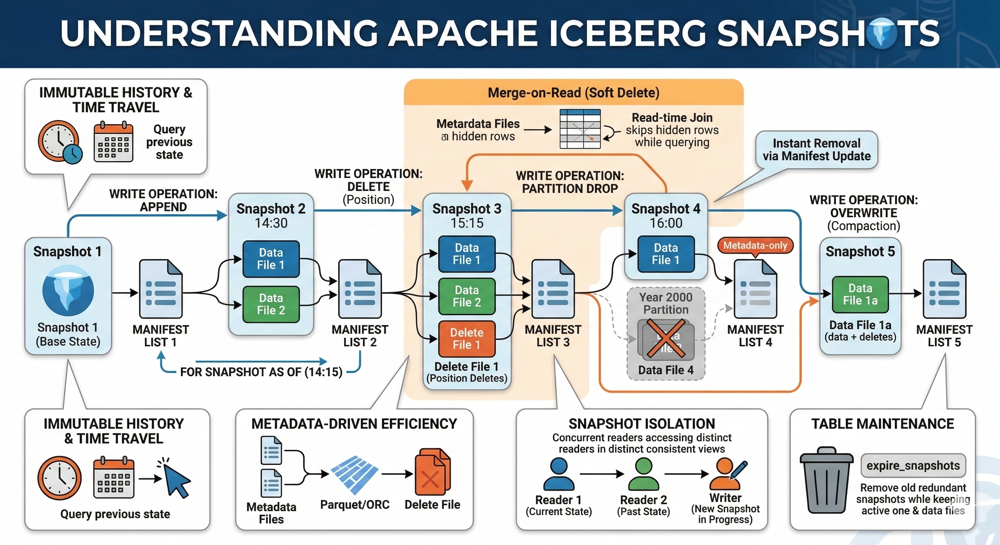

### Merge-on-Read (Position Deletes).

We will delete rows and optimize the table that is configured for Merge-on-Read (MoR) using Position Deletes.

Trino will write a few tiny .parquet files (the position deletes) to hide the rows.

Later the we then perform a "compaction," which is essentially a delayed Copy-on-Write. It took the data + the position deletes and wrote a new "clean" data file.

Trino defaults to Merge-on-Read for Iceberg v2 tables because it allows for near-instant deletions. If you were forced into Copy-on-Write for an 86-million-row table, every single DELETE would take minutes as it rewrote gigabytes of data. With MoR, the delete takes milliseconds, and you "pay the tax" later during the optimize step.

Delete a few days in Jan 1995.

```sql
/*
** delete few days of data
*/
DELETE FROM iceberg.${your_dbname}.fct_flights
WHERE
 year = 1995 and month = 1 and dayofmonth in (1,2,3);
```
Expected Output:

 | rows |
 | :- |
 | 45202 |

Soft delete: 45k rows marked for deletion wrote in a few tiny .parquet files (the position deletes) to hide the rows.

This query shows the number of delete files and the number of rows (added-position-deletes)

```sql
WITH LastDeleteSnapshot AS (
    -- Find the most recent snapshot ID that added delete files
    SELECT snapshot_id
    FROM iceberg.${your_dbname}."fct_flights$snapshots"
    WHERE operation IN ('overwrite', 'delete')
       OR CAST(summary['total-delete-files'] AS INTEGER) > 0
    ORDER BY committed_at DESC
    LIMIT 1
)
SELECT
    s.snapshot_id,
    s.committed_at,
    s.operation,
    -- Flatten the map into a vertical list
    metric.name AS metric_name,
    metric.value AS metric_value
FROM
    iceberg.${your_dbname}."fct_flights$snapshots" s
CROSS JOIN
    UNNEST(s.summary) AS metric(name, value)
JOIN
    LastDeleteSnapshot lds ON s.snapshot_id = lds.snapshot_id
WHERE
    metric.name in ('added-position-delete-files','added-position-deletes','deleted-data-files','deleted-records')
ORDER BY
    metric.name ASC;
```
Expected output:

| snapshot_id |	committed_at | operation |	metric_name |	metric_value |
| :- | :- | :- | :- | :- |
| 3769149312242635307	| 2026-03-05 18:42:44.182 UTC | delete |	added-position-delete-files |	6 |
| 3769149312242635307	| 2026-03-05 18:42:44.182 UTC	| delete | added-position-deletes |	45202 |

What happened: Since you only targeted a few days, Trino didn't want to rewrite the large data files for that month. Instead, it created 4 Position Delete files.

The "Mask": The total-records remained at 86,289,323. The rows aren't gone; they are just "hidden" by the 4 new delete files. Every time you read this table now, Trino has to perform a real-time join to skip those 45k rows.

### Partition Drop (Metadata-only).

When you delete a whole partition (like year = 2000), Trino performs a metadata-only operation by simply unlinking the relevant data files from the table’s manifest.

This process is nearly instantaneous and highly efficient because it physically removes millions of records without rewriting a single byte of data.

Delete the entire year 2000.

```sql
/*
** delete a full year of data (one partition)
*/
DELETE FROM iceberg.${your_dbname}.fct_flights
WHERE
 year = 2000;
```

Expected output:
| rows |
| :- |
| 5683047 |


This query shows the number of delete files and the number of rows (deleted-records)

```sql
WITH LastDeleteSnapshot AS (
    -- Find the most recent snapshot ID that added delete files
    SELECT snapshot_id
    FROM iceberg.${your_dbname}."fct_flights$snapshots"
    WHERE operation IN ('overwrite', 'delete')
       OR CAST(summary['total-delete-files'] AS INTEGER) > 0
    ORDER BY committed_at DESC
    LIMIT 1
)
SELECT
    s.snapshot_id,
    s.committed_at,
    s.operation,
    -- Flatten the map into a vertical list
    metric.name AS metric_name,
    metric.value AS metric_value
FROM
    iceberg.${your_dbname}."fct_flights$snapshots" s
CROSS JOIN
    UNNEST(s.summary) AS metric(name, value)
JOIN
    LastDeleteSnapshot lds ON s.snapshot_id = lds.snapshot_id
WHERE
    metric.name in ('added-position-delete-files','added-position-deletes','deleted-data-files','deleted-records')
ORDER BY
    metric.name ASC;
```
Expected output:

| snapshot_id	| committed_at |	operation	| metric_name	| metric_value |
| :- | :- | :- | :- | :- |
|1282395553745806941 |	2026-03-05 19:05:15.600 UTC |	delete |	deleted-data-files |	7 |
|1282395553745806941 |	2026-03-05 19:05:15.600 UTC	| delete	 | deleted-records |	5683047 |

What happened: This was a "massive" cleanup. Because your table is partitioned by year, Trino realized it didn't need to write any delete files or rewrite any data. It simply unlinked the files belonging to that year.

Actual Removal: Unlike the first query, the total-records dropped significantly from ~86M down to ~80.6M.

Performance: This is the fastest type of delete in the big data world. It’s nearly instantaneous because it only updates the metadata manifest to say "ignore these 7 files."

The deleted rows are marked into files and keeps the rows in the original data file or in other words the delete rows are not removed from the data files.

What is most interesting here is that you have captured two completely different physical behaviors in Iceberg, triggered by how much data you were deleting. Trino automatically switched between Merge-on-Read (using Delete Files) and Metadata-only Deletion (dropping whole partitions).

### Snapshots Maintenance

To remove the unused data we now expire the snapshots and remove the data pyhsically. After the optimize is done, the old files (the ones with the deleted rows) still sit on S3/HDFS for a few days in case you want to "Time Travel" back. If you want to save storage space immediately, you can follow up with:

```sql
/*
** expire all snapshots that will remove all unused the data and delete files
*/

-- Removes the old, unoptimized physical files from storage
ALTER TABLE iceberg.${your_dbname}.fct_flights
EXECUTE expire_snapshots(retention_threshold => '0d');
```
Expected outcome:

TrinoUserError(type=USER_ERROR, name=INVALID_PROCEDURE_ARGUMENT, message="Retention specified (0.00d) is shorter than the minimum retention configured in the system (7.00d). Minimum retention can be changed with iceberg.expire_snapshots.min-retention configuration property or iceberg.expire_snapshots_min_retention session property", query_id=20260305_191945_00444_dffp9)

### Table Rollback

The final step is the Rollback, which restores your table to its original state by resetting the metadata "pointer" to the very first snapshot.

By pointing the table back to its "birth" snapshot, you effectively ignore every deletion and optimization performed since the initial load, causing all original records to reappear instantly.


Start finding the Origin: Your query identifies the unique Snapshot ID when created today. Since parent_id is NULL, this is the definitive "root" of the table's history.


```sql
SELECT
    snapshot_id,
    committed_at,
    operation,
    summary['added-records'] AS rows_ingested
FROM
    iceberg.${your_dbname}."fct_flights$snapshots"
WHERE
    parent_id IS NULL
    AND operation = 'append'
ORDER BY
    committed_at ASC
LIMIT 1;
```

Expected outcome:
| snapshot_id	| committed_at |	operation	| rows_ingested |
| :- | :- | :- | :- |
| 5979788703124072168	| 2026-03-05 19:01:40.585 UTC |	append |	86289323 |

The Rollback Call: The CALL iceberg.system.rollback_to_snapshot(...) is a metadata-only operation. It doesn't move data; it simply tells the Iceberg table to ignore every DELETE, OVERWRITE, and REPLACE (Optimize) that happened.

```sql
-- DANGER ZONE: This changes the 'main' branch pointer back to the initial load
CALL iceberg.system.rollback_to_snapshot('${your_dbname}', 'fct_flights', ****snapshot_id****);
```
The Result: When you run the final SELECT count(1), you should see your original 86,289,323 rows reappear instantly.

```sql
SELECT
  count(1) num_rows
FROM
  iceberg.${your_dbname}.fct_flights;
```

⚠️ Important Note on "DANGER"
The rollback is "dangerous" because it makes all your recent work (the 5.7M deletions and optimizations) "invisible" to the main table. However, in Iceberg, those files aren't physically deleted immediately—they stay in storage until an expire_snapshots command is run.


## Lab 5 - Tables Maintenance

The OPTIMIZE procedure performs a compaction by rewriting fragmented data and "baking" any existing delete files into new, clean Parquet files. This transition from Merge-on-Read to a flat data structure eliminates the runtime overhead of masking rows, significantly accelerating future query performance.

Once completed, the $snapshots table will record a replace operation, indicating that the old, inefficient data and delete files have been replaced by these newly consolidated versions.

```sql
/*
** Optimize the files
*/
-- This "bakes" the 1995 deletes into new, clean data files
ALTER TABLE iceberg.${your_dbname}.fct_flights
EXECUTE optimize
WHERE year = 1995;
```
Note: this may need some time to finish.

After running this, if you check your $snapshots table again, you will see a new replace operation:

```sql
SELECT
    CASE content
        WHEN 0 THEN 'Data File (Clean)'
        WHEN 1 THEN 'Position Delete (Debt)'
        WHEN 2 THEN 'Equality Delete (Debt)'
    END AS file_type,
    count(*) AS file_count,
    sum(record_count) AS total_records,
    round(sum(file_size_in_bytes) / 1024.0 / 1024.0, 2) AS size_mb
FROM iceberg.${your_dbname}."fct_flights$files"
-- WHERE partition['year'] = 1995 -- Filter specifically for the optimized year
GROUP BY 1;
```
| file_type	| file_count |	total_records |	size_mb |
| :- | :- | :- | :- |
| Data File (Clean) |	88 |	80561074 |	1037.5 |

Your table is now fully optimized with 80.5 million rows stored in 88 clean data files and zero delete debt, ensuring maximum read performance.

## Lab 6 - Time Travel and Partition Evolution

Apache Iceberg is a high-performance format for huge analytic tables for engines like Spark, Impala Flink and Hive to safely work with the same tables, at the same time.

Creating a partitioned table with CREATE TABLE ... PARTITIONED BY & STORED BY ICEBERG syntax enables you to create identity-partitioned Iceberg tables. Identity-partitioned Iceberg tables are similar to the regular partitioned tables and are stored in the same directory structure as the regular partitioned tables.

Lets create a new table with Iceberg format and insert rows in batches:

```sql
DROP TABLE IF EXISTS iceberg.${your_dbname}.fct_flights_history_lab;

-- Create a sandbox table for the year 1995
CREATE TABLE iceberg.${your_dbname}.flights_history_lab
WITH (format = 'PARQUET')
AS
SELECT * FROM iceberg.${your_dbname}.fct_flights
WHERE year = 1995 AND month <= 6;

-- Insert a second batch of data (This creates a second snapshot)
INSERT INTO iceberg.${your_dbname}.flights_history_lab
SELECT * FROM iceberg.${your_dbname}.fct_flights
WHERE year = 1995 AND month > 6;

```

Now all rows for one year inserted into the table fct_flights_history_lab.

Check the count of all rows inserted previouly:

```sql
select
 count(*) row_count
from
 iceberg.${your_dbname}.flights_history_lab;
```

Result:

| row_count |
| :- |
| 5327435 |


Now see the snapshots of the table.

```sql
-- View the snapshots and timestamps
SELECT snapshot_id, parent_id, operation, committed_at
FROM iceberg.${your_dbname}."fct_flights_history_lab$snapshots";
```
Output:

| snapshot_id |	parent_id	| operation	| committed_at |
| :- | :- | :- | :- |
| 2276194921605653543 |	NULL |	append |	2026-03-04 12:50:46.050 UTC |
| 4971137753967299831 |	2276194921605653543	|append	|2026-03-04 12:52:00.308 UTC |

Time travel to one of the versions using SYSTEM_VERSION or SYSTEM_TIME.

Pick the number of FLIGHTS_ICE.SNAPSHOT_ID from the first row and replace ***SNAPSHOT_ID***

```sql
SELECT
    year,
    month,
    count(*) as row_count
FROM
    iceberg.${your_dbname}.fct_flights_history_lab
FOR VERSION AS OF *************** -- Use SNAPSHOT_ID
GROUP BY
    year,month
ORDER BY
    year, month;
```

Result: Only data from the first insert Year: 1995 Months 1-6

|year	| month	|row_count |
| :- | :- | :- |
|1995	| 1	| 464933 |
|1995	| 2	| 418312 |
|1995	| 3	| 461503 |
|1995	| 4	| 441074 |
|1995	| 5	| 448341 |
|1995	| 6	| 439423 |

Partition Evolution is a feature when table layout can be updated as data or queries change and  users are not required to maintain partition columns.

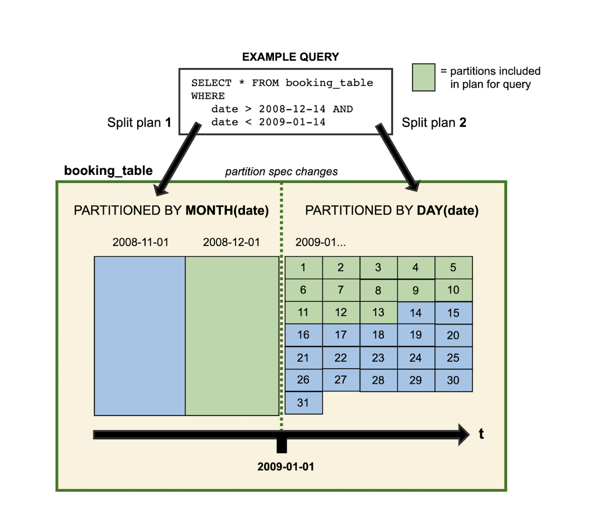

With Iceberg’s hidden partitions the tables separation between physical and logical users avoid reading unnecessary partitions and don’t need to know how the table is partitioned and add extra filters to their queries.

Lets change the partition schema to YEAR & MONTH & DAYOFMONTH and insert data of *ONE* day

```sql
-- Trino uses the ALTER TABLE SET PROPERTIES syntax for Iceberg evolution
ALTER TABLE iceberg.${your_dbname}.fct_flights_history_lab
SET PROPERTIES partitioning = ARRAY['year', 'month', 'dayofmonth'];

INSERT INTO iceberg.${your_dbname}.fct_flights_history_lab (
    year, month, dayofmonth, dayofweek, deptime, crsdeptime, arrtime, crsarrtime,
    uniquecarrier, flightnum, tailnum, actualelapsedtime, crselapsedtime, airtime,
    arrdelay, depdelay, origin, dest, distance, taxiin, taxiout, cancelled,
    cancellationcode, diverted, carrierdelay, weatherdelay, nasdelay,
    securitydelay, lateaircraftdelay
)
SELECT
    2026, 1, 1, dayofweek, deptime, crsdeptime, arrtime, crsarrtime,
    uniquecarrier, flightnum, tailnum, actualelapsedtime, crselapsedtime, airtime,
    arrdelay, depdelay, origin, dest, distance, taxiin, taxiout, cancelled,
    cancellationcode, diverted, carrierdelay, weatherdelay, nasdelay,
    securitydelay, lateaircraftdelay
FROM
    iceberg.${your_dbname}.fct_flights
WHERE
    year = 1995 AND month = 1 AND dayofmonth = 1;
```
Output:
| row_count |
| :- |
| 14175 |

Now lets see the impact what the difference is, lets run two queries and note the complete time:

Count the records for one year and month that is inserted before the partition:
```sql
-- Query 1: Data from the first insert (Older partition spec)
EXPLAIN ANALYZE
SELECT
    count(*) as row_count,
    sum(depdelay) as total_dep_delay
FROM
    iceberg.${your_dbname}.flights_ice
WHERE  
    year = 1995 AND month = 1 AND dayofmonth = 1;
```

```sql
-- Query 2: Data from the second insert (Newer evolved partition)
EXPLAIN ANALYZE
SELECT
    count(*) as row_count,
    sum(depdelay) as total_dep_delay
FROM
    iceberg.${your_dbname}.fct_flights_history_lab
WHERE  
    year = 2026 AND month = 1 AND dayofmonth = 1;
 ```
This comparison perfectly illustrates the performance benefits of Iceberg Partition Evolution. In the second plan, the data was written after the partition spec was made more granular, while the first plan shows a query hitting data written before the evolution.

| Metric | Query 2 (Year 2026) | Query 1 (Year 1995) |
| :- | :- | :- |
| Total Execution Time | 214.92 ms 🚀 | 385.49 ms 🐢 |
| Rows Scanned (Input) | 14,175 rows | 2,673,586 rows |
| Physical Input Size | 257.18 kB | 5.08 MB |
| Filter Efficiency | 0% Filtered (Direct hit) | 99.47% Filtered (Over-scan) |
| Physical Input Time | 0.64 ms | 284.63 ms |

This example shows that the execution time is greatly decreased because less data was read.


## Lab 7 - Federated Query

Trino’s federated query capability serves as a modern architectural feature by allowing users to execute a single SQL statement across multiple, diverse data sources like PostgreSQL, Iceberg, and Hive or Impala without moving the data. This "query-in-place" approach eliminates the need for time-consuming ETL processes, enabling real-time insights by joining live operational data with massive historical datasets stored in a data lake.

Quick check query a table in PostgreSQL
```sql
select * from  postgres.airlinedata.customer_complaints Limit 3;
 ```

Expected outcome

|complaint_id|	complaint_date|	customer_email	|complaint_category	|complaint_text	|uniquecarrier|	flightnum|	delay_minutes	|severity_score|
| :- | :- | :- | :- | :- | :- | :- | :- | :- |
|256|	2001-06-20 20:42:00.000	|m.garcia256@gmail.com|	DOT Refund Eligible| Delay	Sitting on the tarmac for hours. This violates the 3-hour domestic rule.	|DL	|744|	227	|4|
|257|	2001-06-22 00:00:00.000	|alex.chen257@outlook.com|	Involuntary Cancellation|	Flight 744 was cancelled. I am stuck at ATL and the rebooking app is crashing.|DL|	744	|NULL	|5|
|258|	2001-06-23 18:48:00.000	|sarah_j258@icloud.com|	DOT Refund Eligible Delay	|Sitting on the tarmac for hours. This violates the 3-hour domestic rule.	|DL	|744|	205|	4|


Lets create a federated query with dataset from PostgreSQL and Iceberg.


Purpose of this query is to  identify service trends by carrier and aircraft model. By performing complex cross-catalog joins and data type conversions, it allows for a unified analysis of customer sentiment against physical assets without the need for data movement or pre-processing.

 ```sql
SELECT
    f.uniquecarrier,
    p.model AS aircraft_model,
    COUNT(c.complaint_id) AS total_complaints,
    ROUND(AVG(CAST(c.severity_score AS DOUBLE)), 2) AS avg_severity
FROM
    iceberg.${your_dbname}.fct_flights f
JOIN
    postgres.airlinedata.customer_complaints c
    ON f.uniquecarrier = c.uniquecarrier
    AND CAST(f.flightnum AS VARCHAR) = CAST(c.flightnum AS VARCHAR)
    -- FIX for line 106: Cast extracted date parts to VARCHAR
    AND f.year = CAST(EXTRACT(year FROM c.complaint_date) AS integer)
    AND f.month = CAST(EXTRACT(month FROM c.complaint_date) AS integer)
    AND f.dayofmonth = CAST(EXTRACT(day FROM c.complaint_date) AS integer)
JOIN
    iceberg.${your_dbname}.dim_planes p
    ON f.tailnum = p.tailnum
GROUP BY
    f.uniquecarrier, p.model
ORDER BY
    total_complaints DESC
LIMIT 3;
 ```

Expected outcome (may vary)

 |uniquecarrier	|aircraft_model	|total_complaints	|avg_severity|
 | :- | :- | :- | :- |
 |DL |	MD-88	|2278	|3.3|
 |AA	|DC-9-82(MD-82)|	1696	|2.71|
 |DL|	757-232	|1402	|3.1|


 This lab demonstrates that Trino’s query federation effectively collapses data silos by enabling real-time joins between operational PostgreSQL feedback and historical Iceberg flight archives. By eliminating the need for data movement, you’ve established a high-performance architecture that delivers immediate visibility into how specific aircraft models impact the overall customer experience.

----
## Lab 8 - Slowly Changing Dimensions (SCD) - TYPE 2

This lab demonstrates a comprehensive merge operation using ACID tables in Iceberg, including the ability to update, insert, and delete rows within a single transaction.

A Type 2 SCD retains the full history of values. When the value of a chosen attribute changes, the current record is closed. A new record is created with the changed data values and this new record becomes the current record.

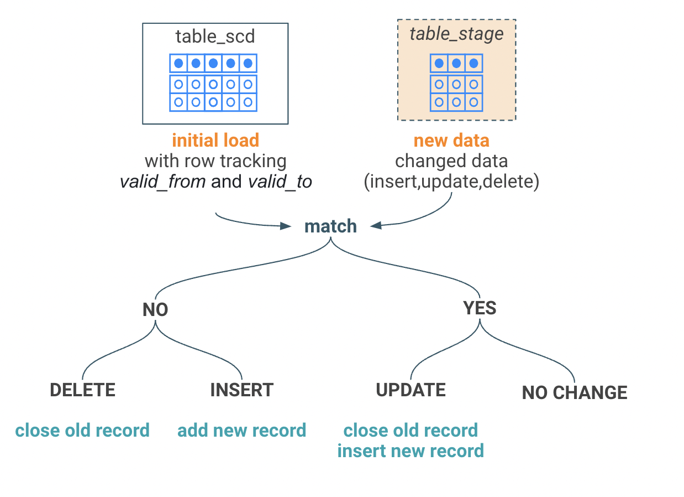

We create a new SDC table ***scd\_airline*** and add columns ***valid\_from*** and ***valid\_to***. Then loading the initial into this SDC table, then mock up new data and change data in the table ***airlines\_stage***.

Create the Hive managed table for airlines. Load initial by copy 1000 rows of current airlines with hard code the valid_from date

```sql
-- Drop and recreate the target Iceberg table
DROP TABLE IF EXISTS iceberg.${your_dbname}.dim_scd_airlines;

CREATE TABLE iceberg.${your_dbname}.dim_scd_airlines (
    code VARCHAR,
    description VARCHAR,
    updated_at TIMESTAMP(6),
    valid_from TIMESTAMP(6),
    valid_to TIMESTAMP(6)
)
WITH (format = 'PARQUET');

-- Initial load from Hive to Iceberg
INSERT INTO iceberg.${your_dbname}.dim_scd_airlines
SELECT
    code,
    description,
    CAST(current_timestamp AS TIMESTAMP(6)), -- updated_at
    CAST(TIMESTAMP '2021-01-01 00:00:00' AS TIMESTAMP(6)), -- valid_from
    CAST(TIMESTAMP '9999-12-31 23:59:59' AS TIMESTAMP(6))  -- valid_to
FROM hive.${your_dbname}.airlines_csv;
```

Create an external staging table pointing to our complete airlines dataset (1491 records), add one row, update a description and delete two rows to mockup a change in the dimension

```sql
DROP TABLE IF EXISTS iceberg.${your_dbname}.stg_airlines;

-- Create staging table with current data
CREATE TABLE iceberg.${your_dbname}.stg_airlines AS
SELECT code, description FROM hive.${your_dbname}.airlines_csv;

-- 1. Insert one row (New record)
INSERT INTO iceberg.${your_dbname}.stg_airlines (code, description)
VALUES ('FFF', 'New Airline');

-- 2. Update a description (Modified record)
UPDATE iceberg.${your_dbname}.stg_airlines
SET description = concat('Update - ', upper(description))
WHERE code = '02Q';

-- 3. Delete a row (Removed record in source)
DELETE FROM iceberg.${your_dbname}.stg_airlines
WHERE code = '04Q';
```

We now execute a single MERGE statement. This logic is sophisticated: it identifies records to expire (setting valid_to to the current time) and records to insert as the new "active" version.

```sql
MERGE INTO iceberg.${your_dbname}.scd_airlines AS target
USING (
    -- PART A: New records that don't exist in target
    SELECT
        src.code AS merge_key,
        src.code,
        src.description,
        'INSERT' as action
    FROM iceberg.${your_dbname}.stg_airlines src
    LEFT JOIN iceberg.${your_dbname}.scd_airlines tgt
        ON src.code = tgt.code
    WHERE tgt.code IS NULL

    UNION ALL

    -- PART B: Records that changed (This branch EXPIRES the old record)
    SELECT
        src.code AS merge_key,
        src.code,
        src.description,
        'UPDATE_EXPIRE' as action
    FROM iceberg.${your_dbname}.stg_airlines src
    JOIN iceberg.${your_dbname}.scd_airlines tgt
        ON src.code = tgt.code
    WHERE src.description <> tgt.description
      AND tgt.valid_to > current_timestamp

    UNION ALL

    -- PART C: Records that changed (This branch INSERTS the new active version)
    SELECT
        CAST(NULL AS VARCHAR) AS merge_key,
        src.code,
        src.description,
        'UPDATE_INSERT' as action
    FROM iceberg.${your_dbname}.stg_airlines src
    JOIN iceberg.${your_dbname}.scd_airlines tgt
        ON src.code = tgt.code
    WHERE src.description <> tgt.description
      AND tgt.valid_to > current_timestamp

    UNION ALL

    -- PART D: Records deleted in source (Expire them in Target)
    SELECT
        tgt.code AS merge_key,
        tgt.code,
        tgt.description,
        'DELETE_EXPIRE' as action
    FROM iceberg.${your_dbname}.scd_airlines tgt
    LEFT JOIN iceberg.${your_dbname}.stg_airlines src
        ON tgt.code = src.code
    WHERE src.code IS NULL
      AND tgt.valid_to > current_timestamp
) AS source
ON (target.code = source.merge_key AND target.valid_to > current_timestamp)

WHEN MATCHED THEN
    UPDATE SET
        valid_to = current_timestamp,
        updated_at = current_timestamp

WHEN NOT MATCHED THEN
    INSERT (code, description, updated_at, valid_from, valid_to)
    VALUES (
        source.code,
        source.description,
        current_timestamp,
        current_timestamp,
        TIMESTAMP '9999-12-31 23:59:59'
    );
```

Expected outcome
|rows|
| :- |
| 4 |


View the changed records and see that the VALID_FROM and VALID_TO dates are set

```sql
SELECT
    code,
    description,
    valid_from,
    valid_to,
    updated_at
FROM
    iceberg.${your_dbname}.scd_airlines
WHERE code IN ('02Q', '04Q', 'FFF')
ORDER BY code ASC, valid_from ASC;
```

Results

|CODE|DESCRIPTION|VALID\_FROM|VALID\_TO|
| :- | :- | :- | :- |
|02Q	|Titan Airways	|2021-01-01 00:00:00	|2026-03-11 12:06:15.649675|
|02Q	|Update - TITAN AIRWAYS	|2024-04-11 12:06:15.649675	|9999-01-01 00:00:00|
|04Q	|Tradewind Aviation	|2021-01-01 00:00:00	|2026-03-11 12:06:15.649675|
|FFF	|New Airline	|2026-03-11 12:06:15.649675	|9999-01-01 00:00:00|
|-----

-----

## Lab 9 - Data Governance and Security

Lets explore a important component of the data security that the dynamic policy enforcement that operates by pushing security rules directly to lightweight plugins within the Trino. This architecture ensures zero-latency authorization because the access check happens locally at the point of request.


In this example we defined a dynamic masking policy on the ***customer_email*** to redact the field.


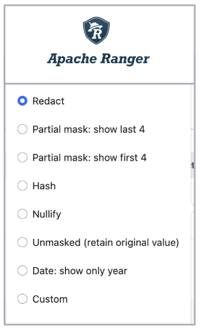

Query the data

```sql
select
  complaint_date,
  customer_email,
  complaint_category,
  severity_score
from
  airlinedatapostgres.airlinedata.customer_complaints
limit 3;
```

results

|complaint_date |	customer_email|	complaint_category|	severity_score|
| :- | :- | :- | :- |
|2001-06-20 20:42:00.000|	x.xxxxxx000@xxxxx.xxx	|DOT Refund Eligible Delay |	4 |
|2001-06-22 00:00:00.000|	xxxx.xxxx000@xxxxxxx.xxx	|Involuntary Cancellation	| 5 |
|2001-06-23 18:48:00.000|	xxxxx_x000@xxxxxx.xxx	|DOT Refund Eligible Delay |	4 |

The enforcement engine intercepted the request and alters the data depending on the Ranger policy.

### Data Redaction - Targeted Queries Return Zero Results - Optinal

When a Redaction policy is active, the engine evaluates the WHERE clause against the transformed value (e.g., x.xxxxxx000@xxxxx.xxx), causing a mismatch with the original clear-text string.

```sql
select
  complaint_date,
  customer_email,
  complaint_category,
  severity_score
from
  postgres.airlinedata.customer_complaints
where
  customer_email = 'm.garcia256@gmail.com'
```

 Done. 0 results.

 This ensures that even if an unauthorized user knows a specific email address, Cloudera SDX prevents them from confirming its existence or accessing the record.


## Lab 10 - Data Visualization

You can explore this dashboard -


or create a new dashboard by the following steps:

Navigate to DataVisualizaton and click on NEW DATASET

Enter:

Dataset Title: ```Top Grumpy Routes```
Dataset Source:  ```SQL```
Enter SQL below:

```sql
SELECT
    o.city || ' to ' || d.city AS route,
    o.city as origion,
    d.city as destination,
    f.uniquecarrier ,
    COUNT(c.complaint_id) AS complaint_volume  
FROM postgres.airlinedata.customer_complaints c
JOIN iceberg.db_user001.fct_flights f ON c.uniquecarrier = f.uniquecarrier AND c.flightnum = cast ( f.flightnum as varchar)
JOIN iceberg.db_user001.dim_airports o ON f.origin = o.iata
JOIN iceberg.db_user001.dim_airports d ON f.dest = d.iata
GROUP BY 1,2,3,4
ORDER BY 2 DESC
```

Click on Show Data
Click on CREATE

This Dataset shows and click on New Dashboard

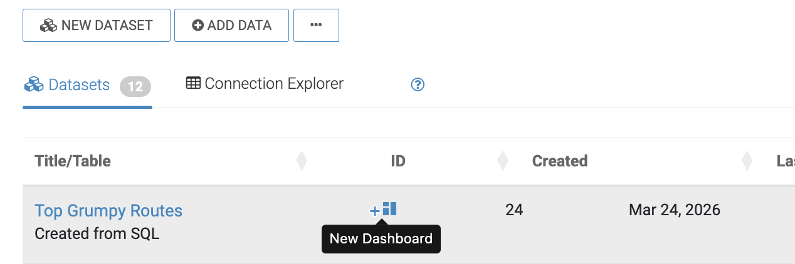


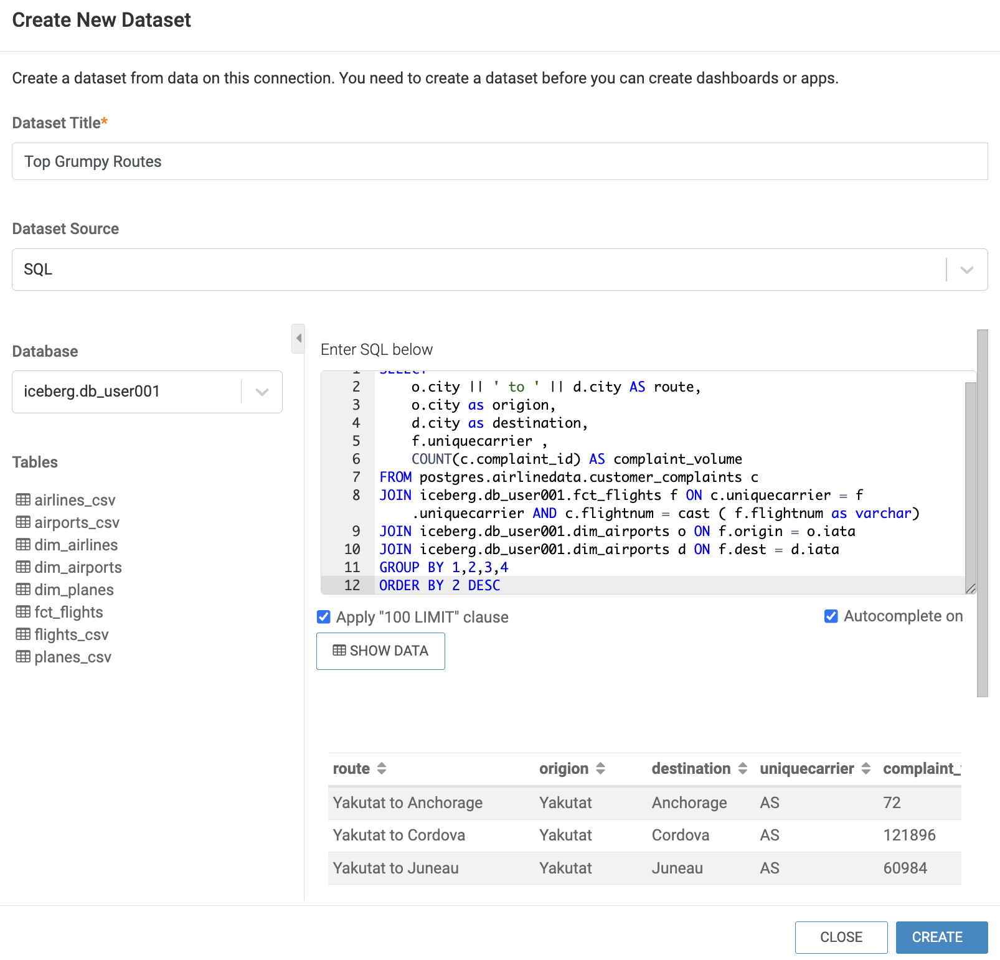

`	`Open DataViz


|**Step**|**Description**|
| :-: | :- |
|1|<p>Open Data Visualization 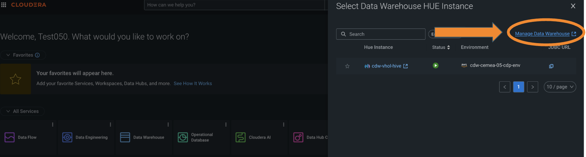 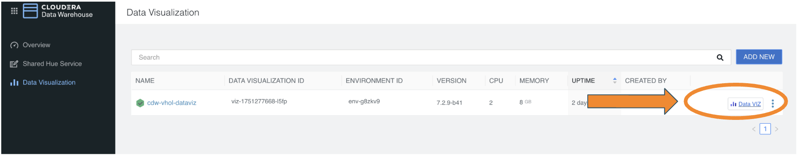</p><p></p><p></p><p></p><p></p>|
|2|<p>Overview</p><p>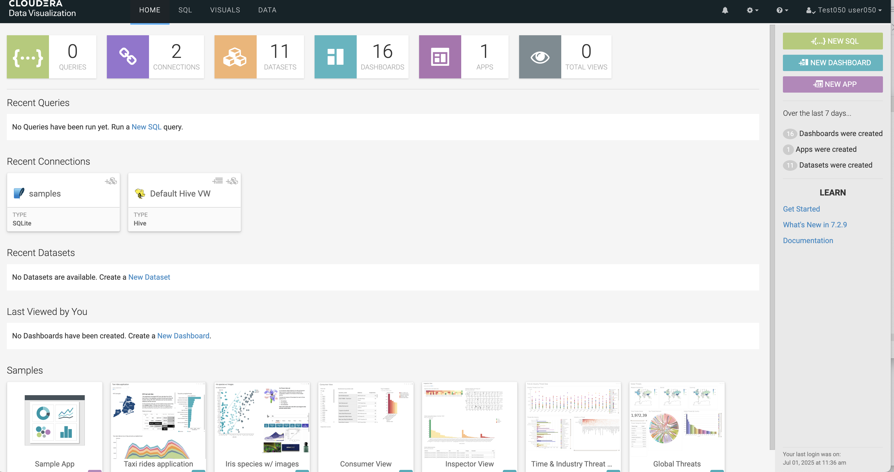</p>|
|3|<p>Switch to Data Tab</p><p>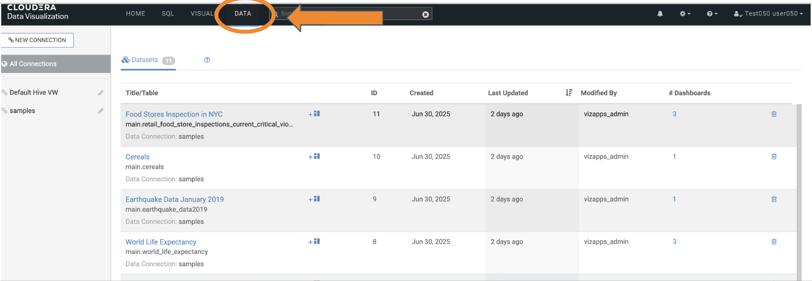</p><p>There a demo datasets shown here (you can explore by your own)</p>|
|4|<p>Click on the Connection and then new dataset</p><p></p><p>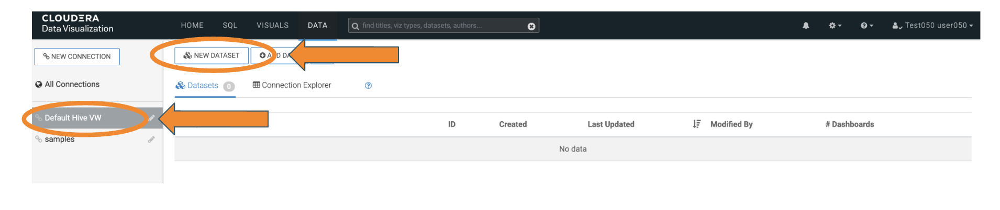</p><p></p>|
|5|<p>Enter name: airline_logistics the select database: airlinedata and table: flights_orc and click CREATE</p><p></p><p></p><p></p><p></p><p>     </p><p></p>|
|6|<p>Edit Dataset - click on the name: airline_logistics</p><p></p><p></p><p>The Dataset Details</p><p></p>|
|7|<p>Click on Fields - List fields of the Dataset</p><p>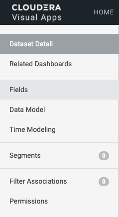 <p>Show fields, each column of the FLIGHTS table, in two categories: Dimensions and Measures</p>    </p><p></p><p></p>|
|8|<p>Join PLANES table with FLIGHTS table - click on Data Model</p><p></p><p></p><p>Then Click on Edit Model and the + </p><p>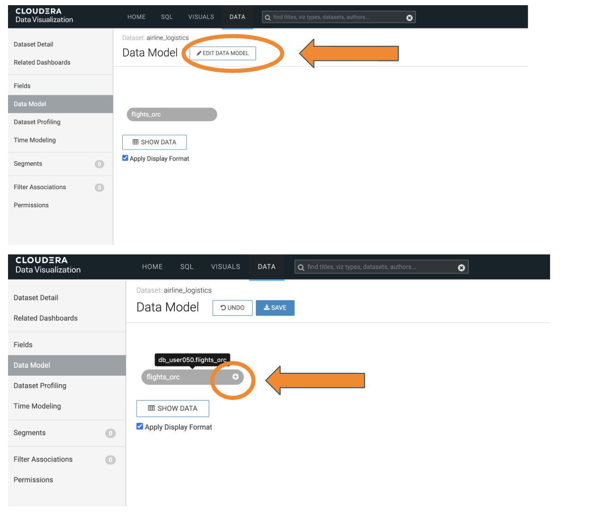</p><p></p><p>  </p><p></p><p></p><p>Select the source and target column to join the two tables </p>|
|9|<p>Add AIRLINES table to the Dataset</p><p>  </p><p></p><p>DON'T FORGET to click on SAVE ! </p><p>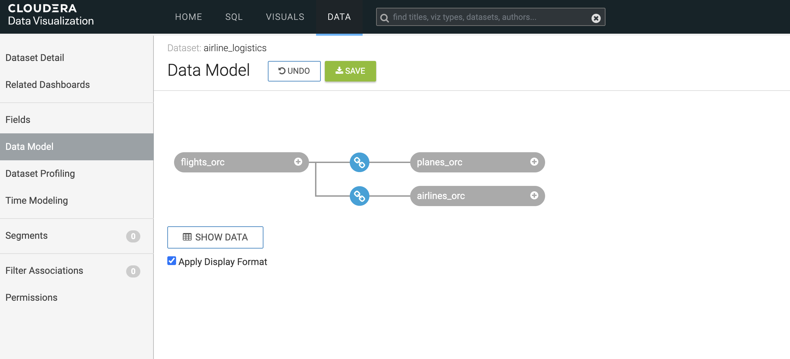</p> |
|10|<p>Click on SHOW DATA to view dataset</p><p></p><p></p><p>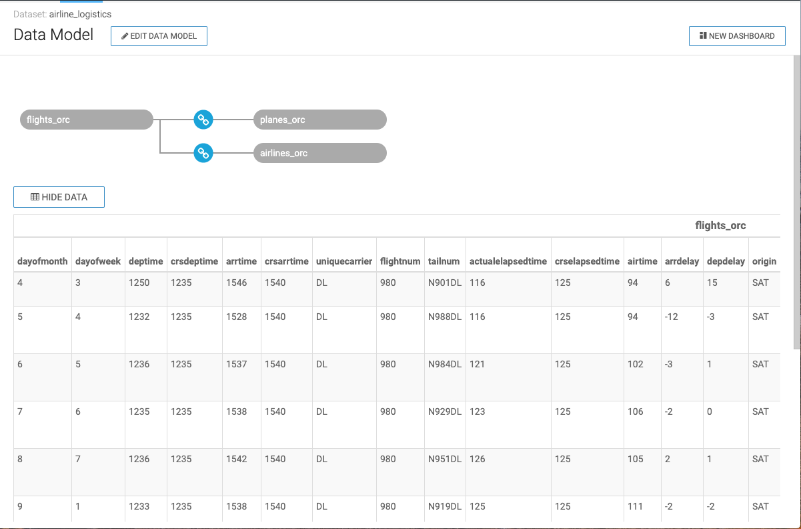</p><p></p><p>Scroll right for all columns of the dataset</p><p></p>|
|11|<p>Go back to Data Model to Edit Fields</p><p>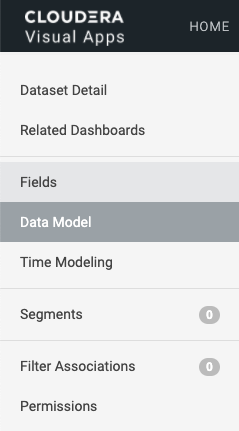</p><p></p><p>Click on EDIT FIELDS</p><p>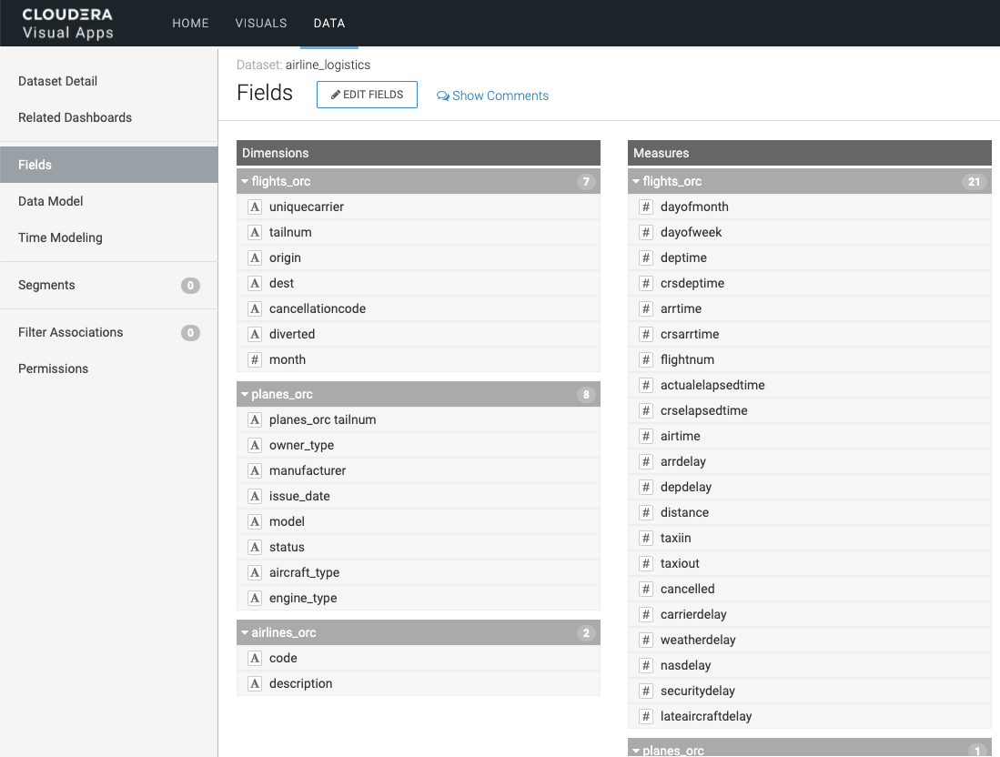</p><p></p><p>Start with changing the display title of the field: deptdelay</p><p></p><p>Edit Field properties</p><p>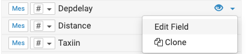</p><p></p><p>  </p><p>Change Field Name into: Dep Delay</p><p></p><p></p><p></p><p></p><p>Add a new field: route that concatenates two fields origin and dest</p><p>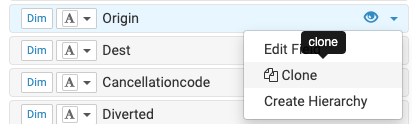</p><p>First clone the field: origin</p><p></p><p>     </p><p></p><p></p><p>Change Display Name to “Route”</p><p>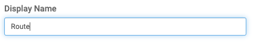</p><p></p><p>Edit Expression</p><p></p><p>Expression: </p><p>**concat( [origin],'-', [dest])**</p><p></p><p>Validate (to check for any errors) and Click Apply (to accept changes)</p><p>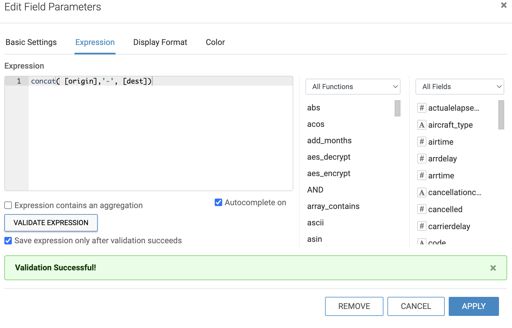</p>|
|12|<p>The Dataset with all fields looks:</p><p>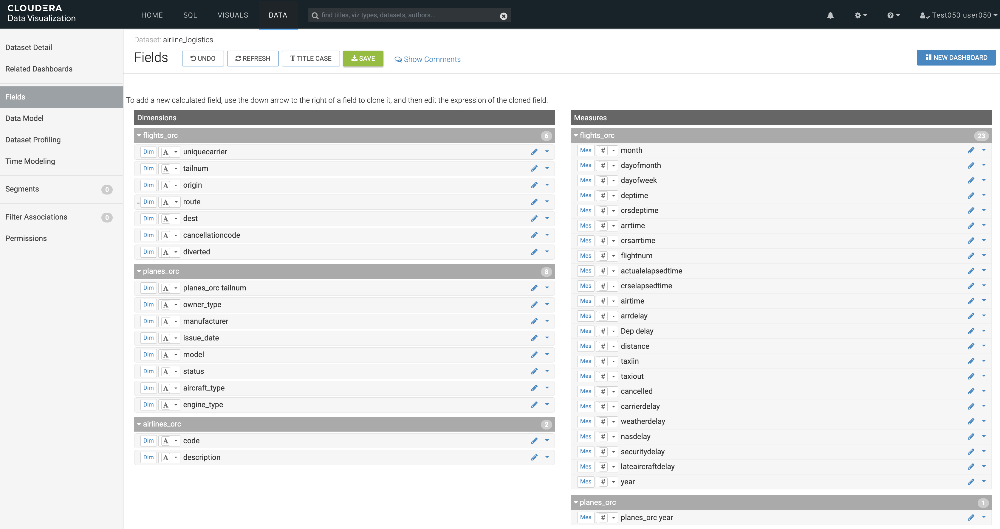</p><p></p><p></p><p>Click Save that completes the dataset</p>|
|13|<p>Create Dashboard</p><p></p><p>` `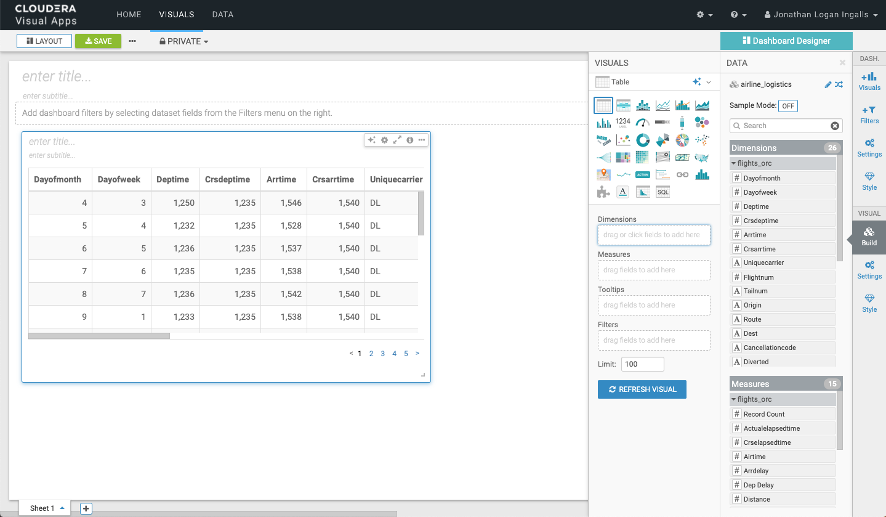</p>|
|14|<p>First Visual - select bar and drag the field: route into x-axis and Dep delay into y-axis </p><p></p><p></p><p></p><p>Change Dep Delay Aggregate to Average</p><p></p><p></p><p></p><p></p><p>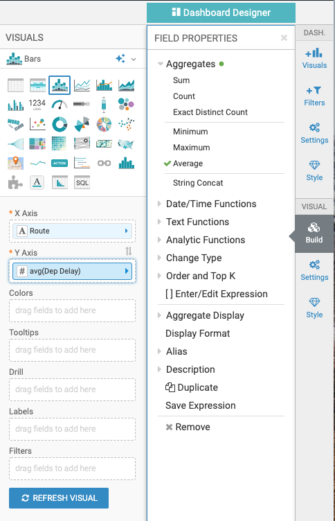</p><p></p><p></p><p>Change to only show Top 25 Avgs</p><p></p><p></p><p>Click on []Enter/Edit Expression </p><p>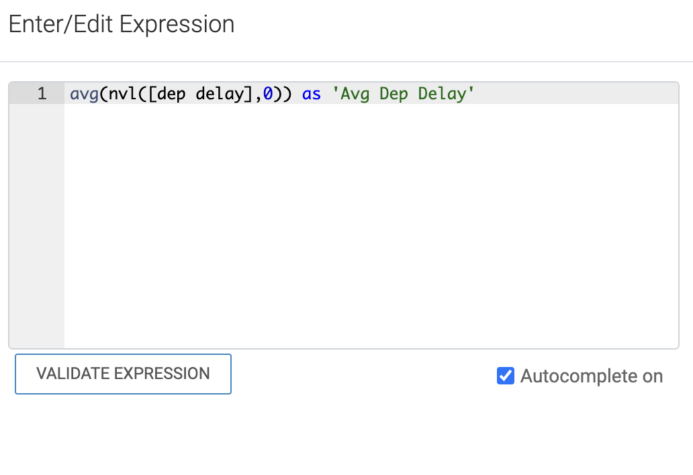</p><p></p><p>avg(nvl([Dep delay],0)) as 'Avg Dep Delay'</p><p>The new alias is created</p><p></p><p></p><p>That should look likes</p><p></p><p></p><p>Now click on refresh Visual</p><p></p><p></p><p></p><p></p><p>Add Title & Subtitle for Dashboard</p><p>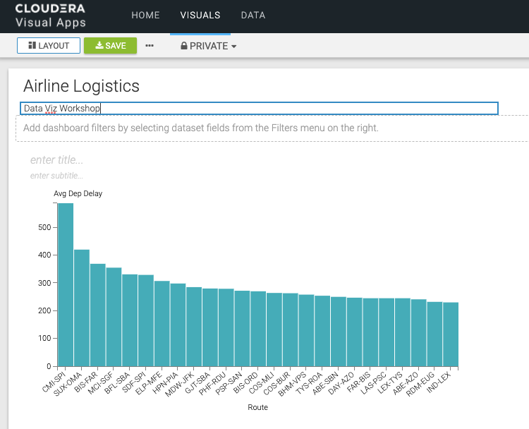</p><p></p><p>Add Title & Subtitle for this chart</p><p></p><p></p>|
|15|<p>Add Filter</p><p></p><p></p><p></p><p></p><p></p><p>Select values from prompt</p><p>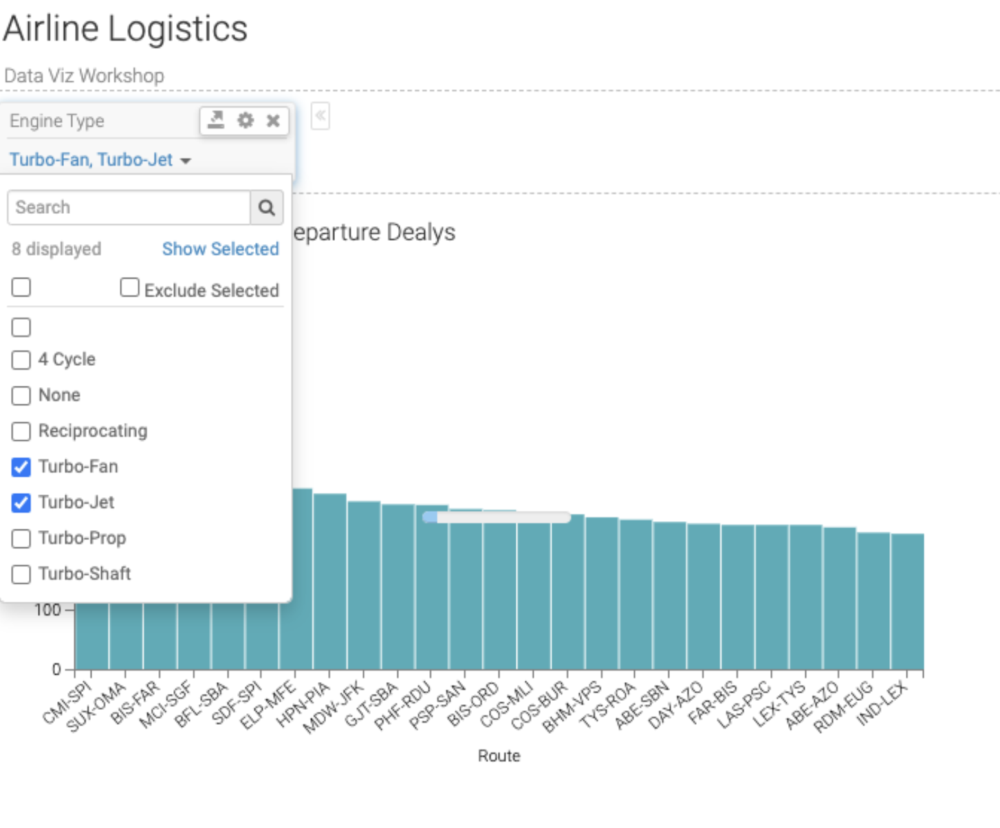</p><p></p><p></p><p></p>|
|17|<p>Save Dashboard</p><p></p><p></p><p></p>|


# Bonus Material (optional)

### SQL AI Assistant - makes SQL development faster, easier, and less error-prone

The SQL AI Assistant is an AI-powered tool designed to enhance SQL development, making it faster, more intuitive, and less prone to errors. By leveraging advanced contextual understanding of your data, it provides accurate and relevant SQL code suggestions that improve productivity. Integrated into Hue within Cloudera, this assistant harnesses the capabilities of Large Language Models (LLMs) for a range of SQL tasks, including query creation, editing, optimization, debugging, and summarization.

Click on the blue dot to launch the SQL AI Assistant

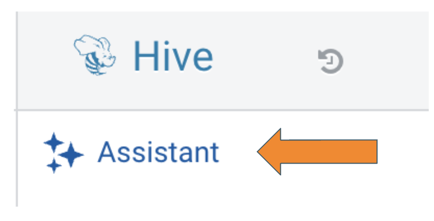

this unfolds this bar and click on EXPLAIN


The SQL AI Assistant will take a few seconds to generate a outcome.

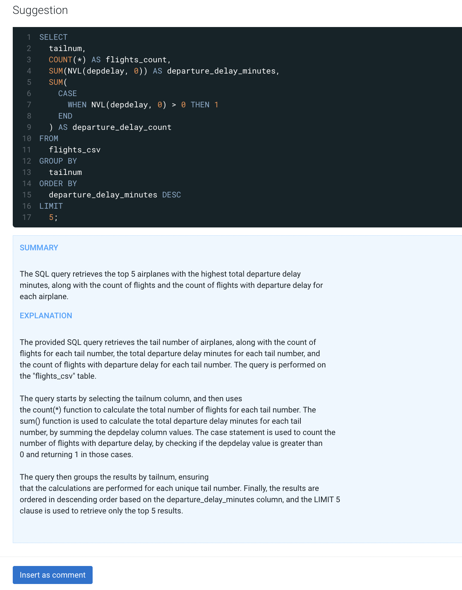

This can be inserted for documentation purposes.


## ⚠️  Data Quality with Branching **** WORK IN PROGRESS *** ⚠️

The quality of data holds immense importance within any data engineering process, directly influencing subsequent analytical tasks like business intelligence and machine learning. It is imperative to conduct thorough testing, cleansing and validation of data at every stage of the data pipeline before deployment into the production.

The QA pipeline looks like the following:
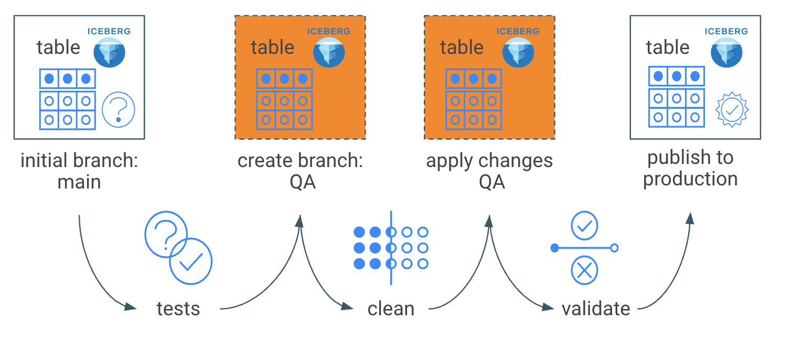

Begin with the creation of ICEBERG V2 table with the raw data and run the first test checking  the field length for the IATA code that must be 3:

```sql
/* ** QA TEST: Validate IATA length (Must be exactly 3)
** EXPECTATION: failures = 0
*/
SELECT
    count(*) AS failures,
    count(*) != 0 AS should_warn,
    count(*) != 0 AS should_error
FROM (
    WITH validation AS (
        SELECT iata AS field
        FROM iceberg.${your_dbname}.dim_airports
        WHERE iata IS NOT NULL -- Exclude nulls from length check
    ),
    validation_errors AS (
        SELECT field
        FROM validation
        WHERE length(field) != 3
    )
    SELECT * FROM validation_errors
) AS iata_length_test;
```

The test shows that 42 rows are not having the correct length.

|failures |	should_warn	| should_error |
| :- | :- |  :- |
| 42 |	true |	true |

NOTE: it's good practice to have a warning level i.e. here 10 rows may is acceptable and does not require cleaning.

Then create a branch with the name QA.

```SQL
/*
** find the snapshot_id
*/
SELECT
  snapshot_id,
  committed_at,
  parent_id,
  operation
FROM
  iceberg.${your_dbname}."dim_airports$snapshots";
```

| snapshot_id |	committed_at |	parent_id |	operation
| :- | :- |  :- | :- | :- |
| 6720208314915384918 |	2026-03-03 09:15:37.781 UTC	| NULL	| append |

```SQL
-- Create a branch named 'v1_original' from your initial snapshot
ALTER TABLE iceberg.${your_dbname}.fct_flights
CREATE BRANCH QA
AS OF VERSION

ALTER TABLE iceberg.${your_dbname}.dim_airports EXECUTE create_branch('QA')
ALTER TABLE table_name EXECUTE create_branch('branch_name')

-- Query a branch: SELECT * FROM "table_name$branch_branch_name"
-- select * from iceberg.${your_dbname}.dim_airports.refs;
```

The list of branches are as follows:

|name	|type	|snapshot_id |	max_reference_age_in_ms |	min_snapshots_to_keep	| max_snapshot_age_in_ms |
| :- | :- |  :- | :- | :- |  :- |
|qa	|BRANCH	|4861947596552380217	|NULL	|NULL	|NULL|
|main	|BRANCH	|4861947596552380217	|NULL	|NULL	|NULL

The main branch always exists a base when creating the Iceberg table.

Now do the cleaning job and delete rows where the IATA code is != 3 and remove the quotation marks from the AIRPORT field.

```SQL
/*
** Data Cleansing: data transformations
*/
⚠️ delete from ${your_dbname}.airports_ice.branch_qa
where LENGTH(iata) != 3;
```

Output should like this:

 Success.

Next is to validate the data we have cleansed to be on the save side.

```SQL
 /*
 ** Validate: not iata len <> 3
 */
 select
       count(*) as failures,
       count(*) != 0 as should_warn,
       count(*) > 100 as should_error
 from (
       with validation as (
 	                         select iata as field
 	                          from ${your_dbname}.airports_ice.branch_qa
                          ),
 validation_errors as (
 	select field from validation
 	where LENGTH(field) != 3
 )
 select *
 from validation_errors
 ) iata_length_test;
```

Expected Output:

 |failures |	should_warn	| should_error |
 | :- | :- |  :- |
 | 0 |	false |	false |


Both validations show no failures and we can move the data from the QA branch into the main branch and drop the QA branch for housekeeping.

 ```SQL
 -- Drop a branch: ALTER TABLE table_name EXECUTE drop_branch('branch_name')
⚠️
ALTER table airports_ice EXECUTE FAST-FORWARD 'qa';

ALTER TABLE airports_ice DROP BRANCH if exists qa;

select * from ${your_dbname}.airports_ice.refs;
```

Output:

|name	|type	|snapshot_id |	max_reference_age_in_ms |	min_snapshots_to_keep	| max_snapshot_age_in_ms |
| :- | :- |  :- | :- | :- |  :- |
|main	|BRANCH	|4861947596552380217	|NULL	|NULL	|NULL


This lab you saw how Iceberg branching feature helping data quality pipelines in a data engineering workflow.


## Lab - Data Security & Governance

The combination of the Data Warehouse with SDX offers a list of powerful features like rule-based masking columns based on a user’s role and/or group association or rule-based row filters.

For this workshop we are going to explore Attribute-Based Access Control a.k.a. Tage-based security policies.

First we are going to create a series of tables in your work database.

In the SQL editor, select your database and run this script:

```sql
CREATE TABLE emp_fname (id int, fname string);
insert into emp_fname(id, fname) values (1, 'Carl'),(2, 'Clarence');

CREATE TABLE emp_lname (id int, lname string);
insert into emp_lname(id, lname) values (1, 'Rickenbacker'), (2, 'Fender');

CREATE TABLE emp_age (id int, age smallint);
insert into emp_age(id, age) values (1, 35),(2, 55);

CREATE TABLE emp_denom (id int, denom char(2), email string);
insert into emp_denom(id, denom, email) values (1, 'rk','cr@yahoo.com'),(2, 'na','cfender@gmail.com');

CREATE TABLE emp_id (id int, empid integer);
insert into emp_id(id, empid) values (1, 1146651),(2, 239125);

CREATE TABLE emp_all as
  (select a.id, a.fname, b.lname, c.age, d.denom,d.email,e.empid from emp_fname a
	inner join emp_lname b on b.id = a.id
	inner join emp_age c on c.id = b.id
	inner join emp_denom d on d.id = c.id
	inner join emp_id e on e.id = d.id);

create table emp_younger as (select * from emp_all where emp_all.age <= 45);

create table emp_older as (select * from emp_all where emp_all.age > 45);
```

After this script executes, a simple

```sql
select * from emp_all;
```

… should give the contents of the emp\_all table, which only has a couple of lines of data.

For the next step we will switch to the UI of Atlas, the CDP component responsible for metadata management and governance: in the Cloudera Data Warehouse *Overview* UI, select Database Catalog. Click on the three-dot menu of this DB catalog and select “Open Atlas” in the associated pop-up menu:


This should open the Atlas UI. CDP comes with a newer, improved user interface which can be enabled through the __“Switch to Beta”__ item in the user menu on the upper right corner of the screen. Do this now.

The Atlas UI has a left column which lists the Entities, Classifications, Business Metadata and Glossaries that belong to your CDP Environment.

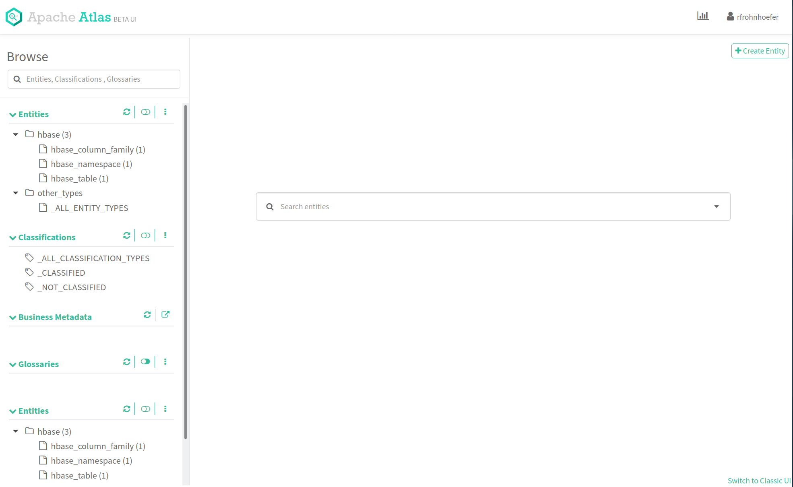

We just created a couple of tables in the Data Warehouse, let’s look at the associated metadata. Under “Entities”, click on “hive\_db”. This should produce a list of databases.
Select you workshop database, this will result in the database’s metadata being displayed.

Select the “Tables” tab (the rightmost)


Select the “emp\_all” table from the list, this will result in Atlas displaying the metadata for this table; select the “lineage” tab:
   
This lineage graph shows the inputs, outputs as well as the processing steps resulting from the execution of our SQL code in the Data Warehouse.

The red circle marks the currently selected entity. Atlas will always display the current entity's type in braces next to the entity name (middle, top of the page, e.g. "hive_table"). Clicking on one of the nodes will display a popup menu, which allows us to navigate through the lineage graph.

##  - Geospatial Queries

Exploring the geospatial functions of Hive that are based on the HIVE_ESRI framework.
see: https://hive.apache.org/docs/latest/language/hive-udfs/#geospatial

Start create a table of all counties in the US state California.

```sql
drop table if exists california_counties;
CREATE EXTERNAL TABLE california_counties (
        Area string,
        Perimeter string,
        State string,
        County string,
        Name string,
        BoundaryShape binary)                  
ROW FORMAT SERDE 'org.apache.hadoop.hive.ql.udf.esri.serde.EsriJsonSerDe'
STORED AS
 INPUTFORMAT 'org.apache.hadoop.hive.ql.io.esriJson.EnclosedEsriJsonInputFormat'
OUTPUTFORMAT 'org.apache.hadoop.hive.ql.io.HiveIgnoreKeyTextOutputFormat'
LOCATION '/airlinedata-csv/california_counties/';
```
Note: This table use a special libary of Esri_Json to transform GEOJSON format.

Run query with a geospatial join that performs a spatial join between the "airports_orc" table and the "california_counties" table.

It selects the county name, counts the total number of airports within each county, and calculates the minimum longitude and latitude values for each county. The join condition uses the ST_CONTAINS function to check if the county
polygon contains the airport point by comparing the boundary shape of the county with the point created from the longitude and latitude of the airport.

The result is grouped by county name and ordered by the total number of airports in descending order.

```sql
SELECT
    cc.Name AS County_Name,
    COUNT(ap.airport) AS Total_Airports,
FROM
    airports_orc ap -- Table of airport points
JOIN
    california_counties cc -- Table of county polygons
ON
    -- Spatial Join Condition: Checks if the county polygon contains the airport point
    ST_CONTAINS(
        cc.BoundaryShape,                      -- The county polygon (WKB/Binary)
        ST_POINT(ap.lon, ap.lat)   -- Creates an ESRI Point from (Longitude, Latitude)
    )
GROUP BY
    cc.Name
ORDER BY
    Total_Airports DESC;
```

Output:

|Rank|County Name|Total Airports|
| :- | :- | :- |
|1|Los Angeles|15|
|2|San Bernardino|14|
|3|Kern|12|
|4|Riverside|10|
|5|San Diego|10|
(more rows ... )

The next SQL query joins the 'airports_orc' table with the 'california_counties'
table based on the condition that the airport's coordinates fall within the boundary shape of a specific county (in this case, Los Angeles county).

It uses the ST_CONTAINS function to check if the point created from the airport's latitude and longitude is contained within the county's boundary shape.

```sql
SELECT
  cc.County,
  ap.airport,
  ap.city,
  ap.iata,
  ap.lon,
  ap.lat
FROM
  airports_orc ap -- Airport points table
  JOIN california_counties cc -- County polygon table
  ON
  -- 1. Create a point geometry from the airport's lat/lon
  ST_CONTAINS (
    cc.BoundaryShape, -- The county polygon (WKB/Binary)
    ST_POINT (ap.lon, ap.lat) -- Create an ESRI Point object from the coordinates
  )
WHERE
  cc.Name = 'Los Angeles' -- **Filter by the specific county name**
;
```

In HUE you can use a map features to show of the airport locations.

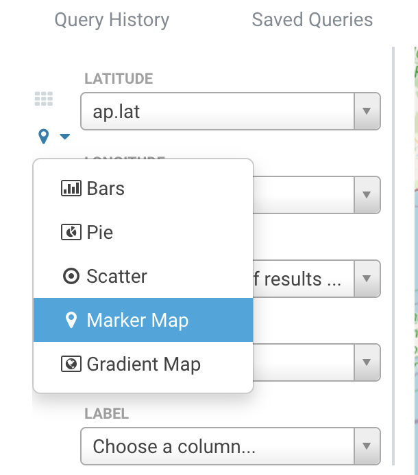

Select correct field names for longitude and latitude and the output should look like this:

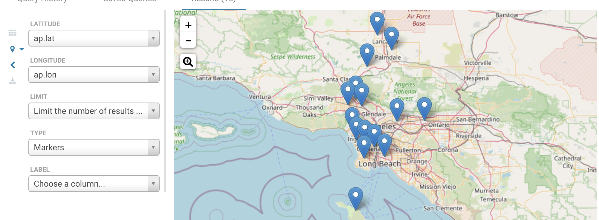


## Lab  -  Materialized View - WORK IN PROGRESS

Query Rewrite Roadmap

Materialized views (MV) cause Trino to transparently rewrite queries, when possible, to use the MV instead of the base tables.

Create Materialized View of a join of two tables with aggregation.

```sql
-- 1. DROP MV if exists
DROP MATERIALIZED VIEW IF EXISTS iceberg.${your_dbname}.mv_traffic_cancel_airlines;

-- 2. Create the Materialized View in the Iceberg catalog
CREATE MATERIALIZED VIEW iceberg.${your_dbname}.mv_traffic_cancel_airlines
AS SELECT
airlines.code AS code,  
airlines.description AS airline_name,
flights.month AS month,
COUNT(*) as flights_count,
SUM(flights.cancelled) AS cancelled,
-- Using COALESCE instead of NVL
SUM(COALESCE(depdelay, 0)) AS departure_delay_minutes,
-- Standardizing the CASE/SUM logic
SUM(CASE WHEN COALESCE(depdelay, 0) > 0 THEN 1 ELSE 0 END) as departure_delay_count
FROM
iceberg.${your_dbname}.fct_flights flights
JOIN
iceberg.${your_dbname}.dim_airlines airlines
ON flights.uniquecarrier = airlines.code
GROUP BY
airlines.code,
airlines.description,
flights.month;
```
Note: The time to create the MV takes apporox. 3-5 minutes.

Checking that the materialized view is created.

```sql
-- work in progress: SHOW MATERIALIZED VIEWS
-- workaround
SELECT
table_catalog,
table_schema,
table_name
FROM iceberg.information_schema.tables
WHERE table_schema = '${your_dbname}'
AND upper(table_name) like 'MV%';
```
Expected Output

|table_catalog | schedule_name | table_name |
| :- | :- | :- |
| iceberg | db_user001 | traffic_cancel_airlines|

Running a query for part of the materialized view.

```sql
SELECT
airlines.description AS description,
SUM(flights.cancelled) AS flights_cancelled
FROM
iceberg.${your_dbname}.fct_flights flights
JOIN
iceberg.${your_dbname}.dim_airlines airlines
ON flights.uniquecarrier = airlines.code
GROUP BY
airlines.description;
```  

Explain if query is optimzed .

```sql

EXPLAIN ANALYZE
SELECT
airlines.description AS description,
SUM(flights.cancelled) AS flights_cancelled
FROM
iceberg.${your_dbname}.fct_flights flights
JOIN
iceberg.${your_dbname}.dim_airlines airlines
ON flights.uniquecarrier = airlines.code
GROUP BY
airlines.description;
```
Output:
```
----
```

##  - Continues Data Pipeline (not setup be default)

During the workshop every minute new streaming flight events are
 - created
 - enriched with realtime weather information and with the prediction of the delay
 - stored in Iceberg table

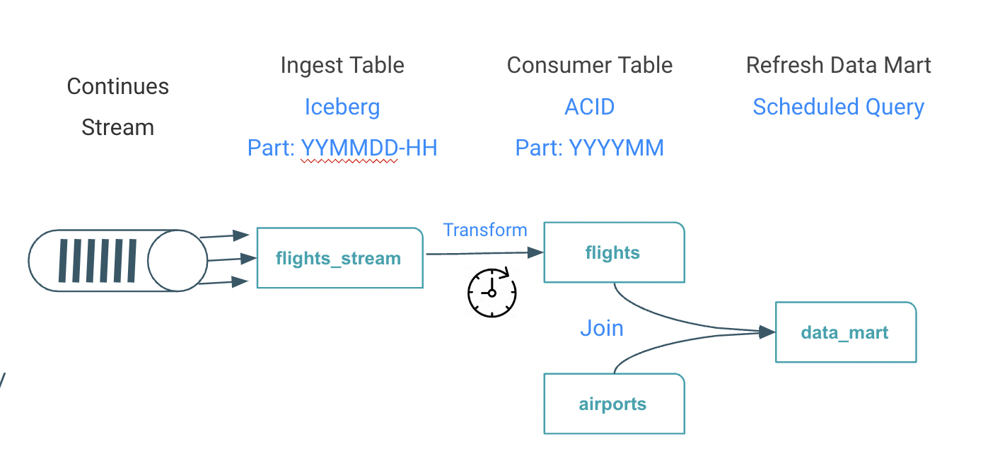

The steps in this optional lab are as follows:
 - Create flights_final table, a offset table and a temporary table
 - Populate and transform the data from the raw streaming table into the temporary table
 - Sweep transformed data and save meta data of the micro batch in the offset table


Create the table of the final streaming events with additional columns for weather information and delay prediction:

```sql
drop table if exists flights_final;
create table flights_final
(
 year int, month int, dayofmonth int,
 dayofweek int, deptime int, crsdeptime int, arrtime int,
 crsarrtime int, uniquecarrier string, flightnum int, tailnum string,
 actualelapsedtime int, crselapsedtime int, airtime int, arrdelay int,
 depdelay int, origin string, dest string, distance int, taxiin int,
 taxiout int, cancelled int, cancellationcode string, diverted string,
 carrierdelay int, weatherdelay int, nasdelay int, securitydelay int, lateaircraftdelay int,
 origin_lon string,origin_lat string, dest_lon string,dest_lat string,
 prediction decimal,proba  decimal,prediction_delay  decimal,
 temp decimal, pressure decimal,humidity decimal,wind_speed decimal, clouds string,
 batch_id BIGINT )
stored by ICEBERG;
```

Create a table for the meta data of the micro batch, as batch_id, offset pointer and row count of the events processed:

```sql
drop table if exists flights_batch_offset;
create table flights_batch_offset(
 batch_id bigint DEFAULT SURROGATE_KEY(), run_ts timestamp,
 from_ts bigint,
 to_ts bigint,
 row_count bigint);
```
Note: the Default surrogate_key() creates new unique number when new rows inserted

Next is to create a temporary table of the new format (including prediction and weather)
```sql
drop table if exists flights_streaming__tmp;
create temporary table flights_streaming__tmp
(
 year int, month int, dayofmonth int,
 dayofweek int, deptime int, crsdeptime int, arrtime int,
 crsarrtime int, uniquecarrier string, flightnum int, tailnum string,
 actualelapsedtime int, crselapsedtime int, airtime int, arrdelay int,
 depdelay int, origin string, dest string, distance int, taxiin int,
 taxiout int, cancelled int, cancellationcode string, diverted string,
 carrierdelay int, weatherdelay int, nasdelay int, securitydelay int, lateaircraftdelay int,
 origin_lon string,origin_lat string, dest_lon string,dest_lat string,
 prediction decimal,proba  decimal,prediction_delay  decimal,
 temp decimal, pressure decimal,humidity decimal,wind_speed decimal, clouds string);
```

Now we populate the temporary table with new events from the raw streaming:
```sql
with flights as ( select
  year, month, dayofmonth, dayofweek, deptime, crsdeptime, arrtime, crsarrtime, uniquecarrier, flightnum, tailnum,
  actualelapsedtime, crselapsedtime, airtime, arrdelay, depdelay, origin, dest, cast( distance as integer ) as distance, taxiin, taxiout,
  cancelled, cancellationcode, diverted, carrierdelay, weatherdelay, nasdelay, securitydelay, lateaircraftdelay,
  origin_lon, origin_lat, cast( dest_lon as float) as dest_lon, cast(dest_lat as float) as dest_lat,
  cast( translate( substr(prediction, instr(prediction,'prediction=')+11,1 ),'}','') as integer),
  cast( translate( substr(prediction, instr(prediction,'proba=')+6,4 ),'}','') as float),
  cast( translate( substr(prediction, instr(prediction,'prediction_delay=')+17,2 ),',','') as integer) ,
  cast( translate( substr( weather_json, instr(weather_json,'temp=')+5,5 ),',','') as float) ,
  cast( translate( substr( weather_json, instr(weather_json,'pressure=')+9,6 ),',','') as float) ,
  cast( translate( substr( weather_json, instr(weather_json,'humidity=')+9,2 ),',','') as float) ,
  cast( translate( substr( weather_json, instr(weather_json,'speed=')+6,5 ),',','') as float) ,
  cast( translate( substr( weather_json, instr(weather_json,'all=')+4,3 ),'}','') as string)
 from
  airlinedata.flights_streaming_ice
  ),
offset as ( select max(to_ts) as max_ts from flights_batch_offset)
insert into flights_streaming__tmp
  select
    flights.*
  from
   flights, offset
   where  
     unix_timestamp(concat( year,'-', month, '-', dayofmonth, ' ' ,
       substring(lpad(deptime,4,'0'),1,2),':', substring(lpad(deptime,4,'0'),3,2) ,':00' )) > nvl(max_ts,0);
```

Maintain the offset and create a new batch_id and meta data about the batch content into the offset table:

```SQL
insert into flights_batch_offset(run_ts,from_ts,to_ts,row_count)
select
 current_timestamp(),
 min( unix_timestamp(concat( year,'-', month, '-', dayofmonth, ' ' ,
   substring(lpad(deptime,4,'0'),1,2),':', substring(lpad(deptime,4,'0'),3,2) ,':00' ))),
 max( unix_timestamp(concat( year,'-', month, '-', dayofmonth, ' ' ,
   substring(lpad(deptime,4,'0'),1,2),':', substring(lpad(deptime,4,'0'),3,2) ,':00' ))),
 count(1)
from
flights_streaming__tmp;
```

Finally swept events into the flights_final table:

```SQL
with ingest as ( select * from flights_streaming__tmp),
     offset as ( select max(batch_id) from flights_batch_offset)
insert into flights_final
select
 ingest.*,
 offset.*
from
 ingest,
 offset;
```
Clean up as good housekeeping is;
```SQL
drop table if exists flights_streaming__tmp;
```

Lets run two checks, checking the offset table
```sql
select
 run_ts,
 from_unixtime(from_ts) as ingest_from,
 from_unixtime(to_ts) as ingest_to,  
 row_count as total_process
from
 flights_batch_offset;
```
There should be one row of the previous ingest
| run_ts | ingest_from | ingest_to     | total_process |
| :------------- | :------------- |:------------- |:------------- |
| 2023-05-22 12:45:50.832883 | 2023-05-22 10:14:00   | 	2023-05-22 12:38:00 | 	4020 |

Let's run a SQL query of a 15 minutes tumbling window:
```sql
with tumbling_window as (
 SELECT
  from_unixtime(
   floor(
    unix_timestamp(concat( year,'-', month, '-', dayofmonth, ' ' ,substring(lpad(deptime,4,'0'),1,2),':', substring(lpad(deptime,4,'0'),3,2) ,':00' ))
     / (15 * 60)) * (15 * 60)) AS window_start,
  from_unixtime(floor(unix_timestamp(concat( year,'-', month, '-', dayofmonth, ' ' ,substring(lpad(deptime,4,'0'),1,2),':', substring(lpad(deptime,4,'0'),3,2) ,':00' )) / (15 * 60)) * (15 * 60) + (15 * 60)) AS window_end,
  COUNT(*) AS count
 FROM
  flights_final
 GROUP BY
  floor(unix_timestamp(concat( year,'-', month, '-', dayofmonth, ' ' ,substring(lpad(deptime,4,'0'),1,2),':', substring(lpad(deptime,4,'0'),3,2) ,':00' )) / (15 * 60))
)
select * from tumbling_window
order by 1 desc;
```

The output should like this for every 15 minutes window

| window_start    | window_end    | count |
| :------------- | :------------- |:-------------
| 2023-05-22 10:30:00	| 2023-05-22 10:45:00	| 423 |
| 2023-05-22 10:15:00 |	2023-05-22 10:30:00	| 405 |
(more rows ... )

##  Data Mart / Cubes

In earlier Above examples you had two dimensions with origin and dest, now you add a third dimension with the time i.e. year. The data set you start to analyze has become a real cube with three dimensions as here airlinedata as multi dimension cube.


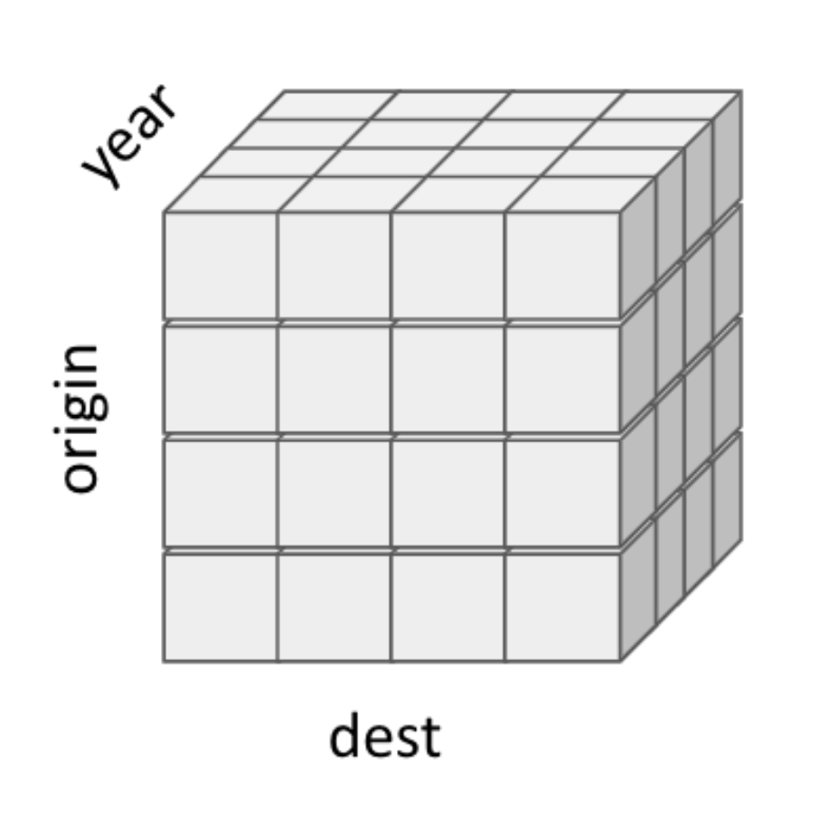


Lets define the table for the cube:

```sql
drop table if exists airport_delayed_flights;
create table airport_delayed_flights (
 daytime string,
 dest_airport_iata string,
 dest_city  string,
 dest_temp  decimal,
 dest_wind_speed decimal,
 dest_pressure  decimal,
 predicted_delayed int,
 predicted_delay_min int);
 ```

Create a job with the query scheduler to run the query every 15 minute:

```sql
-- drop scheduled query airport_delayed_flights;
create scheduled query airport_delayed_flights cron '0 */15 * * * ? *' defined as
insert overwrite airlinedata.airport_delayed_flights
SELECT
  date_format( from_unixtime( ( unix_timestamp(concat( year,'-', month, '-', dayofmonth, ' ' ,
        substring(lpad(deptime,4,'0'),1,2),':', substring(lpad(deptime,4,'0'),3,2) ,':00' )))) , 'yyyy/MM/dd HH:00:00'),
   flights.dest as destination_airport,
   airports.city as destination_city,
    max(flights.temp) as dest_temp,
    max(flights.wind_speed) as dest_wind_speed,
    max(flights.pressure) as dest_pressure,
    sum(flights.prediction) AS predicted_delayed,
    sum(flights.prediction_delay) AS predicted_delay_min
FROM
   airlinedata.flights_final flights,
   airlinedata.airports_orc airports
WHERE
    flights.dest = airports.iata
GROUP BY
   date_format( from_unixtime( ( unix_timestamp(concat( year,'-', month, '-', dayofmonth, ' ' ,
        substring(lpad(deptime,4,'0'),1,2),':', substring(lpad(deptime,4,'0'),3,2) ,':00' )))) , 'yyyy/MM/dd HH:00:00'),
   flights.dest ,
   airports.city ;
```

Lets enable and check that the job is created:
```sql
alter scheduled query airport_delayed_flights enable;
select
  schedule_name,
  enabled,
  next_execution,
  query  
from
  information_schema.scheduled_queries
where
  `user` = current_user();
```
The query output should be like this:

|schedule_name	|enabled	|next_execution	|query |
| :- | :- | :- | :- |
|airport_delayed_flights | true | 2023-05-15 17:55:00 | insert overwrite airlinedata.airport_delayed_flights SELECT  .... |

Next step is activated job to kick off executions, check the status:
```sql
alter scheduled query airport_delayed_flights execute;
with job_runs as (select
 schedule_name,
 state,
 start_time,
 elapsed
from
  information_schema.scheduled_executions )
select
 job_runs.*
from
  information_schema.scheduled_queries jobs
join job_runs
  on
   `user` = current_user()
  and
   jobs.schedule_name = job_runs.schedule_name;
  ```
You see the job finished status:

|job_runs.schedule_name	|job_runs.state	|job_runs.start_time	|job_runs.elapsed|
| :- | :- | :- | :- |
|airport_delayed_flights | FINISHED | 2023-05-15 17:48:06 | 3 |


Check that rows for Boston airport in the data mart:
```sql
select  
 *
from
 airport_delayed_flights
where
 dest_airport_iata = 'BOS'
order by 1 desc;
```

##  Observability

Observability is important because it continuously gathers and monitors performance data from applications and infrastructure components.

Real-time correlations are made to identify both current and potential issues, providing actionable insights and recommendations to resolve them proactively.

Navigate to Observability
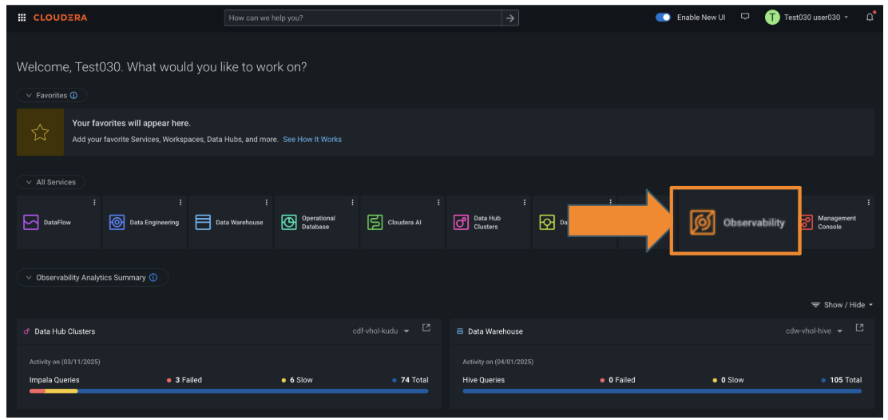

Select the virtual Warehouse
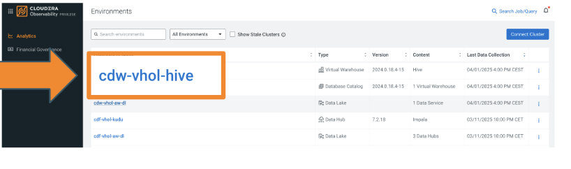

Select Hive
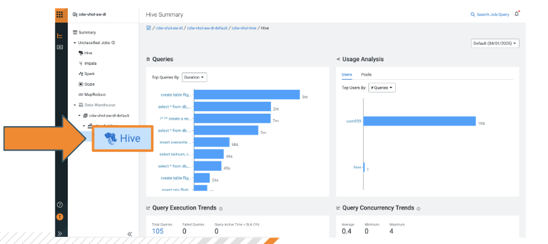

Now you can start exploring the dashboard.


||
| :- |

### Hive Compaction

Hive compaction is a ‘subsystem’ within Hive to implement the most critical type of ACID housekeeping task: merging the delta changes together to reduce the read-path overhead of reading current state from across multiple deltas.

Compaction workflow is fully asynchronous:


There are two types of compaction.

Minor compaction merges deltas but does not merge original base.

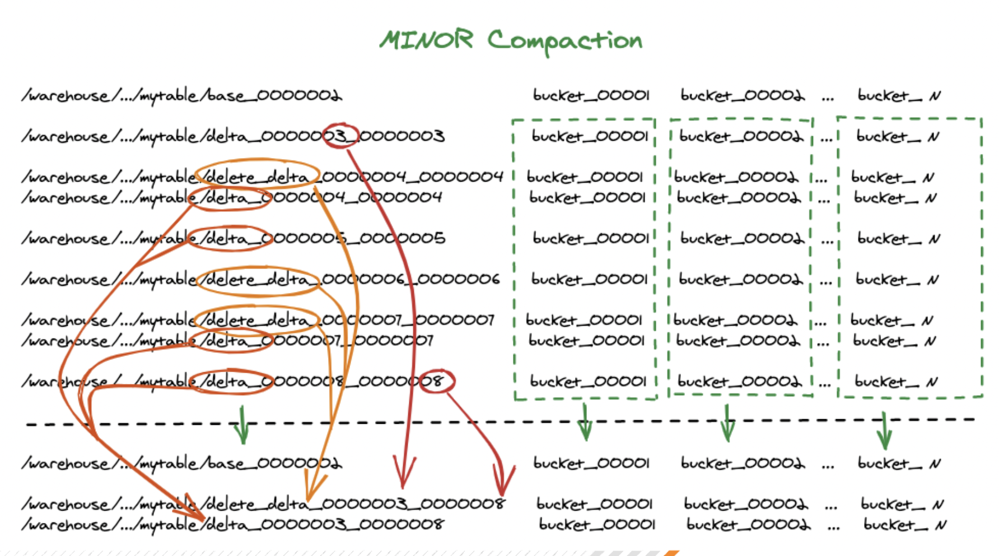

Major compaction merges old base (if exists) with deltas - creates new base .
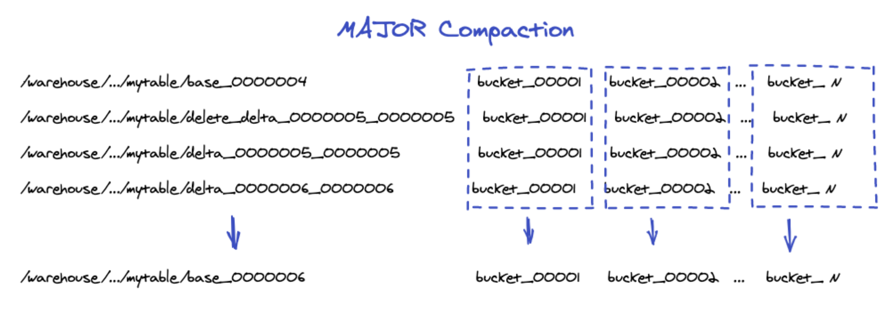

Let's see how Hive compaction works in practice.

```sql
describe formatted flights;
```
Search in the result the numFiles and numPartitions


|numFiles  |          	12  |                
|numPartitions  |     	12  |  

Now lets update the table and see the impact

```sql
update flights set taxiin = 1
where
 month = 1;

update flights set taxiin = 2
where
 month = 2;

describe formatted flights;
```

Search agin the numFiles and notice the numFiles is increased


|numFiles  |          	16  |                
|numPartitions  |     	12  |  

Now we start a manual compaction for the table partitions

```sql
alter table flights partition (month='1') compact 'major';
alter table flights partition (month='2') compact 'major';
```

This works asyncronus in the background can you can observe the status with

```sql
show compactions;
```

Results

| compactionid	| dbname | tabname | partname | type | state | workerhost | workerid | enqueuetime | starttime | duration | hadoopjobid | errormessage |
| :- | :- | :- | :- | :- | :- | :- | :-| :- | :- | :- | :- | :- |
| 1 |	airlinedata_ws	| flights	| month=2 | MAJOR | succeeded | yjnam-yakurut-oozie-master0.se-sandb.a465-9q4k.cloudera.site | 66 | 1666787018950 | 1666787023591 | 62 | None | jk.svc.cluster.local |


When the compaction is completed you can lookup the numFiles and find the reduced number.

Compaction does helps with the small file problem as it eliminates the deltas and their buckets.

Compaction does NOT reduce the number of base buckets for the table/partition and the rows don’t move between buckets (which can lead to unbalanced data skew in the bucket files). A full table rewrites would solve this issue.


### HPLSQL - Database Applications


This HPLSQL Package run a analyse by airport and list the top delayed flights in one single field (denormalized).

SQL Procedures Script - copy and paste to Hue

```sql

use airlinedata;

create or replace package airport_experience AS
 MAX_FLIGHTS int := 3;
 procedure describe();
 procedure dbg (debug_level integer, msg string);
 procedure total_arrival_delay ( IN v_iata string, OUT v_top_flights string, OUT v_totaldelay double);
 procedure generate( v_airports varchar default 'JFK');
END;

create or replace package body airport_experience AS

procedure describe () is
begin
 dbms_output.put_line('Package airport_experiences');
 dbms_output.put_line('Version: 0.0.1');
 dbms_output.put_line('Collection of prodecures to calcluate airpoort experience')
 dbms_output.put_line('prodecures : generate () no parameter')
 dbms_output.put_line('result set : table : airport_experiences')
end;

procedure dbg (debug_level integer, msg string)
is
BEGIN
declare ts string default SYSDATE;
declare lvl string default 'INFO';
if debug_level > 0
 Begin

 if debug_level > 10 SET lvl := 'ERROR';

  DBMS_OUTPUT.PUT_LINE( ts || ':' ||lvl|| ': ' || msg);
 end;
EXCEPTION WHEN OTHERS THEN
  dbg(99,'Error: procedure dbg');
end;

procedure total_arrival_delay ( IN v_iata string, OUT v_top_flights string, OUT v_totaldelay double)
is
BEGIN
  declare debug_level integer default 1;
  declare v_flight string default  '';
  declare v_sum_delay double;
  declare i int default  0;
  declare v_d double;

  DECLARE cur CURSOR FOR SELECT concat(uniquecarrier, flightnum) as flight_num, sum(arrdelay) as sum_delay
        from flights_orc
        where origin = v_iata
        group by concat(uniquecarrier,flightnum)
	having sum(arrdelay) is not null
        order by sum_delay DESC;

  dbg(debug_level, 'pro: total_arriaval_delay v_iata value: ' || v_iata || ' v_arrdelay: '||v_arr_delay );
  v_top_flights = '';

  select nvl(sum(arrdelay),0) into v_totaldelay
    from flights_orc
    where origin = v_iata;

  dbg(debug_level, 'pro: fetch total delay value: ' || v_totaldelay );


  if v_totaldelay <> 0  then
    begin
    dbg(debug_level, 'pro: delays found');

    OPEN cur;

    dbg(debug_level,'pro: cursor open');

    FETCH cur INTO  v_flight, v_sum_delay;
     WHILE SQLCODE=0 and i < MAX_FLIGHTS THEN
      set i := i + 1;

      dbg(debug_level,'pro: fetched to ' || i || ' flight : ' || v_flight );

      SET v_top_flights = v_top_flights || v_flight ||':'||v_sum_delay||';'
    FETCH cur INTO  v_flight, v_sum_delay;
   END WHILE;
   CLOSE cur;

   end;
   else
    begin
    dbg(debug_level,'pro: no delays found ');
     v_totaldelay = 0;
    end;
 end if;

dbg( debug_level,'end: top_flights: '||v_top_flights);

EXCEPTION WHEN OTHERS THEN
  dbg(99,'OTHERS: total_arrival_delay()');
END;

procedure generate( v_airports varchar default 'JFK')
IS
BEGIN
DECLARE debug_level integer default 1;
DECLARE v_iata string default 'JFK';
DECLARE v_top string default '#';
DECLARE v_total double default 0;
DECLARE v_c char;
DECLARE ts timestamp;
DECLARE v_msg string default '';

dbg(debug_level, 'main: 1 airports ' || v_airports);
select "'" into v_c;

DECLARE cur CURSOR FOR 'SELECT iata from airports_orc where iata in ( ' || v_c || v_airports || v_c || ')';

dbg(debug_level, 'main: 1');

OPEN cur;

  dbg(debug_level,'main: 2 - cursor open');

FETCH cur INTO v_iata;
WHILE SQLCODE=0 THEN
  v_top = '#';
  v_total = 0;

  dbg(debug_level,'main: 3 fetch - iata: ' || v_iata) ;
  call total_arrival_delay(v_iata,v_top,v_total );
  dbg(debug_level,  'main: 4 called proc total_arrival_delay ');

  v_msg = 'airport:'||v_iata|| ' top flights: '|| v_top ||' total delay:'||v_total;
  dbg(debug_level,  'main: 4 IN_OUT '||v_msg);
  if v_total > 0.0
    BEGIN
     insert into  airports_experiences values( v_iata, v_top, v_total);
     dbg(debug_level,  'main: 5 row inserted with SQLCODE '|| SQLCODE );
    END;

  FETCH cur INTO v_iata;
END WHILE;
CLOSE cur;

  dbg(debug_level ,'main: 5 - finished');

EXCEPTION WHEN OTHERS THEN
  dbg(99,'Error: main');
END;

end;

```

Open Hue HPL/SQL Editor and create the above package.


Now run the Analytics for a individual airport

```sql
drop table if exists airports_experiences;
create table airports_experiences(iata string, delay_top_flights string, delay_total double  ) ;
begin
 CALL airport_experience.describe();
 CALL airport_experience.generate( 'SFO');
 CALL airport_experience.generate( 'JFK');
 CALL airport_experience.generate( 'BOS');
end;
select * from airports_experiences;

```


Results

| airports_stats.iata  |        airports_stats.delay_top_flights        | airports_stats.delay_total  |
| :- | :- | :- |
| JFK                  | AA647:91067.0;AA177:87305.0;AA1639:82770.0;    | 1.0155716E7                 |
| LAX                  | DL1579:68519.0;DL1565:49367.0;WN1517:48037.0;  | 1.795024E7                  |

Create dataset for top 100 airports


```sql
drop table if exists airports_experiences;
create table airports_experiences(iata string, delay_top_flights string, delay_total double  ) ;
begin
declare c_iata string;
declare c_anz int;
declare cur cursor as select origin, count(*) anz
       from flights_orc
       group by origin
       order by anz desc
       limit 100;
open cur;
FETCH cur INTO  c_iata, c_anz;
     WHILE SQLCODE=0 THEN
     DBMS_OUTPUT.PUT_LINE( 'airport:' || c_iata || ' Anzahl Flüge:' || c_anz );
     CALL airport_experience.generate( c_iata);
    FETCH cur INTO c_iata, c_anz;
   END WHILE;
CLOSE cur;
END;
/
```


### HPLSQL - Oracle Migration


Login into a K8s pod with hiveserver2 CDW and create emp & dept tables (DDL with Oracle data type and constraints) and insert data.


SQL Procedures Script - copy and save in a file: emp.ddl

```sql

create database if not exists hplsql;
use hplsql;

drop table dept;
create table  dept(
  deptno number(2,0),
  dname  varchar2(14),
  loc    varchar2(13),
  constraint pk_dept primary key (deptno)
);

drop table emp;
create table emp(
  empno    number(4,0),
  ename    varchar2(10),
  job      varchar2(9),
  mgr      number(4,0),
  hiredate date,
  sal      number(7,2),
  comm     number(7,2),
  deptno   number(2,0),
  constraint pk_emp primary key (empno),
  constraint fk_deptno foreign key (deptno) references dept (deptno)
);
insert into dept values(10, 'ACCOUNTING', 'NEW YORK');
insert into dept values(20, 'RESEARCH', 'DALLAS');
insert into dept values(30, 'SALES', 'CHICAGO');
insert into dept values(40, 'OPERATIONS', 'BOSTON');

insert into emp values (7369,'SMITH','CLERK',7902,'1993-6-13',800,0.00,20);
insert into emp values (7499,'ALLEN','SALESMAN',7698,'1998-8-15',1600,300,30);
insert into emp values (7521,'WARD','SALESMAN',7698,'1996-3-26',1250,500,30);
insert into emp values (7566,'JONES','MANAGER',7839,'1995-10-31',2975,null,20);
insert into emp values (7698,'BLAKE','MANAGER',7839,'1992-6-11',2850,null,30);
insert into emp values (7782,'CLARK','MANAGER',7839,'1993-5-14',2450,null,10);
insert into emp values (7788,'SCOTT','ANALYST',7566,'1996-3-5',3000,null,20);
insert into emp values (7839,'KING','PRESIDENT',null,'1990-6-9',5000,0,10);
insert into emp values (7844,'TURNER','SALESMAN',7698,'1995-6-4',1500,0,30);
insert into emp values (7876,'ADAMS','CLERK',7788,'1999-6-4',1100,null,20);
insert into emp values (7900,'JAMES','CLERK',7698,'2000-6-23',950,null,30);
insert into emp values (7934,'MILLER','CLERK',7782,'2000-1-21',1300,null,10);
insert into emp values (7902,'FORD','ANALYST',7566,'1997-12-5',3000,null,20);
insert into emp values (7654,'MARTIN','SALESMAN',7698,'1998-12-5',1250,1400,30);
```
Switch to HUE and query the data.
```sql
use hplsql;
select ename, dname, job, empno, hiredate, loc  
from emp, dept  
where emp.deptno = dept.deptno  
order by ename;
```
Result

|  ename  |    dname    |    job     | empno  | hiredate    |    loc    |
|:--------|:------------|:-----------|:-------|:------------|:----------|
| ADAMS   | RESEARCH    | CLERK      | 7876   | 1999-06-04  | DALLAS    |
| ALLEN   | SALES       | SALESMAN   | 7499   | 1998-08-15  | CHICAGO   |
| BLAKE   | SALES       | MANAGER    | 7698   | 1992-06-11  | CHICAGO   |
| CLARK   | ACCOUNTING  | MANAGER    | 7782   | 1993-05-14  | NEW YORK  |
| FORD    | RESEARCH    | ANALYST    | 7902   | 1997-12-05  | DALLAS    |
| JAMES   | SALES       | CLERK      | 7900   | 2000-06-23  | CHICAGO   |
| JONES   | RESEARCH    | MANAGER    | 7566   | 1995-10-31  | DALLAS    |
| KING    | ACCOUNTING  | PRESIDENT  | 7839   | 1990-06-09  | NEW YORK  |
| MARTIN  | SALES       | SALESMAN   | 7654   | 1998-12-05  | CHICAGO   |
| MILLER  | ACCOUNTING  | CLERK      | 7934   | 2000-01-21  | NEW YORK  |
| SCOTT   | RESEARCH    | ANALYST    | 7788   | 1996-03-05  | DALLAS    |
| SMITH   | RESEARCH    | CLERK      | 7369   | 1993-06-13  | DALLAS    |
| TURNER  | SALES       | SALESMAN   | 7844   | 1995-06-04  | CHICAGO   |
| WARD    | SALES       | SALESMAN   | 7521   | 1996-03-26  | CHICAGO   |


### Data Sketches

You can use Datasketch algorithms for queries that take too long to calculate exact results due to very large data sets (e.g. number of distinct values).

You may use data sketches (i.e. HLL algorithms) to generate approximate results that are much faster to retrieve. HLL is an algorithm that gives approximate answers for computing the number of distinct values in a column. The value returned by this algorithm is similar to the result of COUNT(DISTINCT col) and the NDV function integrated with Impala.

However, HLL algorithm is much faster than COUNT(DISTINCT col) and the NDV function and is less memory-intensive for columns with high cardinality.

Create a table for data sketch columns
```sql
drop table if exists airlinedata.flights_qt_sketch;

create table airlinedata.flights_qt_sketch as
select flights_orc.uniquecarrier AS airline_code,
 count(1) as sum_flights,
 ds_quantile_doubles_sketch(cast(arrdelay+1 as double)) as sk_arrdelay
FROM airlinedata.flights_orc
where arrdelay > 0
GROUP BY uniquecarrier;

```
Fast retrieval a few rows
```sql							 
select airline_code, ds_quantile_doubles_pmf(sk_arrdelay,10,20,30,40,50,60,70,80,90,100)
from airlinedata.flights_qt_sketch;

```

|AIRLINE_CODE |	_C1 |
| :- | :- |
|AS	|[0.3603343697705233,0.26553116086244244,0.13278361 more... |
|B6	|[0.30352223997076566,0.22151105008319052,0.1250266 more...|
| ... |


Count distinct with HLL algorithm  

How many unique flights

```sql

drop table if exists airlinedata.flights_hll_sketch;							
create table airlinedata.flights_hll_sketch as
select ds_hll_sketch( cast(concat(flights_orc.uniquecarrier,flights_orc.flightnum) as string) ) AS flightnum_sk
FROM airlinedata.flights_orc;

select ds_hll_estimate(flightnum_sk)
from airlinedata.flights_hll_sketch;
```

|Results|
| :- |
|44834.13712876354|


Explain - extreme fast query a table


alternative classic query would be

```sql
select count(distinct(cast(concat(flights_orc.uniquecarrier,flights_orc.flightnum) as string)))
from airlinedata.flights_orc;
```
|Results|
| :- |
|44684|


Explain - query full fact table with going over 86mio of the fact table

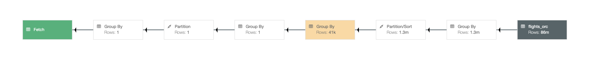


#### Needle in Haystack - most frequency items - or better not on Alaska Airline Flight - AS65

Optional step. Can be just a discussion

What flights are most frequently cancelled

```sql
drop table if exists airlinedata.flights_frq_sketch; 					  
create table airlinedata.flights_frq_sketch (cancelled int, sk_flightnum binary);
insert into airlinedata.flights_frq_sketch
select flights_orc.cancelled, ds_freq_sketch( cast(concat(flights_orc.uniquecarrier,flights_orc.flightnum) as string), 8192 )
FROM airlinedata.flights_orc
GROUP BY flights_orc.cancelled;

select ds_freq_frequent_items(sk_flightnum, 'NO_FALSE_POSITIVES')
from airlinedata.flights_frq_sketch;
```

<p>Results</p><p>     </p>|


|ITEM|ESTIMATE|LOWER\_BOUND|UPPER\_BOUND|
| :- | :- | :- | :- |
|AS65|960|591|960|
|WN25|913|544|913|
|AS64|889|520|889|


validate the results

```sql
select concat(flights_orc.uniquecarrier,flights_orc.flightnum) as flight, count(1) as num_cancelled
from airlinedata.flights_orc
where uniquecarrier = 'AS' and flightnum = 65 and cancelled = 1
group by concat(flights_orc.uniquecarrier,flights_orc.flightnum)
order by num_cancelled desc;
```

Results

|FLIGHT|NUM\_CANCELLED|
| :- | :- |
|AS65|940|


### Cryptographic Functions

Hive has support for AES functions to encrypt or decrypt individual columns.

In this example we create a new table: manufactors_crypt and store the field
manufactor from the plances_orc table in a encrypted AES format. The 2nd parameter
of the aes_encrypt or aes_decrypt functions are the secret key. The sixteen
character are good for a 128bit encryption, for 256bit use 32 characters.  

```sql
drop table if exists manufactors_crypt;

create table manufactors_crypt
(id BIGINT DEFAULT SURROGATE_KEY() , description_crypt string);

INSERT into manufactors_crypt( description_crypt )
select base64( aes_encrypt(manufacturer,'1234567890123456'))
from planes_orc
where planes_orc.manufacturer
is not NULL
group by manufacturer;

SELECT description_crypt, aes_decrypt(unbase64(description_crypt),
'1234567890123456') description
from manufactors_crypt
where description_crypt is not NULL;
```

Results

|DESCRIPTION\_CRYPT|DESCRIPTIION|
| :- | :- |
|RhTzKHhSBr7RD3pGudQG3g==|	AEROSPATIALE|
|S0w4E8xFm3q1FaeKG99NAaNG7uqU2XAsD2A94p79NYk=|	AEROSPATIALE/ALENIA|
|HIL21crGdEnSYvLIqiKzNQ==|	AIRBUS|
